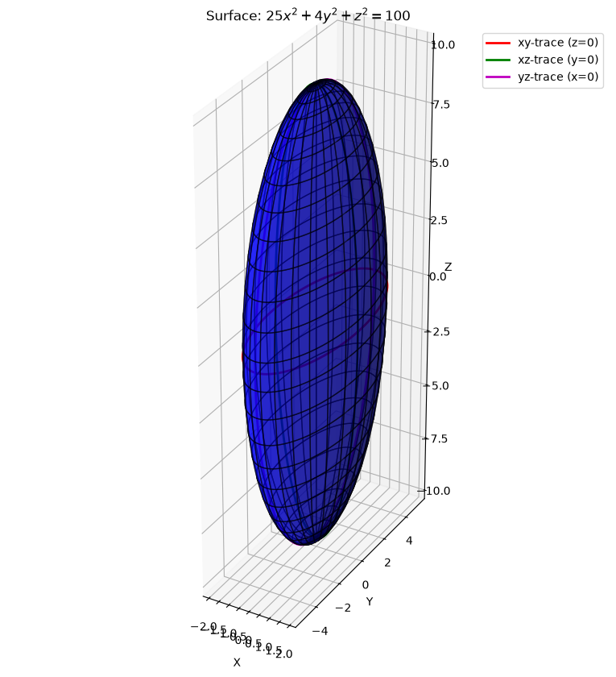
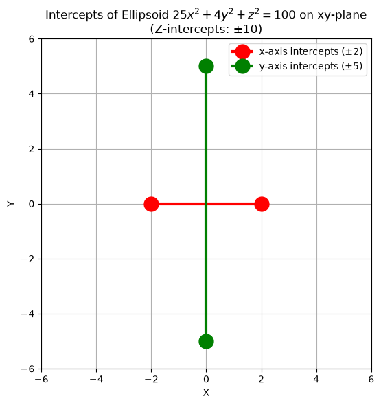
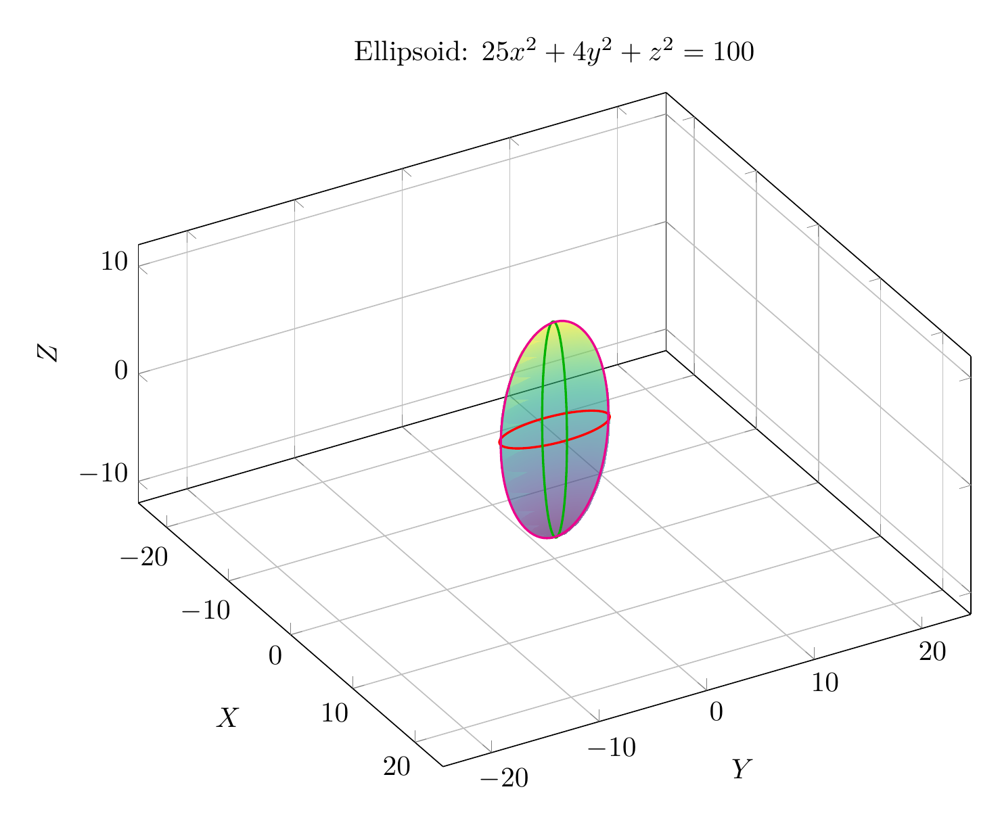
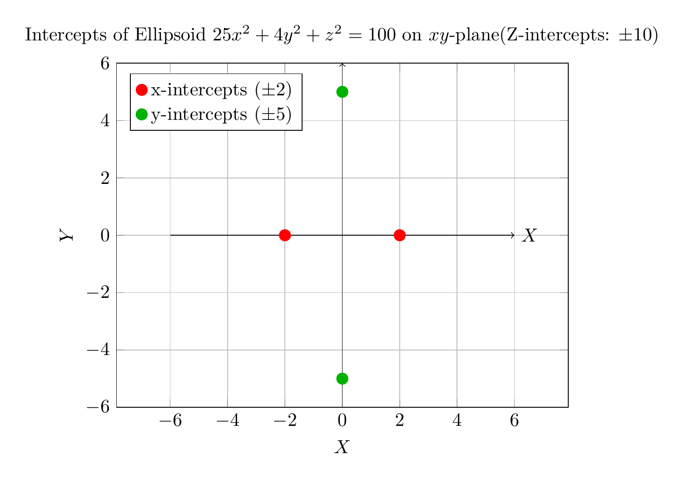

`[ Begin message. Type: AIMessage. ]`

# Solution: Identify the Surface Using Traces

The given equation is:
$$25x^2 + 4y^2 + z^2 = 100$$

To identify and sketch the surface, we will examine its traces, which are the curves of intersection of the surface with planes parallel to the coordinate planes.

## 1. Rewrite in Standard Form

First, we divide the entire equation by 100 to get it into a more recognizable form:
$$\frac{25x^2}{100} + \frac{4y^2}{100} + \frac{z^2}{100} = \frac{100}{100}$$
$$\frac{x^2}{4} + \frac{y^2}{25} + \frac{z^2}{100} = 1$$
This can be written as:
$$\frac{x^2}{2^2} + \frac{y^2}{5^2} + \frac{z^2}{10^2} = 1$$
This is the standard equation of an **ellipsoid** centered at the origin $(0, 0, 0)$ with semi-axes of lengths $a=2$ along the x-axis, $b=5$ along the y-axis, and $c=10$ along the z-axis.

## 2. Analyze the Traces

Let's find the traces in the coordinate planes.

### xy-trace (set $z = 0$)
Substitute $z=0$ into the original equation:
$$25x^2 + 4y^2 + 0^2 = 100 \implies 25x^2 + 4y^2 = 100$$
Dividing by 100:
$$\frac{x^2}{4} + \frac{y^2}{25} = 1$$
This is an **ellipse** in the xy-plane with x-intercepts at $(\pm 2, 0)$ and y-intercepts at $(0, \pm 5)$.

### xz-trace (set $y = 0$)
Substitute $y=0$ into the original equation:
$$25x^2 + 4(0)^2 + z^2 = 100 \implies 25x^2 + z^2 = 100$$
Dividing by 100:
$$\frac{x^2}{4} + \frac{z^2}{100} = 1$$
This is an **ellipse** in the xz-plane with x-intercepts at $(\pm 2, 0)$ and z-intercepts at $(0, \pm 10)$.

### yz-trace (set $x = 0$)
Substitute $x=0$ into the original equation:
$$25(0)^2 + 4y^2 + z^2 = 100 \implies 4y^2 + z^2 = 100$$
Dividing by 100:
$$\frac{y^2}{25} + \frac{z^2}{100} = 1$$
This is an **ellipse** in the yz-plane with y-intercepts at $(0, \pm 5)$ and z-intercepts at $(0, \pm 10)$.

## 3. Conclusion

Since all traces in the coordinate planes are ellipses, the surface is an **ellipsoid**. The semi-axes lengths are 2, 5, and 10 along the x, y, and z axes respectively. The plots below visualize the ellipsoid and its traces.

$\boxed{\text{ellipsoid}}$

---


(Image `20260823_213436_357427_utc_0800_pyplot_0.png`. Alt text: pyplot-generated plot.)



(Image `20260823_213436_357427_utc_0800_pyplot_1.png`. Alt text: pyplot-generated plot.)




---

[PGFplots / tikz plot.](./20260823_213436_357427_utc_0800_pgfplots_0.tex)

```latex
\documentclass[border=10pt]{standalone}
\usepackage{pgfplots}
\pgfplotsset{compat=1.18}
\usepgfplotslibrary{colormaps}

\begin{document}
\begin{tikzpicture}
\begin{axis}[
    view={60}{30},
    xlabel={$X$},
    ylabel={$Y$},
    zlabel={$Z$},
    title={Ellipsoid: $25x^2 + 4y^2 + z^2 = 100$},
    axis equal,
    width=12cm,
    height=10cm,
    grid=major,
    colormap/viridis,
    ]
    % Parametric plot of the ellipsoid
    % x = 2 cos(u) sin(v)
    % y = 5 sin(u) sin(v)
    % z = 10 cos(v)
    \addplot3[
        surf,
        shader=interp,
        opacity=0.6,
        domain=0:360,
        y domain=0:180,
        samples=30,
        samples y=15,
        colormap/viridis
    ] 
    ({2*cos(x)*sin(y)}, {5*sin(x)*sin(y)}, {10*cos(y)});

    % xy-trace (z=0): x^2/4 + y^2/25 = 1
    % x = 2 cos(t), y = 5 sin(t), z = 0
    \addplot3[
        domain=0:360,
        samples=100,
        thick,
        color=red
    ]
    ({2*cos(x)}, {5*sin(x)}, 0);

    % xz-trace (y=0): x^2/4 + z^2/100 = 1
    % x = 2 cos(t), y = 0, z = 10 sin(t)
    \addplot3[
        domain=0:360,
        samples=100,
        thick,
        color=green!70!black
    ]
    ({2*cos(x)}, 0, {10*sin(x)});

    % yz-trace (x=0): y^2/25 + z^2/100 = 1
    % x = 0, y = 5 cos(t), z = 10 sin(t)
    \addplot3[
        domain=0:360,
        samples=100,
        thick,
        color=magenta
    ]
    (0, {5*cos(x)}, {10*sin(x)});

\end{axis}
\end{tikzpicture}
\end{document}
```


(Image `20260823_213436_357427_utc_0800_pgfplots_0.png`. Alt text: PGFplots / tikz plot (converted to PNG).)




[PGFplots / tikz plot.](./20260823_213436_357427_utc_0800_pgfplots_1.tex)

```latex
\documentclass[border=10pt]{standalone}
\usepackage{pgfplots}
\pgfplotsset{compat=1.18}

\begin{document}
\begin{tikzpicture}
\begin{axis}[
    xlabel={$X$},
    ylabel={$Y$},
    title={Intercepts of Ellipsoid $25x^2 + 4y^2 + z^2 = 100$ on $xy$-plane\\(Z-intercepts: $\pm 10$)},
    axis equal,
    width=10cm,
    height=8cm,
    grid=major,
    xmin=-6, xmax=6,
    ymin=-6, ymax=6,
    legend pos=north west,
]
    % x-intercepts: (2, 0) and (-2, 0)
    \addplot[only marks, mark=*, mark size=3pt, color=red] coordinates {(2, 0) (-2, 0)};
    \addlegendentry{x-intercepts ($\pm 2$)}

    % y-intercepts: (0, 5) and (0, -5)
    \addplot[only marks, mark=*, mark size=3pt, color=green!70!black] coordinates {(0, 5) (0, -5)};
    \addlegendentry{y-intercepts ($\pm 5$)}

    % Draw axes lines for clarity
    \draw[->] (axis cs:-6,0) -- (axis cs:6,0) node[right] {$X$};
    \draw[->] (axis cs:0,-6) -- (axis cs:0,6) node[above] {$Y$};

\end{axis}
\end{tikzpicture}
\end{document}
```


(Image `20260823_213436_357427_utc_0800_pgfplots_1.png`. Alt text: PGFplots / tikz plot (converted to PNG).)



`[ End message. Type: AIMessage. ]`