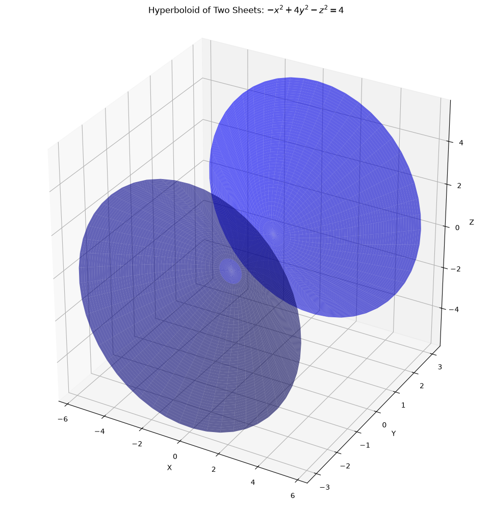
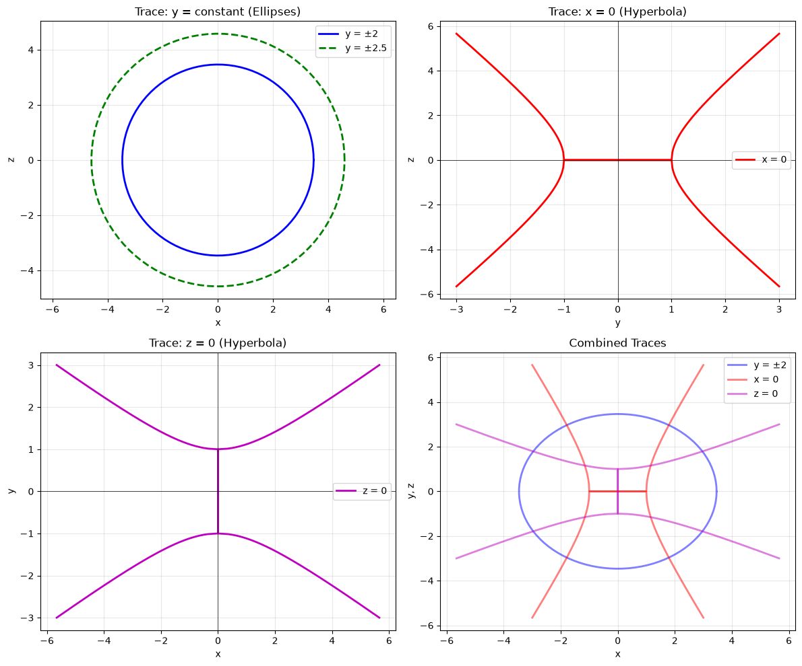
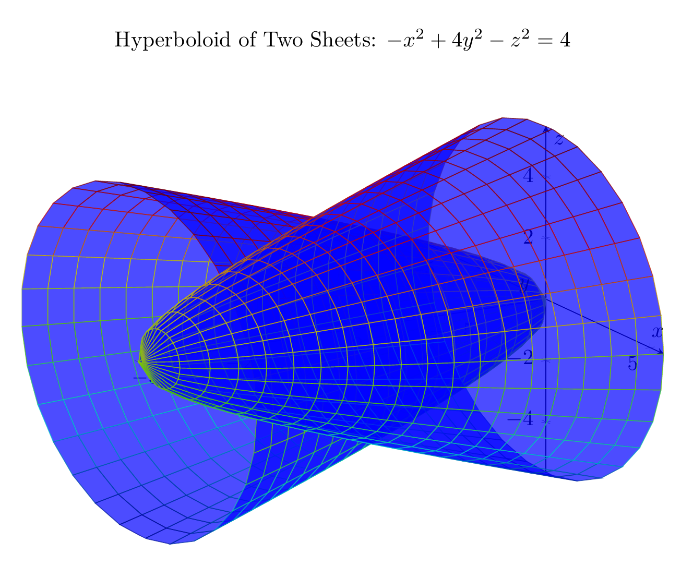
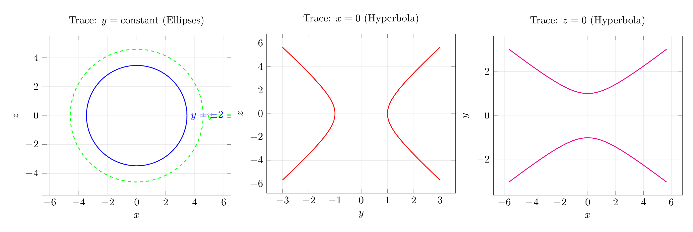

`[ Begin message. Type: HumanMessage. ]`

`[Begin Problem]`

Please solve the math problem in the image.


(Image `problem.png`. Alt text: Problem.)


`[End Problem]`

`[ End message. Type: HumanMessage. ]`

`[ Begin message. Type: AIMessage. ]`

`[Begin Answer]`

# Solution: Identifying and Sketching the Surface $-x^2 + 4y^2 - z^2 = 4$

## Step 1: Rewrite the Equation in Standard Form

To identify the surface, we rewrite the equation in standard form:

$$-x^2 + 4y^2 - z^2 = 4$$

Dividing by 4:

$$-\frac{x^2}{4} + y^2 - \frac{z^2}{4} = 1$$

Rearranging:

$$y^2 - \frac{x^2}{4} - \frac{z^2}{4} = 1$$

Or equivalently:

$$\frac{y^2}{1^2} - \frac{x^2}{2^2} - \frac{z^2}{2^2} = 1$$

This is the standard form of a **hyperboloid of two sheets** with the $y$-axis as its axis of symmetry.

## Step 2: Analyze Traces

### Trace in the plane $y = k$ (horizontal traces):

Setting $y = k$:
$$-x^2 + 4k^2 - z^2 = 4$$
$$x^2 + z^2 = 4k^2 - 4 = 4(k^2 - 1)$$

- For $|k| > 1$: We get circles (or ellipses in the general case) with radius $\sqrt{4(k^2-1)}$
- For $|k| = 1$: We get a point (the vertex)
- For $|k| < 1$: No real solution (the surface doesn't exist here)

### Trace in the plane $x = 0$ (yz-plane):

Setting $x = 0$:
$$4y^2 - z^2 = 4$$
$$\frac{y^2}{1} - \frac{z^2}{4} = 1$$

This is a **hyperbola** opening along the $y$-axis.

### Trace in the plane $z = 0$ (xy-plane):

Setting $z = 0$:
$$-x^2 + 4y^2 = 4$$
$$\frac{y^2}{1} - \frac{x^2}{4} = 1$$

This is also a **hyperbola** opening along the $y$-axis.

## Step 3: Identify Key Features

- **Type**: Hyperboloid of two sheets
- **Axis of symmetry**: $y$-axis
- **Vertices**: $(0, \pm 1, 0)$
- **Exists for**: $|y| \geq 1$
- **Cross-sections perpendicular to $y$-axis**: Circles (ellipses in general)
- **Cross-sections containing the $y$-axis**: Hyperbolas

## Step 4: Sketch the Surface

The surface consists of two separate sheets:
1. One sheet for $y \geq 1$ (opening upward along the positive $y$-axis)
2. One sheet for $y \leq -1$ (opening downward along the negative $y$-axis)

Each sheet is bowl-shaped and symmetric about the $y$-axis. The sheets never touch; there's a gap between $y = -1$ and $y = 1$.

## Final Answer

The surface $-x^2 + 4y^2 - z^2 = 4$ is a **hyperboloid of two sheets** with the $y$-axis as its axis of symmetry.

$\boxed{\text{Hyperboloid of two sheets}}$

---


(Image `20260823_213508_943993_utc_0800_pyplot_0.png`. Alt text: pyplot-generated plot.)



(Image `20260823_213508_943993_utc_0800_pyplot_1.png`. Alt text: pyplot-generated plot.)




---

[PGFplots / tikz plot.](./20260823_213508_943993_utc_0800_pgfplots_0.tex)

```latex
\documentclass[border=10pt]{standalone}
\usepackage{pgfplots}
\pgfplotsset{compat=1.18}

\begin{document}
\begin{tikzpicture}
\begin{axis}[
    view={60}{20},
    axis lines=center,
    xlabel=$x$,
    ylabel=$y$,
    zlabel=$z$,
    title={Hyperboloid of Two Sheets: $-x^2 + 4y^2 - z^2 = 4$},
    domain=0:2*pi,
    y domain=-3:-1,
    samples=30,
    samples y=20,
    width=12cm,
    height=10cm,
    colormap/bluered,
]
% First sheet (y < -1)
\addplot3[surf, opacity=0.7, blue] ({sqrt(4*y^2-4)*cos(deg(x))}, {y}, {sqrt(4*y^2-4)*sin(deg(x))});
\end{axis}

\begin{axis}[
    view={60}{20},
    axis lines=center,
    xlabel=$x$,
    ylabel=$y$,
    zlabel=$z$,
    domain=0:2*pi,
    y domain=1:3,
    samples=30,
    samples y=20,
    width=12cm,
    height=10cm,
    hide axis,
    colormap/bluered,
]
% Second sheet (y > 1)
\addplot3[surf, opacity=0.7, blue] ({sqrt(4*y^2-4)*cos(deg(x))}, {y}, {sqrt(4*y^2-4)*sin(deg(x))});
\end{axis}
\end{tikzpicture}
\end{document}
```


(Image `20260823_213508_943993_utc_0800_pgfplots_0.png`. Alt text: PGFplots / tikz plot (converted to PNG).)




[PGFplots / tikz plot.](./20260823_213508_943993_utc_0800_pgfplots_1.tex)

```latex
\documentclass[border=10pt]{standalone}
\usepackage{pgfplots}
\pgfplotsset{compat=1.18}

\begin{document}
\begin{tikzpicture}
\begin{axis}[
    xlabel=$x$,
    ylabel=$z$,
    title={Trace: $y = \mathrm{constant}$ (Ellipses)},
    axis equal,
    grid=both,
    grid style={opacity=0.3},
    width=8cm,
    height=7cm,
    domain=0:360,
    samples=100,
]
% Ellipse for y = 2: x^2 + z^2 = 12
\addplot[blue, thick] ({sqrt(12)*cos(x)}, {sqrt(12)*sin(x)}) node[right] {$y = \pm 2$};
% Ellipse for y = 2.5: x^2 + z^2 = 21
\addplot[green, thick, dashed] ({sqrt(21)*cos(x)}, {sqrt(21)*sin(x)}) node[right] {$y = \pm 2.5$};
\end{axis}
\end{tikzpicture}

\begin{tikzpicture}
\begin{axis}[
    xlabel=$y$,
    ylabel=$z$,
    title={Trace: $x = 0$ (Hyperbola)},
    grid=both,
    grid style={opacity=0.3},
    width=8cm,
    height=7cm,
    domain=-3:3,
    samples=200,
]
% Hyperbola: 4y^2 - z^2 = 4 => z = \pm\sqrt{4y^2 - 4}
\addplot[red, thick, domain=-3:-1] {sqrt(4*x^2 - 4)};
\addplot[red, thick, domain=1:3] {sqrt(4*x^2 - 4)};
\addplot[red, thick, domain=-3:-1] {-sqrt(4*x^2 - 4)};
\addplot[red, thick, domain=1:3] {-sqrt(4*x^2 - 4)};
\end{axis}
\end{tikzpicture}

\begin{tikzpicture}
\begin{axis}[
    xlabel=$x$,
    ylabel=$y$,
    title={Trace: $z = 0$ (Hyperbola)},
    grid=both,
    grid style={opacity=0.3},
    width=8cm,
    height=7cm,
    domain=-5:5,
    samples=200,
]
% Hyperbola: -x^2 + 4y^2 = 4 => x = \pm\sqrt{4y^2 - 4}
\addplot[magenta, thick, domain=-3:-1] ({sqrt(4*x^2 - 4)}, {x});
\addplot[magenta, thick, domain=1:3] ({sqrt(4*x^2 - 4)}, {x});
\addplot[magenta, thick, domain=-3:-1] ({-sqrt(4*x^2 - 4)}, {x});
\addplot[magenta, thick, domain=1:3] ({-sqrt(4*x^2 - 4)}, {x});
\end{axis}
\end{tikzpicture}
\end{document}
```


(Image `20260823_213508_943993_utc_0800_pgfplots_1.png`. Alt text: PGFplots / tikz plot (converted to PNG).)



`[End Answer]`

`[ End message. Type: AIMessage. ]`