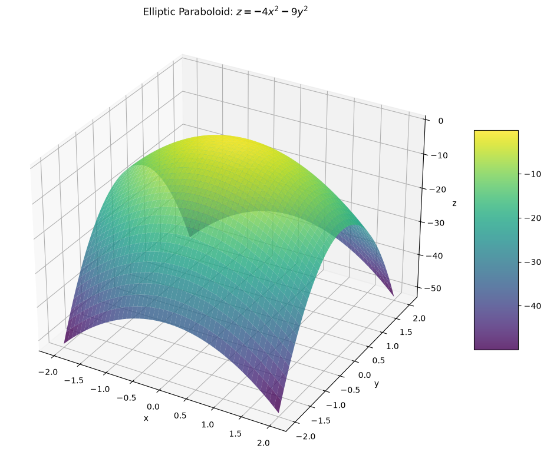
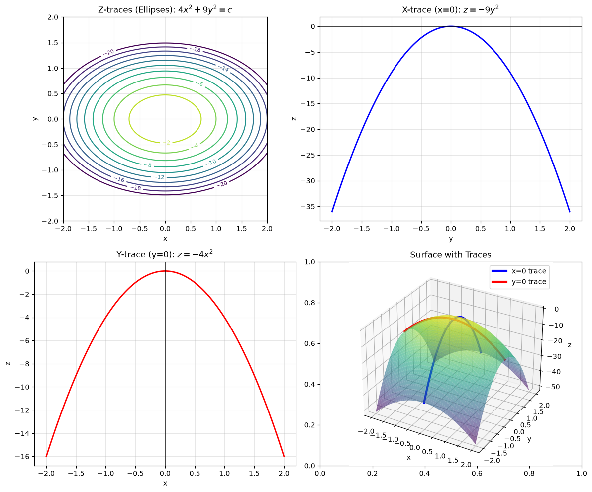
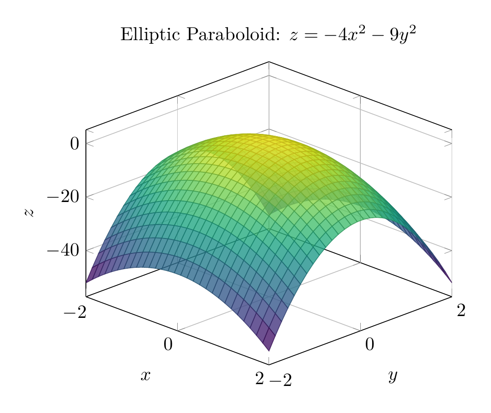
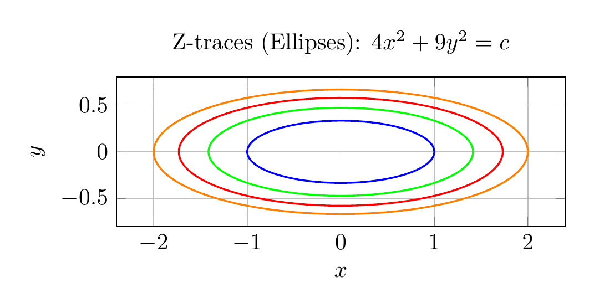

# Solution: Using Traces to Sketch and Identify the Surface

## Problem
Use traces to sketch and identify the surface:
$$4x^2 + 9y^2 + z = 0$$

## Step 1: Rewrite the Equation

First, solve for $z$:
$$z = -4x^2 - 9y^2$$

This form will help us analyze the traces more easily.

## Step 2: Analyze the Traces

To identify the surface, we examine its traces (cross-sections) in the three coordinate planes.

### **Z-traces** (Horizontal traces at $z = k$)

Set $z = k$ (constant):
$$4x^2 + 9y^2 + k = 0$$
$$4x^2 + 9y^2 = -k$$

- If $k < 0$ (i.e., $k = -c$ where $c > 0$), then $4x^2 + 9y^2 = c$
- This is the equation of an **ellipse** centered at the origin
- As $k$ becomes more negative (going down the z-axis), the ellipses get larger

### **X-trace** (in the $yz$-plane, where $x = 0$)

Set $x = 0$:
$$9y^2 + z = 0$$
$$z = -9y^2$$

This is a **parabola** opening downward in the $yz$-plane.

### **Y-trace** (in the $xz$-plane, where $y = 0$)

Set $y = 0$:
$$4x^2 + z = 0$$
$$z = -4x^2$$

This is a **parabola** opening downward in the $xz$-plane.

## Step 3: Identify the Surface

Based on the trace analysis:
- **Horizontal traces** ($z = k < 0$): Ellipses
- **Vertical traces** ($x = 0$ and $y = 0$): Parabolas opening downward

This combination of traces identifies the surface as an **elliptic paraboloid**.

Since the coefficients of $x^2$ and $y^2$ are both negative (when written as $z = -4x^2 - 9y^2$), the paraboloid **opens downward** with its vertex at the origin $(0, 0, 0)$.

## Step 4: Sketch the Surface

The surface has the following characteristics:
1. **Vertex**: At the origin $(0, 0, 0)$
2. **Axis of symmetry**: The $z$-axis
3. **Opening direction**: Downward (negative $z$ direction)
4. **Cross-sections**: 
   - Horizontal slices are ellipses
   - Vertical slices through the origin are parabolas
5. **Shape**: The parabola in the $yz$-plane ($z = -9y^2$) is steeper than in the $xz$-plane ($z = -4x^2$), so the surface is narrower in the $y$-direction

## Final Answer

The surface $4x^2 + 9y^2 + z = 0$ is an **elliptic paraboloid opening downward** with vertex at the origin.

$$\boxed{\text{Elliptic Paraboloid (opening downward)}}$$

---





---

[PGFplots / tikz plot.](./20260825_142243_716209_utc_0800_pgfplots_0.tex)

```latex
\documentclass[border=10pt]{standalone}
\usepackage{pgfplots}
\pgfplotsset{compat=1.18}
\begin{document}
\begin{tikzpicture}
\begin{axis}[
    xlabel=$x$,
    ylabel=$y$,
    zlabel=$z$,
    title={Elliptic Paraboloid: $z = -4x^2 - 9y^2$},
    view={45}{30},
    colormap/viridis,
    grid=major,
    ]
    \addplot3[
        surf,
        domain=-2:2,
        y domain=-2:2,
        samples=30,
        opacity=0.8
    ] {-4*x^2 - 9*y^2};
\end{axis}
\end{tikzpicture}
\end{document}
```



[PGFplots / tikz plot.](./20260825_142243_716209_utc_0800_pgfplots_1.tex)

```latex
\documentclass[border=10pt]{standalone}
\usepackage{pgfplots}
\pgfplotsset{compat=1.18}
\begin{document}
\begin{tikzpicture}
\begin{axis}[
    xlabel=$x$,
    ylabel=$y$,
    title={Z-traces (Ellipses): $4x^2 + 9y^2 = c$},
    grid=major,
    axis equal image,
    ]
    % Draw several ellipses for different z values
    \addplot[domain=0:360, samples=100, thick, blue] ({sqrt(1)*cos(x)}, {sqrt(1/9)*sin(x)});
    \addplot[domain=0:360, samples=100, thick, green] ({sqrt(2)*cos(x)}, {sqrt(2/9)*sin(x)});
    \addplot[domain=0:360, samples=100, thick, red] ({sqrt(3)*cos(x)}, {sqrt(3/9)*sin(x)});
    \addplot[domain=0:360, samples=100, thick, orange] ({sqrt(4)*cos(x)}, {sqrt(4/9)*sin(x)});
\end{axis}
\end{tikzpicture}
\end{document}
```

