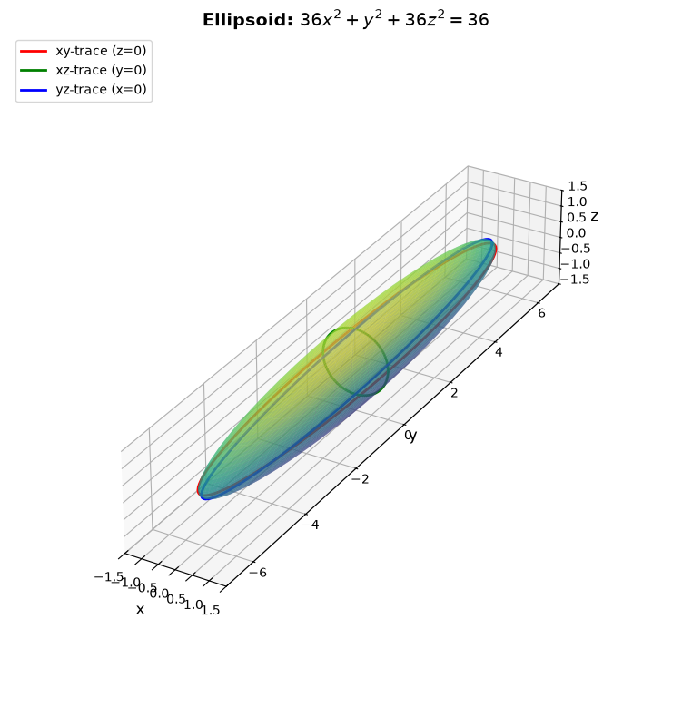
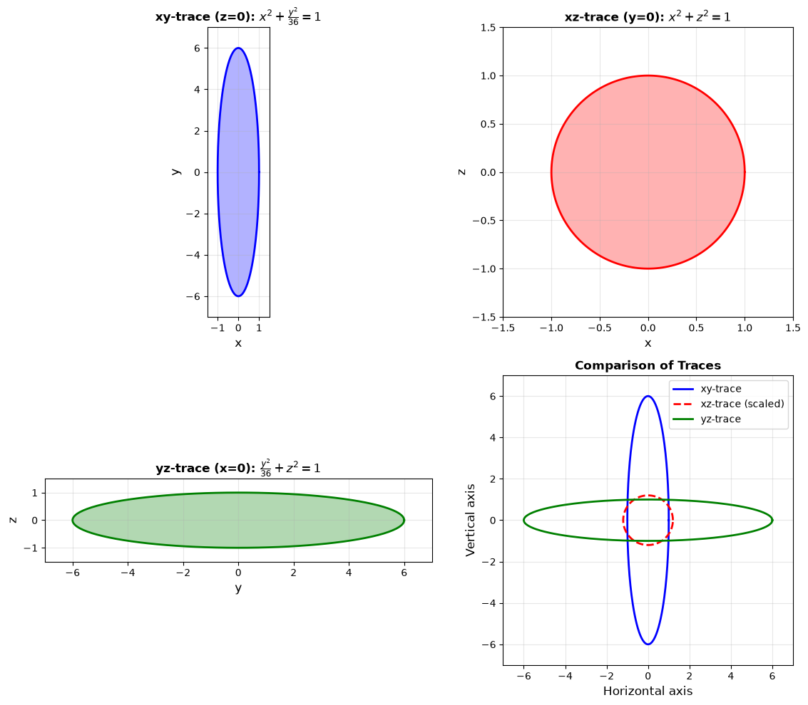
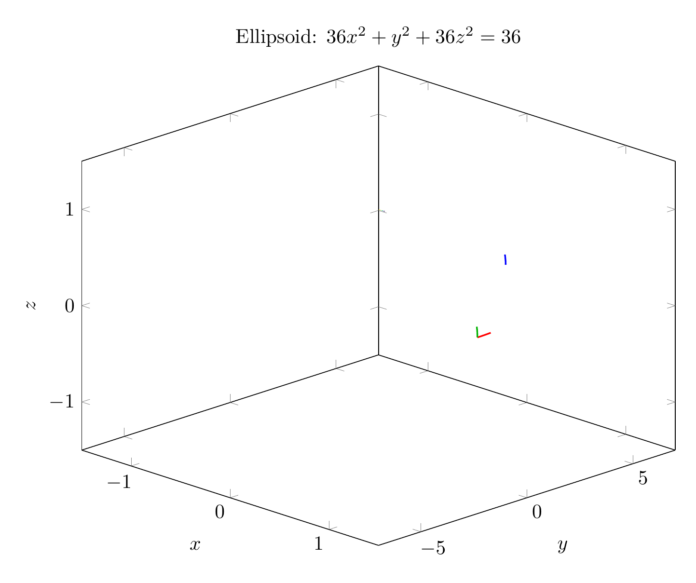
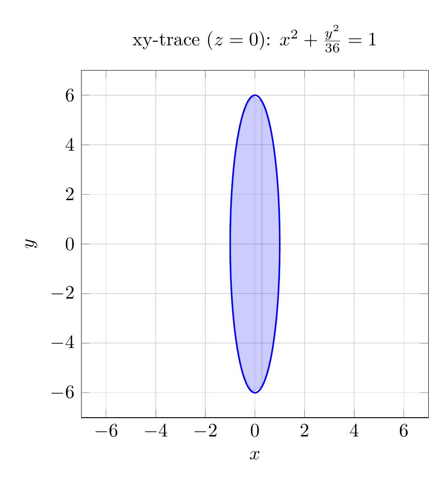

`[ Begin message. Type: AIMessage. ]`

# Solution: Identifying the Surface Using Traces

## Step 1: Rewrite the Equation in Standard Form

Given the equation:
$$36x^2 + y^2 + 36z^2 = 36$$

Divide both sides by 36:
$$x^2 + \frac{y^2}{36} + z^2 = 1$$

Rewrite in standard ellipsoid form:
$$\frac{x^2}{1^2} + \frac{y^2}{6^2} + \frac{z^2}{1^2} = 1$$

This is the equation of an **ellipsoid** centered at the origin with semi-axes:
- $a = 1$ (along the x-axis)
- $b = 6$ (along the y-axis)  
- $c = 1$ (along the z-axis)

## Step 2: Analyze the Traces

To sketch the surface using traces, we examine the intersection of the surface with the three coordinate planes.

### xy-trace (z = 0):
Setting $z = 0$:
$$x^2 + \frac{y^2}{36} = 1$$

This is an **ellipse** in the xy-plane with:
- x-intercepts: $(\pm 1, 0, 0)$
- y-intercepts: $(0, \pm 6, 0)$

### xz-trace (y = 0):
Setting $y = 0$:
$$x^2 + z^2 = 1$$

This is a **circle** in the xz-plane with radius 1, centered at the origin.

### yz-trace (x = 0):
Setting $x = 0$:
$$\frac{y^2}{36} + z^2 = 1$$

This is an **ellipse** in the yz-plane with:
- y-intercepts: $(0, \pm 6, 0)$
- z-intercepts: $(0, 0, \pm 1)$

## Step 3: Sketch the Surface

Using the traces:

1. **Draw the three coordinate plane traces:**
   - In the xy-plane: ellipse extending from $x = \pm 1$ to $y = \pm 6$
   - In the xz-plane: circle of radius 1
   - In the yz-plane: ellipse extending from $y = \pm 6$ to $z = \pm 1$

2. **Connect the traces smoothly** to form a closed, oval-shaped surface.

3. **Key features:**
   - The surface is elongated along the y-axis (length 12)
   - The surface is symmetric about all three coordinate planes
   - The surface passes through the points $(\pm 1, 0, 0)$, $(0, \pm 6, 0)$, and $(0, 0, \pm 1)$

## Conclusion

The surface $36x^2 + y^2 + 36z^2 = 36$ is an **ellipsoid** centered at the origin with semi-axes of lengths 1, 6, and 1 along the x, y, and z axes respectively.

The ellipsoid is stretched along the y-axis, making it appear as a prolate spheroid (cigar-shaped) when viewed from certain angles.

$$\boxed{\text{Ellipsoid}}$$

---


(Image `20260823_213445_924190_utc_0800_pyplot_0.png`. Alt text: pyplot-generated plot.)



(Image `20260823_213445_924190_utc_0800_pyplot_1.png`. Alt text: pyplot-generated plot.)




---

[PGFplots / tikz plot.](./20260823_213445_924190_utc_0800_pgfplots_0.tex)

```latex
\documentclass[border=10pt]{standalone}
\usepackage{pgfplots}
\usepgfplotslibrary{colormaps}
\pgfplotsset{compat=1.18}

\begin{document}
\begin{tikzpicture}
\begin{axis}[
    view={45}{25},
    xlabel={$x$},
    ylabel={$y$},
    zlabel={$z$},
    title={Ellipsoid: $36x^2 + y^2 + 36z^2 = 36$},
    domain=0:2*pi,
    y domain=0:pi,
    samples=30,
    samples y=20,
    z buffer=sort,
    colormap/viridis,
    width=12cm,
    height=10cm,
    xmin=-1.5, xmax=1.5,
    ymin=-7, ymax=7,
    zmin=-1.5, zmax=1.5,
]
% Ellipsoid surface
\addplot3[surf, opacity=0.6, shader=interp] 
    ({sin(y)*cos(x)}, {6*sin(y)*sin(x)}, {cos(y)});

% xy-trace (z=0)
\addplot3[red, thick, domain=0:2*pi, samples=50] 
    ({cos(x)}, {6*sin(x)}, 0);

% xz-trace (y=0)
\addplot3[green!70!black, thick, domain=0:2*pi, samples=50] 
    ({cos(x)}, 0, {sin(x)});

% yz-trace (x=0)
\addplot3[blue, thick, domain=0:2*pi, samples=50] 
    (0, {6*cos(x)}, {sin(x)});

\end{axis}
\end{tikzpicture}
\end{document}
```


(Image `20260823_213445_924190_utc_0800_pgfplots_0.png`. Alt text: PGFplots / tikz plot (converted to PNG).)




[PGFplots / tikz plot.](./20260823_213445_924190_utc_0800_pgfplots_1.tex)

```latex
\documentclass[border=10pt]{standalone}
\usepackage{pgfplots}
\pgfplotsset{compat=1.18}

\begin{document}

% xy-trace (z=0)
\begin{tikzpicture}
\begin{axis}[
    xlabel={$x$},
    ylabel={$y$},
    title={xy-trace ($z=0$): $x^2 + \frac{y^2}{36} = 1$},
    axis equal,
    grid=both,
    grid style={gray!30},
    width=8cm,
    height=8cm,
    xmin=-1.5, xmax=1.5,
    ymin=-7, ymax=7,
]
\addplot[blue, thick, domain=0:2*pi, samples=100] 
    ({cos(deg(x))}, {6*sin(deg(x))});
\addplot[blue, fill, opacity=0.2] 
    ({cos(deg(x))}, {6*sin(deg(x))}) -- cycle;
\end{axis}
\end{tikzpicture}

\end{document}
```


(Image `20260823_213445_924190_utc_0800_pgfplots_1.png`. Alt text: PGFplots / tikz plot (converted to PNG).)



`[ End message. Type: AIMessage. ]`