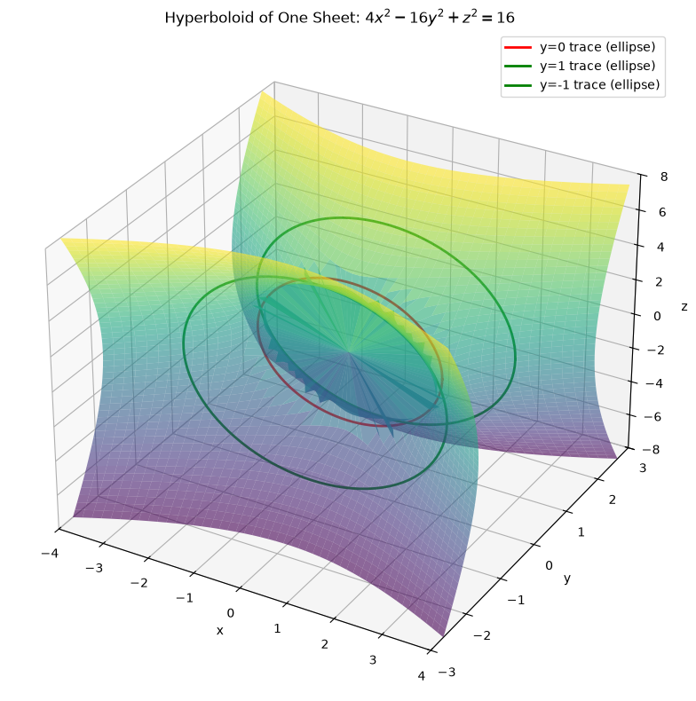
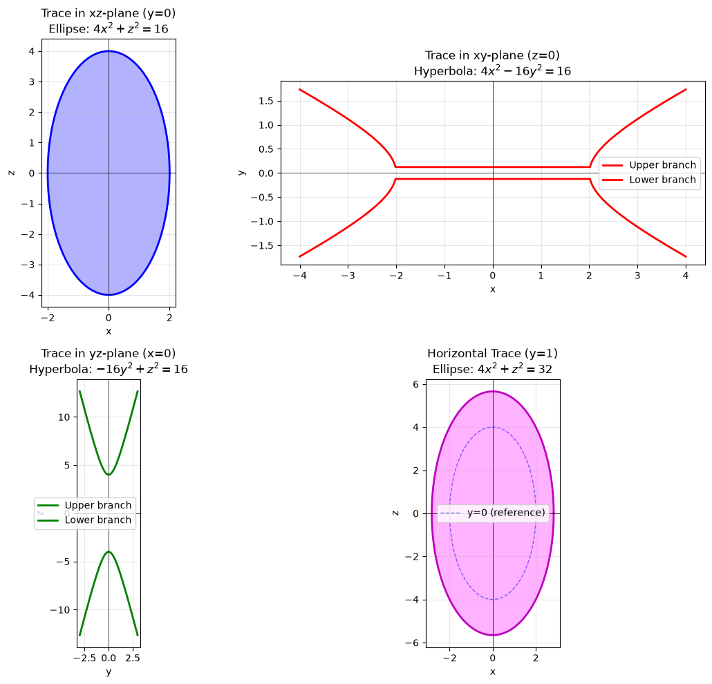
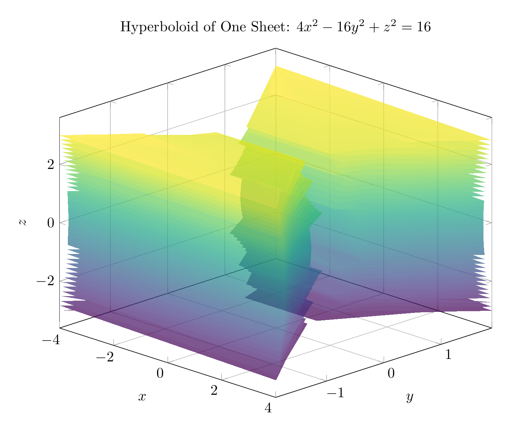
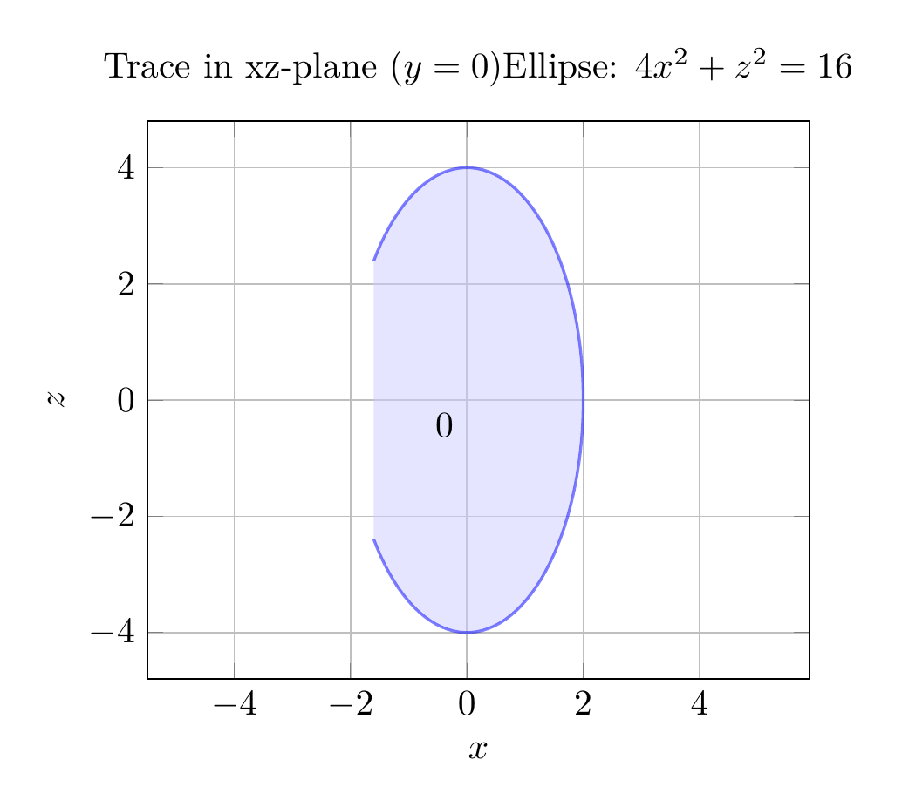

# Solution: Identifying and Sketching the Surface $4x^2 - 16y^2 + z^2 = 16$

## Step 1: Convert to Standard Form

To identify the surface, we first convert the equation to standard form by dividing both sides by 16:

$$\frac{4x^2}{16} - \frac{16y^2}{16} + \frac{z^2}{16} = \frac{16}{16}$$

$$\frac{x^2}{4} - \frac{y^2}{1} + \frac{z^2}{16} = 1$$

This is the standard form of a **hyperboloid of one sheet** with the equation:

$$\frac{x^2}{a^2} - \frac{y^2}{b^2} + \frac{z^2}{c^2} = 1$$

where $a = 2$, $b = 1$, and $c = 4$.

## Step 2: Analyze Traces

### Coordinate Plane Traces:

1. **xz-plane (y = 0):** Setting $y = 0$:
   $$4x^2 + z^2 = 16 \quad \text{or} \quad \frac{x^2}{4} + \frac{z^2}{16} = 1$$
   This is an **ellipse** with semi-axes 2 (in x-direction) and 4 (in z-direction).

2. **xy-plane (z = 0):** Setting $z = 0$:
   $$4x^2 - 16y^2 = 16 \quad \text{or} \quad \frac{x^2}{4} - y^2 = 1$$
   This is a **hyperbola** opening in the x-direction.

3. **yz-plane (x = 0):** Setting $x = 0$:
   $$-16y^2 + z^2 = 16 \quad \text{or} \quad \frac{z^2}{16} - y^2 = 1$$
   This is a **hyperbola** opening in the z-direction.

### Horizontal Traces (y = k):

For any constant $y = k$:
$$4x^2 + z^2 = 16 + 16k^2$$

This represents an **ellipse** for all values of $k$. As $|k|$ increases, the ellipse gets larger. The smallest ellipse occurs at $k = 0$ (the xz-plane trace).

## Step 3: Identify the Surface

The surface is a **hyperboloid of one sheet** because:
- The standard form has two positive terms and one negative term
- The traces perpendicular to the y-axis (the axis corresponding to the negative term) are ellipses
- The traces in the coordinate planes containing the y-axis are hyperbolas
- The surface is connected (one sheet), unlike a hyperboloid of two sheets

## Step 4: Key Features

- **Axis of symmetry:** y-axis (the variable with the negative coefficient)
- **Central ellipse:** At $y = 0$, with semi-axes $a = 2$ and $c = 4$
- **Expands as |y| increases:** The ellipses get larger as we move away from the xz-plane
- **Opens along y-axis:** The surface extends infinitely in both positive and negative y-directions

$\boxed{\text{Hyperboloid of one sheet}}$

---





---

[PGFplots / tikz plot.](./20260823_213447_968821_utc_0800_pgfplots_0.tex)

```latex
\documentclass[border=10pt]{standalone}
\usepackage{pgfplots}
\pgfplotsset{compat=1.18}
\usepgfplotslibrary{colormaps}

\begin{document}
\begin{tikzpicture}
\begin{axis}[
    view={45}{25},
    xlabel=$x$,
    ylabel=$y$,
    zlabel=$z$,
    title={Hyperboloid of One Sheet: $4x^2 - 16y^2 + z^2 = 16$},
    domain=-4:4,
    y domain=-3:3,
    samples=40,
    samples y=40,
    colormap/viridis,
    width=12cm,
    height=10cm,
    grid=major,
    ]
    % Plot upper half (y >= 0)
    \addplot3[surf, opacity=0.7, shader=interp] 
        ({x}, {sqrt((4*x^2 + y^2 - 16)/16)}, {y});

    % Plot lower half (y <= 0)
    \addplot3[surf, opacity=0.7, shader=interp] 
        ({x}, {-sqrt((4*x^2 + y^2 - 16)/16)}, {y});
\end{axis}
\end{tikzpicture}
\end{document}
```



[PGFplots / tikz plot.](./20260823_213447_968821_utc_0800_pgfplots_1.tex)

```latex
\documentclass[border=10pt]{standalone}
\usepackage{pgfplots}
\pgfplotsset{compat=1.18}

\begin{document}
\begin{tikzpicture}
\begin{axis}[
    xlabel=$x$,
    ylabel=$z$,
    title={Trace in xz-plane ($y=0$)\\Ellipse: $4x^2 + z^2 = 16$},
    domain=-2.5:2.5,
    samples=100,
    width=8cm,
    height=7cm,
    axis equal,
    grid=major,
    ]
    % Ellipse: x^2/4 + z^2/16 = 1
    \addplot[blue, thick, fill=blue!20, opacity=0.5] 
        ({2*cos(deg(x))}, {4*sin(deg(x))});
    \addplot[black, thin] (0,0) node[below left] {0};
\end{axis}
\end{tikzpicture}
\end{document}
```

