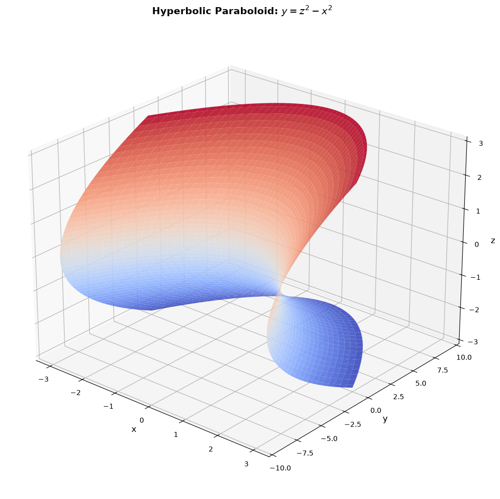
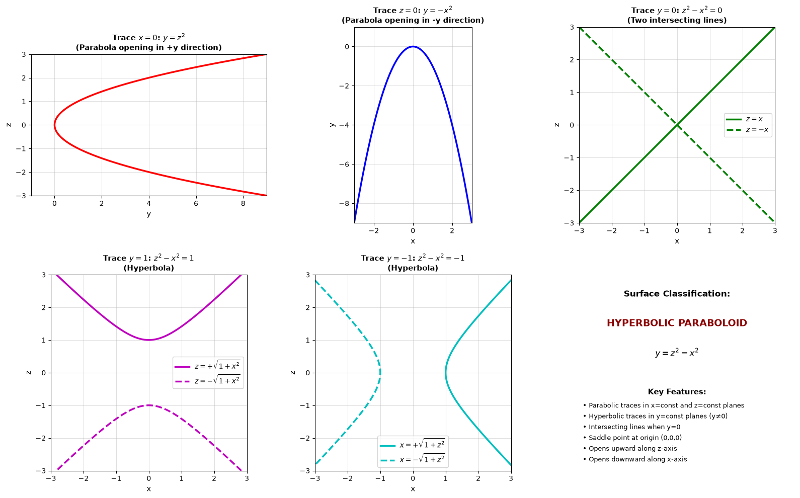
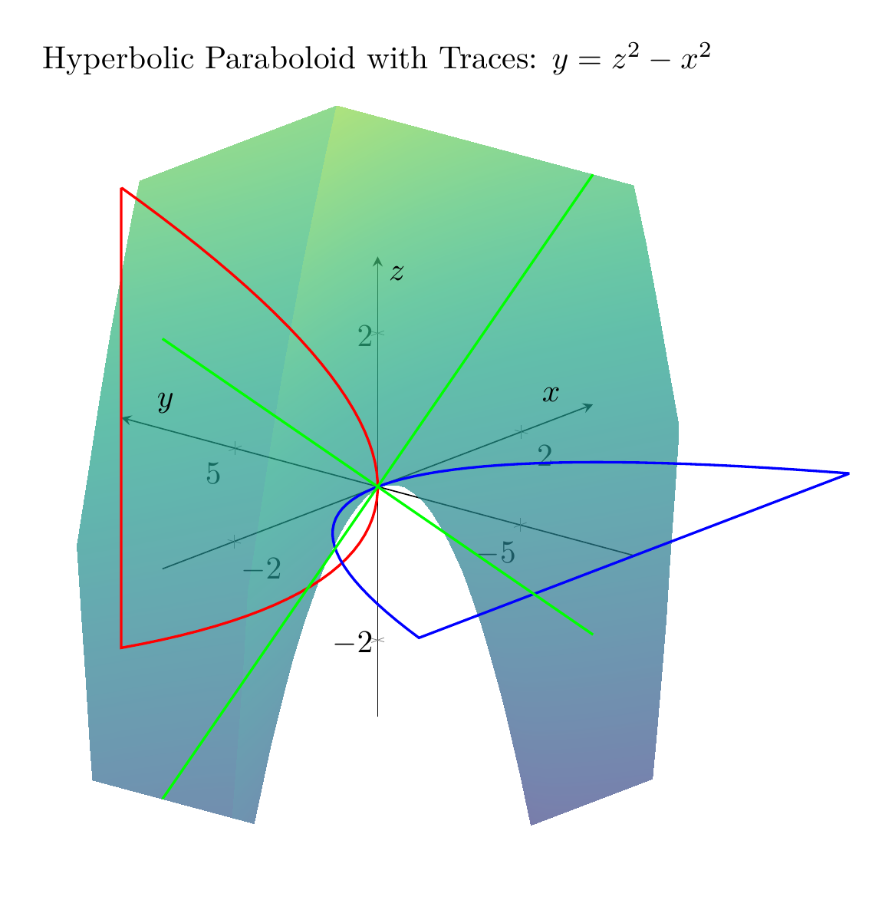

`[ Begin message. Type: AIMessage. ]`

# Solution: Using Traces to Sketch and Identify the Surface $y = z^2 - x^2$

## Step 1: Understanding Traces

**Traces** are the curves formed by intersecting a surface with planes parallel to the coordinate planes. By examining traces in different planes, we can understand the 3D shape of a surface.

## Step 2: Analyzing Traces in Different Planes

### Trace in the plane $x = 0$ (yz-plane):
Setting $x = 0$ in the equation $y = z^2 - x^2$:
$$y = z^2 - 0^2 = z^2$$

This is a **parabola** in the yz-plane that opens in the positive y-direction with vertex at the origin.

### Trace in the plane $z = 0$ (xy-plane):
Setting $z = 0$ in the equation:
$$y = 0^2 - x^2 = -x^2$$

This is a **parabola** in the xy-plane that opens in the negative y-direction with vertex at the origin.

### Trace in the plane $y = 0$ (xz-plane):
Setting $y = 0$ in the equation:
$$0 = z^2 - x^2 \implies z^2 = x^2 \implies z = \pm x$$

This gives us **two intersecting lines** in the xz-plane: $z = x$ and $z = -x$, which cross at the origin.

### Trace in the plane $y = c$ (where $c \neq 0$):
Setting $y = c$ (a constant):
$$c = z^2 - x^2 \implies z^2 - x^2 = c$$

- When $c > 0$ (e.g., $y = 1$): $z^2 - x^2 = 1$ is a **hyperbola** opening along the z-axis
- When $c < 0$ (e.g., $y = -1$): $z^2 - x^2 = -1$, or $x^2 - z^2 = 1$, is a **hyperbola** opening along the x-axis

## Step 3: Identifying the Surface

Based on the trace analysis:
- **Parabolic traces** in planes parallel to the yz-plane ($x = \text{const}$) and xy-plane ($z = \text{const}$)
- **Hyperbolic traces** in planes parallel to the xz-plane ($y = \text{const}$, $y \neq 0$)
- **Intersecting lines** when $y = 0$

This pattern of traces is characteristic of a **hyperbolic paraboloid**.

## Step 4: Key Features of the Surface

1. **Saddle Point**: The origin $(0, 0, 0)$ is a saddle point (neither a maximum nor minimum)
2. **Axis Orientation**: The surface opens upward along the z-axis and downward along the x-axis
3. **Symmetry**: The surface is symmetric with respect to both the xz-plane and yz-plane
4. **Standard Form**: The equation $y = z^2 - x^2$ is already in the standard form of a hyperbolic paraboloid

## Conclusion

The surface $y = z^2 - x^2$ is a **hyperbolic paraboloid**.

This surface is sometimes called a "saddle surface" because of its distinctive shape. It's a doubly-ruled surface, meaning that through every point on the surface, there are two straight lines that lie entirely on the surface.

$\boxed{\text{Hyperbolic Paraboloid}}$

---


(Image `20260823_213523_084876_utc_0800_pyplot_0.png`. Alt text: pyplot-generated plot.)


(Image `20260823_213523_084876_utc_0800_pyplot_1.png`. Alt text: pyplot-generated plot.)



(Image `20260823_213523_084876_utc_0800_pyplot_2.png`. Alt text: pyplot-generated plot.)




---

[PGFplots / tikz plot.](./20260823_213523_084876_utc_0800_pgfplots_0.tex)

```latex
\documentclass[border=10pt]{standalone}
\usepackage{pgfplots}
\pgfplotsset{compat=1.18}

\begin{document}
\begin{tikzpicture}
\begin{axis}[
    xlabel=$x$,
    ylabel=$y$,
    zlabel=$z$,
    title={Hyperbolic Paraboloid: $y = z^2 - x^2$},
    view={-50}{25},
    colormap/viridis,
    grid=none,
    axis lines=center,
    domain=-3:3,
    y domain=-3:3,
    samples=50,
    samples y=50,
    zmin=-3, zmax=3,
    xmin=-3, xmax=3,
    ymin=-9, ymax=9,
]
\addplot3[surf, opacity=0.8, shader=interp] {y^2 - x^2};
\end{axis}
\end{tikzpicture}
\end{document}
```


(Image `20260823_213523_084876_utc_0800_pgfplots_0.png`. Alt text: PGFplots / tikz plot (converted to PNG).)


[PGFplots / tikz plot.](./20260823_213523_084876_utc_0800_pgfplots_1.tex)

```latex
\documentclass[border=10pt]{standalone}
\usepackage{pgfplots}
\pgfplotsset{compat=1.18}

\begin{document}
\begin{tikzpicture}
\begin{axis}[
    xlabel=$x$,
    ylabel=$y$,
    zlabel=$z$,
    title={Hyperbolic Paraboloid with Traces: $y = z^2 - x^2$},
    view={-50}{25},
    colormap/viridis,
    grid=none,
    axis lines=center,
    domain=-3:3,
    y domain=-3:3,
    samples=40,
    samples y=40,
    zmin=-3, zmax=3,
    xmin=-3, xmax=3,
    ymin=-9, ymax=9,
    width=12cm,
    height=10cm,
]
% Main surface
\addplot3[surf, opacity=0.7, shader=interp] {y^2 - x^2};

% Trace x=0 (red parabola)
\addplot3[red, thick, domain=-3:3, samples=50] ({0}, {x^2}, {x});

% Trace z=0 (blue parabola)
\addplot3[blue, thick, domain=-3:3, samples=50] ({x}, {-x^2}, {0});

% Trace y=0 (green lines)
\addplot3[green, thick, domain=-3:3, samples=50] ({x}, {0}, {x});
\addplot3[green, thick, dashed, domain=-3:3, samples=50] ({x}, {0}, {-x});

\end{axis}
\end{tikzpicture}
\end{document}
```


(Image `20260823_213523_084876_utc_0800_pgfplots_1.png`. Alt text: PGFplots / tikz plot (converted to PNG).)




[PGFplots / tikz plot.](./20260823_213523_084876_utc_0800_pgfplots_2.tex)

```latex
\documentclass[border=10pt]{standalone}
\usepackage{pgfplots}
\pgfplotsset{compat=1.18}

\begin{document}
\begin{tikzpicture}
\begin{axis}[
    xlabel=$y$,
    ylabel=$z$,
    title={Trace $x=0$: $y = z^2$},
    grid=both,
    axis lines=center,
    domain=0:9,
    samples=100,
    ymin=-3, ymax=3,
    xmin=0, xmax=9,
    width=8cm,
    height=8cm,
]
\addplot[red, thick, domain=-3:3] ({x^2}, {x});
\end{axis}
\end{tikzpicture}
\end{document}
```


(Image `20260823_213523_084876_utc_0800_pgfplots_2.png`. Alt text: PGFplots / tikz plot (converted to PNG).)


`[ End message. Type: AIMessage. ]`