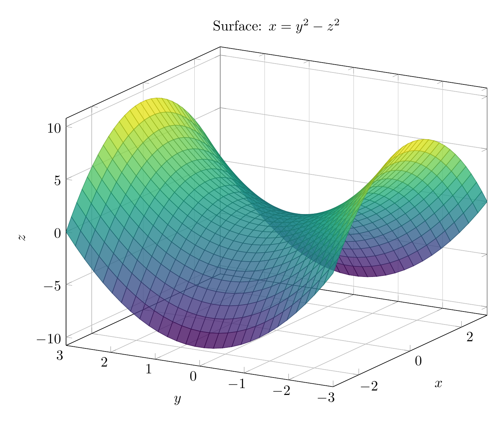
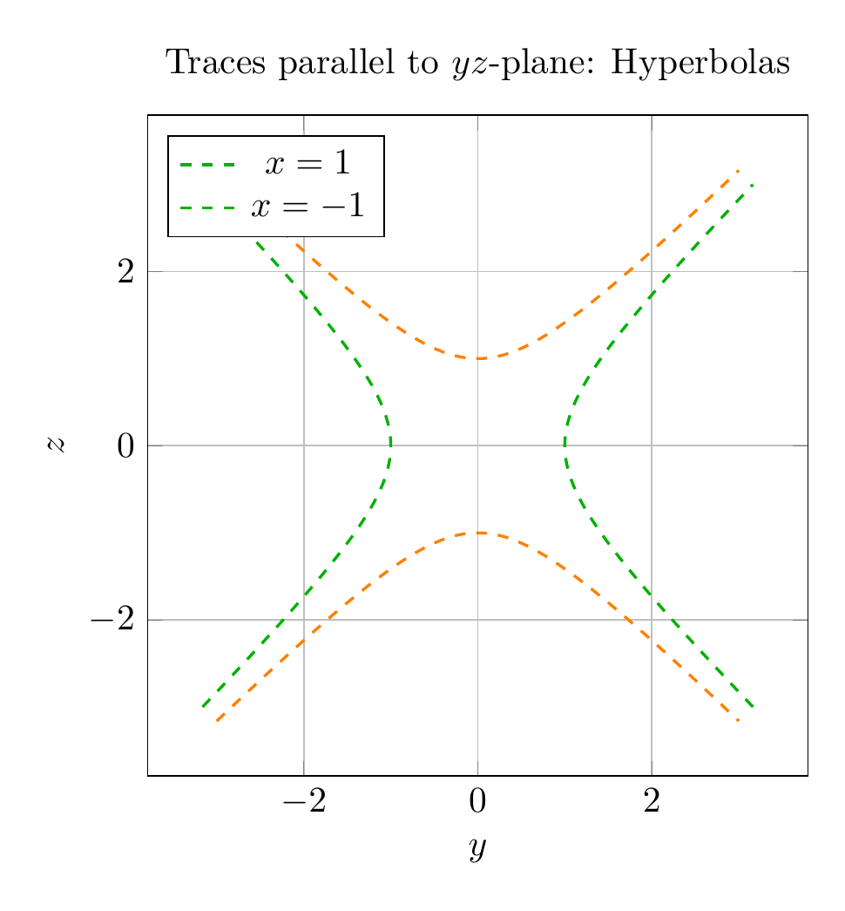

`[ Begin message. Type: HumanMessage. ]`

`[Begin Problem]`

Please solve the math problem in the image.


(Image `problem.png`. Alt text: Problem.)


`[End Problem]`

`[ End message. Type: HumanMessage. ]`

`[ Begin message. Type: AIMessage. ]`

`[Begin Answer]`

# Solution: Identifying the Surface $x = y^2 - z^2$

## Problem Statement
Use traces to sketch and identify the surface given by the equation $x = y^2 - z^2$.

## Method: Using Traces

To identify a quadric surface, we examine its **traces** - the curves formed by intersecting the surface with various planes.

### Step 1: Traces in Coordinate Planes

**1. Trace in the $xy$-plane ($z = 0$):**
- Substitute $z = 0$ into the equation: $x = y^2 - 0^2$
- Result: $x = y^2$
- This is a **parabola** opening in the positive $x$-direction

**2. Trace in the $xz$-plane ($y = 0$):**
- Substitute $y = 0$ into the equation: $x = 0^2 - z^2$
- Result: $x = -z^2$
- This is a **parabola** opening in the negative $x$-direction

**3. Trace in the $yz$-plane ($x = 0$):**
- Substitute $x = 0$ into the equation: $0 = y^2 - z^2$
- Result: $y^2 = z^2$, which gives $y = \pm z$
- These are **two intersecting lines** through the origin

### Step 2: Traces Parallel to Coordinate Planes

**4. Traces parallel to the $yz$-plane ($x = k$, where $k$ is constant):**
- For $x = k$: $k = y^2 - z^2$
- This is the equation of a **hyperbola**
- When $k > 0$: $y^2 - z^2 = k$ (hyperbola opening along $y$-axis)
- When $k < 0$: $z^2 - y^2 = -k$ (hyperbola opening along $z$-axis)
- When $k = 0$: Two intersecting lines $y = \pm z$

### Step 3: Identifying the Surface

The characteristic features are:
- Parabolic traces in two perpendicular planes ($xy$ and $xz$)
- Hyperbolic traces in planes parallel to the third coordinate plane ($yz$)
- The parabolas open in **opposite directions** along the $x$-axis

This combination of traces uniquely identifies the surface as a **hyperbolic paraboloid**.

## Key Characteristics of a Hyperbolic Paraboloid

1. **Saddle shape**: The surface curves upward in one direction and downward in the perpendicular direction
2. **Doubly ruled surface**: Can be generated by moving a line in two different ways
3. **Standard form**: $\frac{x}{a} = \frac{y^2}{b^2} - \frac{z^2}{c^2}$ (when the axis is along $x$)
4. **Our equation**: $x = y^2 - z^2$ fits this form with $a = 1$, $b = 1$, $c = 1$

## Conclusion

The surface $x = y^2 - z^2$ is a **hyperbolic paraboloid** with its axis along the $x$-axis. The vertex is at the origin $(0, 0, 0)$, and the surface opens in opposite directions along the $y$ and $z$ axes, creating the characteristic saddle shape.

$\boxed{\text{Hyperbolic Paraboloid}}$

---


Image `20260823_213525_696161_utc_0800_pyplot_0.png` not found.

Image `20260823_213525_696161_utc_0800_pyplot_1.png` not found.


---

[PGFplots / tikz plot.](./20260823_213525_696161_utc_0800_pgfplots_0.tex)

```latex
\documentclass[border=10pt]{standalone}
\usepackage{pgfplots}
\pgfplotsset{compat=1.18}
\usepgfplotslibrary{colormaps}

\begin{document}
\begin{tikzpicture}
\begin{axis}[
    xlabel={$x$},
    ylabel={$y$},
    zlabel={$z$},
    title={Surface: $x = y^2 - z^2$},
    view={-60}{20},
    colormap/viridis,
    grid=major,
    width=12cm,
    height=10cm,
]
\addplot3[
    surf,
    domain=-3:3,
    y domain=-3:3,
    samples=30,
    opacity=0.8,
] {y^2 - x^2};
\end{axis}
\end{tikzpicture}
\end{document}
```


(Image `20260823_213525_696161_utc_0800_pgfplots_0.png`. Alt text: PGFplots / tikz plot (converted to PNG).)




[PGFplots / tikz plot.](./20260823_213525_696161_utc_0800_pgfplots_1.tex)

```latex
\documentclass[border=10pt]{standalone}
\usepackage{pgfplots}
\pgfplotsset{compat=1.18}

\begin{document}
\begin{tikzpicture}
\begin{axis}[
    xlabel={$y$},
    ylabel={$z$},
    title={Traces parallel to $yz$-plane: Hyperbolas},
    grid=major,
    axis equal,
    width=8cm,
    height=8cm,
    domain=-3:3,
    legend pos=north west,
]
% x=1: y^2 - z^2 = 1 => y = +/- sqrt(1+z^2)
\addplot[green!70!black, dashed, thick, domain=-3:3, samples=100] ({sqrt(1+x^2)}, x);
\addplot[green!70!black, dashed, thick, domain=-3:3, samples=100] ({-sqrt(1+x^2)}, x);
\addlegendentry{$x=1$}

% x=-1: z^2 - y^2 = 1 => z = +/- sqrt(1+y^2)
\addplot[orange, dashed, thick, domain=-3:3, samples=100] (x, {sqrt(1+x^2)});
\addplot[orange, dashed, thick, domain=-3:3, samples=100] (x, {-sqrt(1+x^2)});
\addlegendentry{$x=-1$}
\end{axis}
\end{tikzpicture}
\end{document}
```


(Image `20260823_213525_696161_utc_0800_pgfplots_1.png`. Alt text: PGFplots / tikz plot (converted to PNG).)



`[End Answer]`

`[ End message. Type: AIMessage. ]`