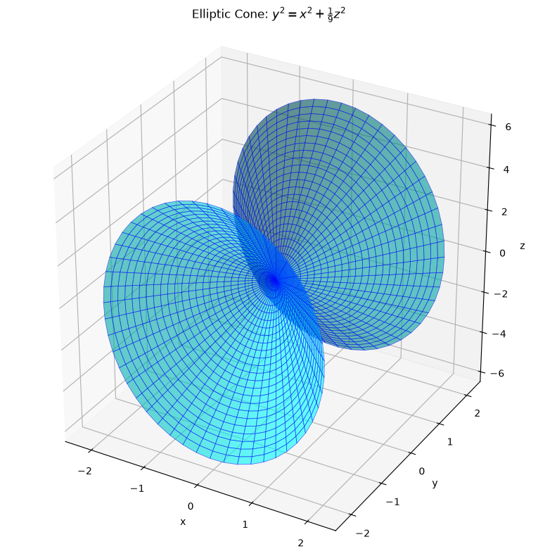
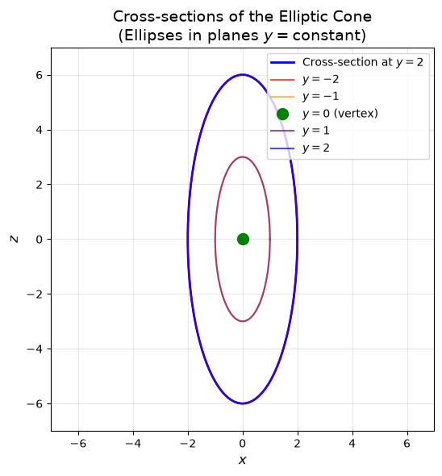
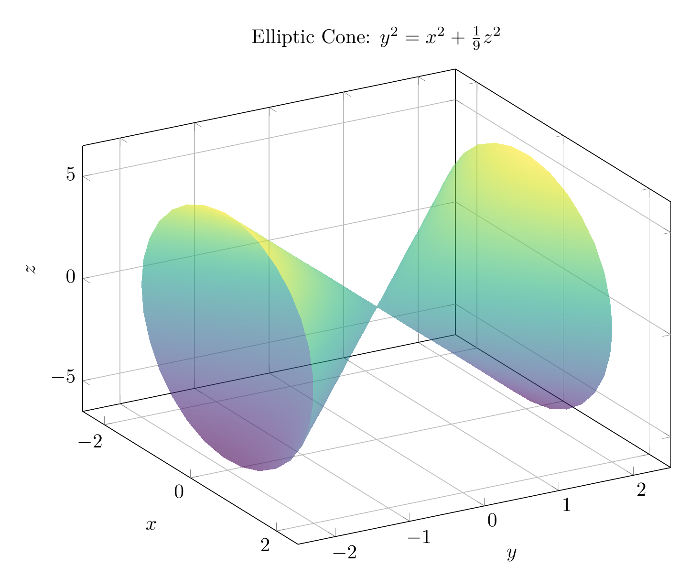
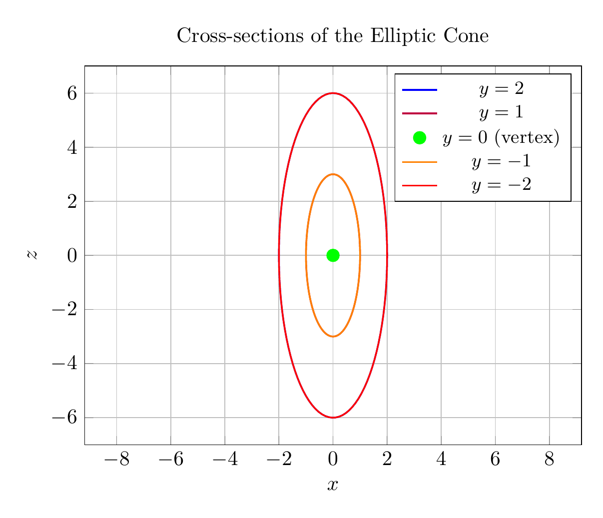

# Solution: Classifying the Quadric Surface

## Problem
Reduce the equation to one of the standard forms, classify the surface, and sketch it:
$$y^2 = x^2 + \frac{1}{9}z^2$$

## Step 1: Rewrite in Standard Form

The given equation is:
$$y^2 = x^2 + \frac{1}{9}z^2$$

To put this in standard form, we rearrange the terms:
$$y^2 - x^2 - \frac{z^2}{9} = 0$$

Or equivalently:
$$\frac{y^2}{1} - \frac{x^2}{1} - \frac{z^2}{9} = 0$$

This can be written as:
$$\frac{y^2}{1^2} = \frac{x^2}{1^2} + \frac{z^2}{3^2}$$

## Step 2: Identify the Surface Type

The standard form of a **cone** (specifically an elliptic cone) is:
$$\frac{y^2}{c^2} = \frac{x^2}{a^2} + \frac{z^2}{b^2}$$

Comparing our equation:
- $a^2 = 1$, so $a = 1$
- $b^2 = 9$, so $b = 3$
- $c^2 = 1$, so $c = 1$

Since our equation matches this form exactly, the surface is an **elliptic cone** with its axis along the $y$-axis.

## Step 3: Classification

**Classification: Elliptic Cone**

Key characteristics:
- The vertex is at the origin $(0, 0, 0)$
- The axis of the cone is the $y$-axis
- Cross-sections perpendicular to the $y$-axis (planes $y = k$) are ellipses
- The semi-axes of the elliptical cross-sections are:
  - In the $x$-direction: $|k|$
  - In the $z$-direction: $3|k|$
- The ratio of the $z$-axis to $x$-axis in each elliptical cross-section is $3:1$

## Step 4: Analysis of Cross-Sections

1. **Horizontal cross-sections** ($y = k$): 
   - When $y = k$, we get $k^2 = x^2 + \frac{z^2}{9}$
   - This is an ellipse: $\frac{x^2}{k^2} + \frac{z^2}{9k^2} = 1$
   - The ellipse has semi-axes $|k|$ and $3|k|$

2. **Cross-section in the $xy$-plane** ($z = 0$):
   - $y^2 = x^2$, which gives $y = \pm x$ (two intersecting lines)

3. **Cross-section in the $yz$-plane** ($x = 0$):
   - $y^2 = \frac{z^2}{9}$, which gives $y = \pm \frac{z}{3}$ (two intersecting lines)

## Conclusion

The surface $y^2 = x^2 + \frac{1}{9}z^2$ is an **elliptic cone** with vertex at the origin and axis along the $y$-axis. The elliptical cross-sections have a $3:1$ ratio between the $z$ and $x$ semi-axes.

$\boxed{\text{Elliptic Cone}}$

---





---

[PGFplots / tikz plot.](./20260823_213442_612288_utc_0800_pgfplots_0.tex)

```latex
\documentclass[border=10pt]{standalone}
\usepackage{pgfplots}
\pgfplotsset{compat=1.18}
\usepgfplotslibrary{colormaps}

\begin{document}
\begin{tikzpicture}
\begin{axis}[
    view={60}{30},
    xlabel={$x$},
    ylabel={$y$},
    zlabel={$z$},
    title={Elliptic Cone: $y^2 = x^2 + \frac{1}{9}z^2$},
    domain=0:360,
    y domain=-2:2,
    samples=30,
    samples y=20,
    colormap/viridis,
    grid=major,
    width=12cm,
    height=10cm,
    zmin=-6.5,
    zmax=6.5,
    xmin=-2.5,
    xmax=2.5,
    ymin=-2.5,
    ymax=2.5,
]
% Parameterization: x = v*cos(u), y = v, z = 3*v*sin(u)
\addplot3[surf, opacity=0.6, shader=interp] ({y*cos(x)}, {y}, {3*y*sin(x)});
\end{axis}
\end{tikzpicture}
\end{document}
```



[PGFplots / tikz plot.](./20260823_213442_612288_utc_0800_pgfplots_1.tex)

```latex
\documentclass[border=10pt]{standalone}
\usepackage{pgfplots}
\pgfplotsset{compat=1.18}

\begin{document}
\begin{tikzpicture}
\begin{axis}[
    xlabel={$x$},
    ylabel={$z$},
    title={Cross-sections of the Elliptic Cone},
    domain=0:360,
    samples=100,
    axis equal,
    grid=major,
    width=10cm,
    height=8cm,
    xmin=-7,
    xmax=7,
    ymin=-7,
    ymax=7,
    legend style={at={(0.98,0.98)}, anchor=north east, font=\small}
]

% Cross-section at y = 2 (blue)
\addplot[blue, thick] ({2*cos(x)}, {6*sin(x)});
\addlegendentry{$y=2$}

% Cross-section at y = 1 (purple)
\addplot[purple, thick] ({1*cos(x)}, {3*sin(x)});
\addlegendentry{$y=1$}

% Cross-section at y = 0 (point)
\addplot[green, only marks, mark=*, mark size=3pt] coordinates {(0,0)};
\addlegendentry{$y=0$ (vertex)}

% Cross-section at y = -1 (orange)
\addplot[orange, thick] ({1*cos(x)}, {3*sin(x)});
\addlegendentry{$y=-1$}

% Cross-section at y = -2 (red)
\addplot[red, thick] ({2*cos(x)}, {6*sin(x)});
\addlegendentry{$y=-2$}

\end{axis}
\end{tikzpicture}
\end{document}
```

