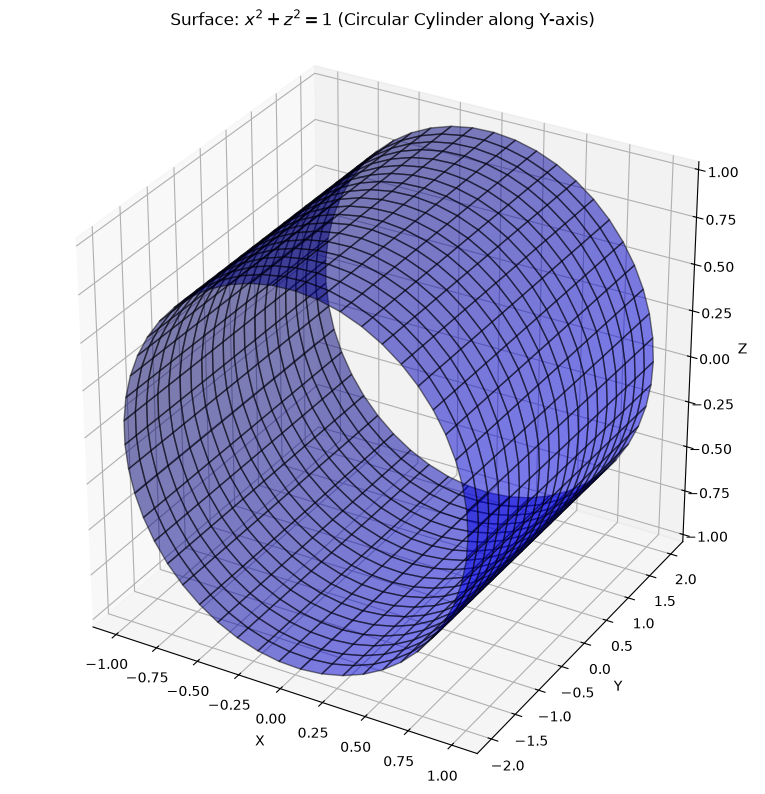
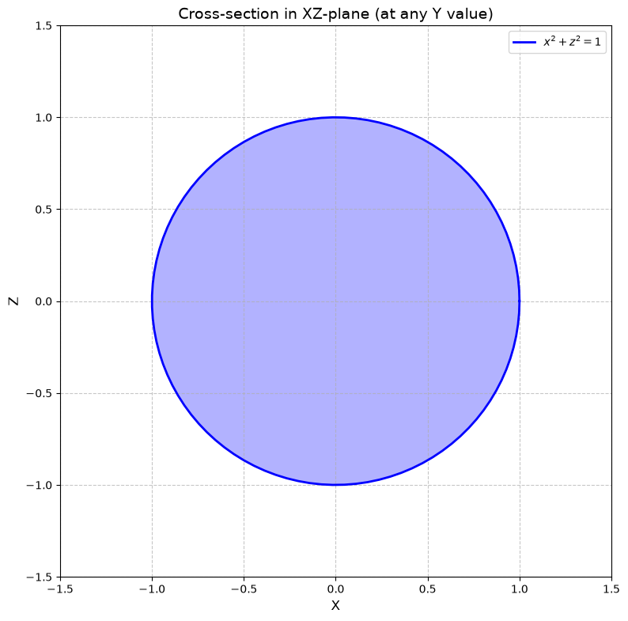
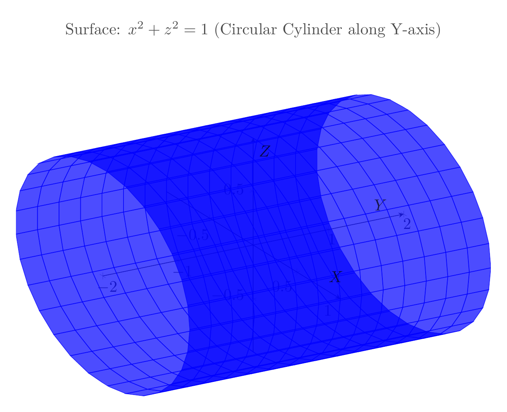
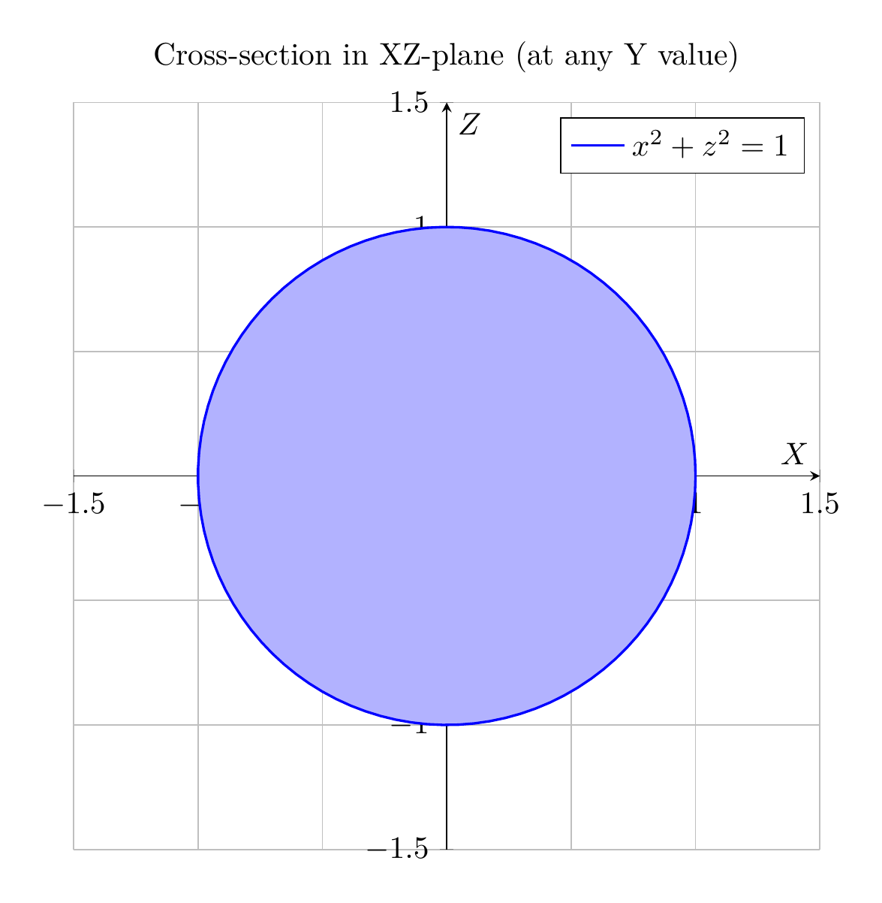

# Solution: Describe and Sketch the Surface $x^2 + z^2 = 1$

## Analysis

The equation $x^2 + z^2 = 1$ describes a surface in three-dimensional space. Let's analyze it step by step:

### Step 1: Identify the type of surface

Notice that the equation $x^2 + z^2 = 1$ does not contain the variable $y$. This is a crucial observation!

**Key principle:** When an equation in three variables ($x$, $y$, $z$) is missing one variable, the surface is a **cylinder** whose axis is parallel to the missing variable's axis.

Since $y$ is missing, this surface is a cylinder with its axis parallel to the $y$-axis.

### Step 2: Analyze the cross-section

In any plane where $y = k$ (for any constant $k$), the cross-section is given by:
$$x^2 + z^2 = 1$$

This is the equation of a **circle** in the $xz$-plane with:
- Center at $(0, 0)$ in the $xz$-plane
- Radius $r = 1$

### Step 3: Describe the complete surface

Since the cross-section is the same circle for every value of $y$, the surface is formed by taking this unit circle in the $xz$-plane and extending it infinitely in both directions along the $y$-axis.

## Final Description

**The surface $x^2 + z^2 = 1$ is a circular cylinder (or right circular cylinder) with:**
- **Axis:** The $y$-axis (the line $x = 0, z = 0$)
- **Radius:** $1$
- **Extent:** Infinite in both positive and negative $y$ directions

This cylinder consists of all points in $\mathbb{R}^3$ that are at distance $1$ from the $y$-axis.

## Visualizations

The plots below show:
1. **3D view:** The complete cylindrical surface extending along the $y$-axis
2. **2D cross-section:** The unit circle in the $xz$-plane (which is the same for any $y$ value)

$\boxed{\text{Circular cylinder with radius 1 and axis along the } y\text{-axis}}$

---





---

[PGFplots / tikz plot.](./20260823_213355_629800_utc_0800_pgfplots_0.tex)

```latex
\documentclass[border=10pt]{standalone}
\usepackage{pgfplots}
\pgfplotsset{compat=1.18}
\usepackage{tikz}

\begin{document}
\begin{tikzpicture}
\begin{axis}[
    width=12cm,
    height=10cm,
    view={60}{30},
    xlabel=$X$,
    ylabel=$Y$,
    zlabel=$Z$,
    title={Surface: $x^2 + z^2 = 1$ (Circular Cylinder along Y-axis)},
    axis lines=center,
    grid=major,
    domain=0:360,
    y domain=-2:2,
    samples=30,
    samples y=15,
    z buffer=sort,
    opacity=0.7,
]
    \addplot3[surf, blue, shader=flat] ({cos(x)}, {y}, {sin(x)});
\end{axis}
\end{tikzpicture}
\end{document}
```



[PGFplots / tikz plot.](./20260823_213355_629800_utc_0800_pgfplots_1.tex)

```latex
\documentclass[border=10pt]{standalone}
\usepackage{pgfplots}
\pgfplotsset{compat=1.18}
\usepackage{tikz}

\begin{document}
\begin{tikzpicture}
\begin{axis}[
    width=10cm,
    height=10cm,
    xlabel=$X$,
    ylabel=$Z$,
    title={Cross-section in XZ-plane (at any Y value)},
    axis lines=center,
    grid=major,
    axis equal,
    xmin=-1.5, xmax=1.5,
    ymin=-1.5, ymax=1.5,
]
    % Draw the unit circle
    \addplot[domain=0:360, samples=100, blue, thick, fill=blue!30] ({cos(x)}, {sin(x)});
    \addlegendentry{$x^2 + z^2 = 1$}
\end{axis}
\end{tikzpicture}
\end{document}
```

