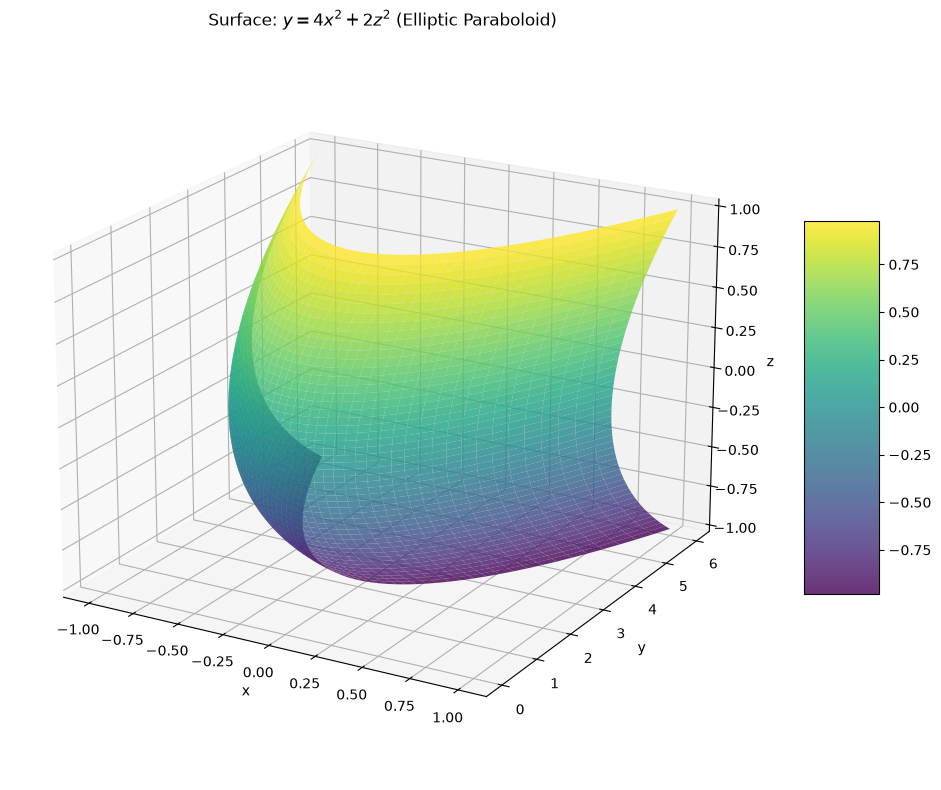
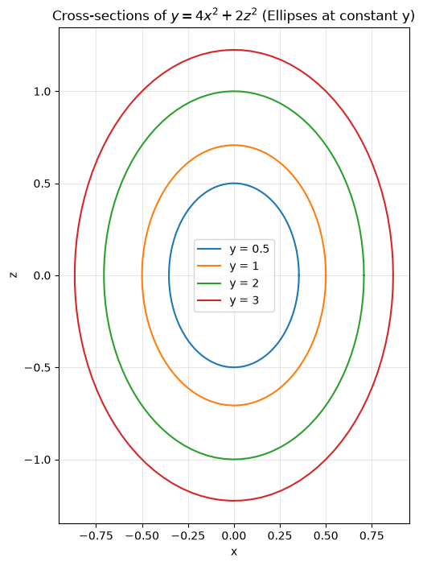
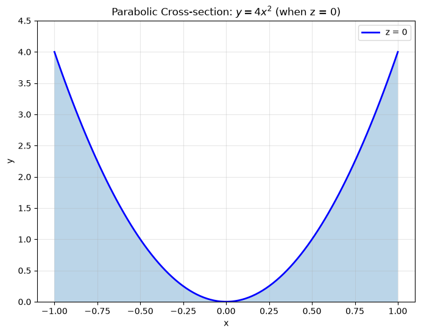
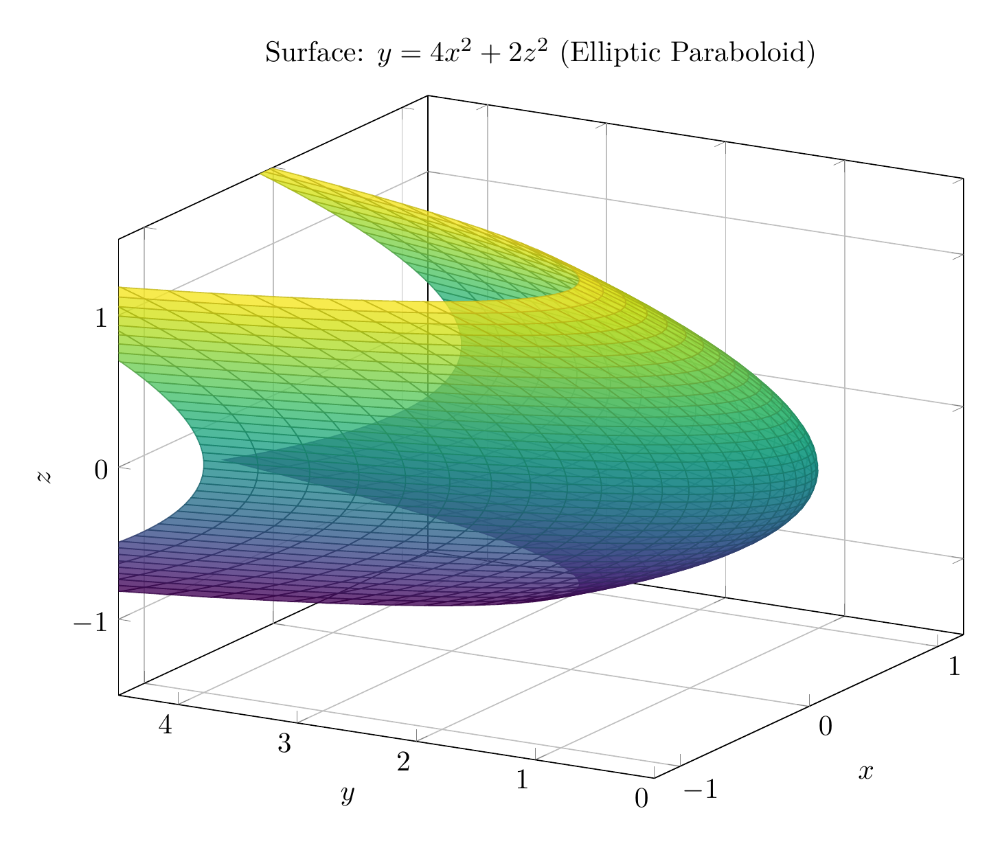
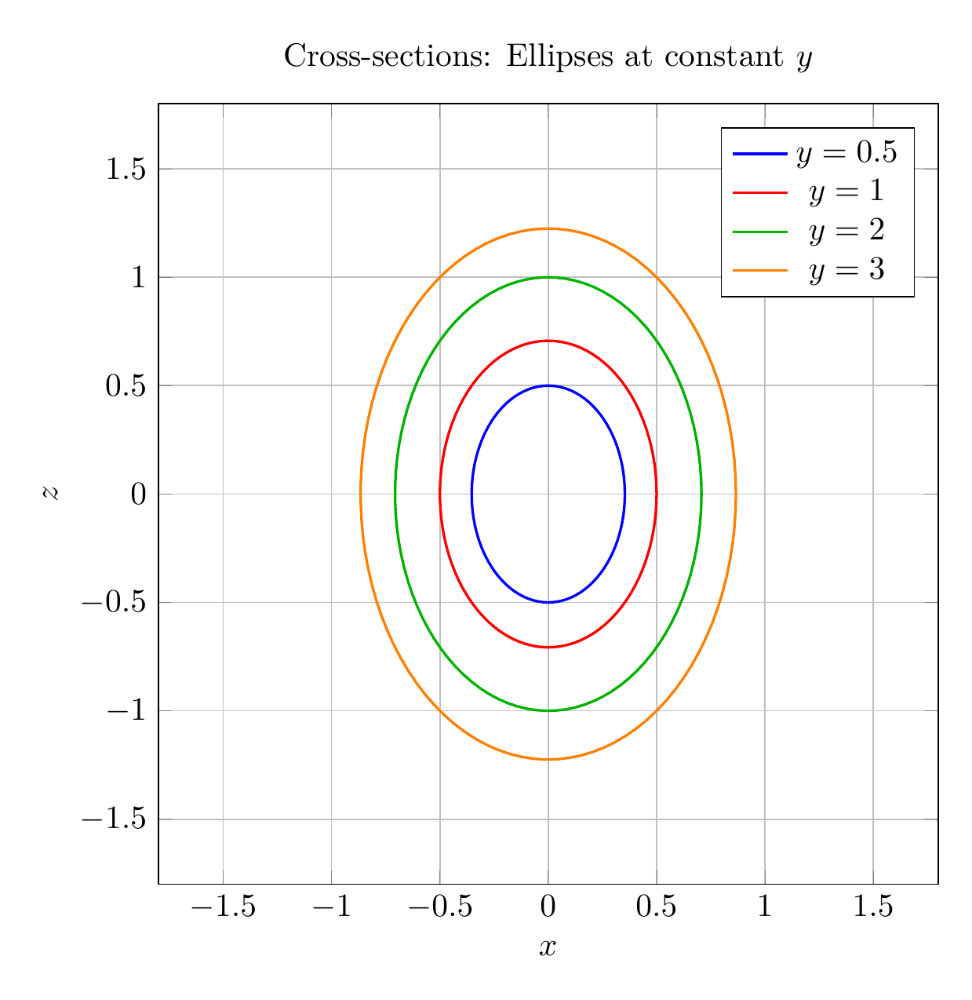
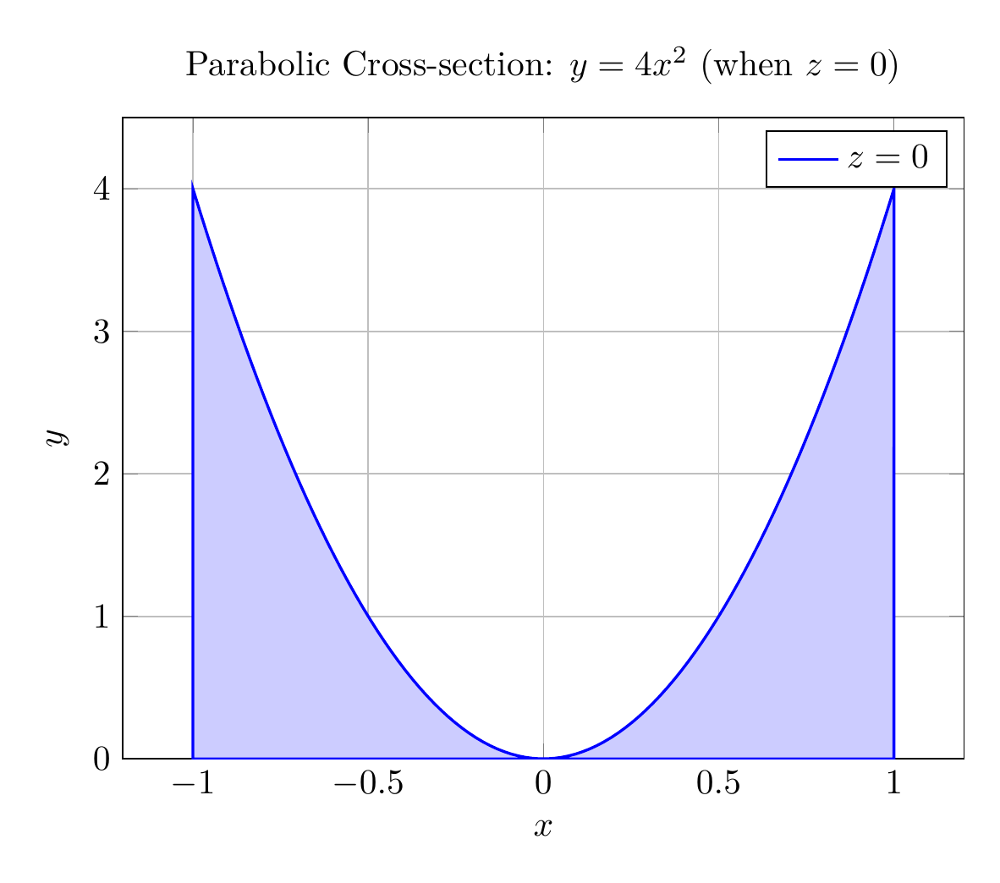

`[ Begin message. Type: AIMessage. ]`

# Solution: Reducing and Classifying the Quadric Surface

## Problem
Reduce the equation to one of the standard forms, classify the surface, and sketch it:
$$4x^2 - y + 2z^2 = 0$$

## Step 1: Reduce to Standard Form

Starting with the given equation:
$$4x^2 - y + 2z^2 = 0$$

Solve for $y$:
$$y = 4x^2 + 2z^2$$

To express this in standard form, divide both sides by appropriate constants. The standard form of an **elliptic paraboloid** is:
$$\frac{y}{c} = \frac{x^2}{a^2} + \frac{z^2}{b^2}$$

Rewriting our equation:
$$y = 4x^2 + 2z^2$$

$$\frac{y}{1} = \frac{x^2}{1/4} + \frac{z^2}{1/2}$$

Or equivalently:
$$\boxed{y = \frac{x^2}{(1/2)^2} + \frac{z^2}{(1/\sqrt{2})^2}}$$

This is the **standard form** of an elliptic paraboloid opening in the positive $y$-direction.

## Step 2: Classify the Surface

The surface is an **elliptic paraboloid** because:
- The equation has the form $y = Ax^2 + Bz^2$ where $A, B > 0$
- Cross-sections parallel to the $xz$-plane (constant $y$) are ellipses
- Cross-sections in the $xy$-plane ($z = 0$) and $yz$-plane ($x = 0$) are parabolas
- The vertex is at the origin $(0, 0, 0)$
- The axis of symmetry is the $y$-axis

## Step 3: Key Features for Sketching

1. **Vertex**: $(0, 0, 0)$
2. **Axis**: The $y$-axis (the paraboloid opens in the positive $y$-direction)
3. **Cross-sections**:
   - At $y = c > 0$: Ellipses $\frac{x^2}{c/4} + \frac{z^2}{c/2} = 1$
   - At $z = 0$: Parabola $y = 4x^2$
   - At $x = 0$: Parabola $y = 2z^2$

The elliptic cross-sections become larger as $y$ increases, and the surface extends infinitely in the positive $y$-direction.

$\boxed{\text{Elliptic Paraboloid: } y = 4x^2 + 2z^2}$

---


(Image `20260823_213437_021673_utc_0800_pyplot_0.png`. Alt text: pyplot-generated plot.)



(Image `20260823_213437_021673_utc_0800_pyplot_1.png`. Alt text: pyplot-generated plot.)



(Image `20260823_213437_021673_utc_0800_pyplot_2.png`. Alt text: pyplot-generated plot.)




---

[PGFplots / tikz plot.](./20260823_213437_021673_utc_0800_pgfplots_0.tex)

```latex
\documentclass[border=10pt]{standalone}
\usepackage{pgfplots}
\pgfplotsset{compat=1.18}
\usepgfplotslibrary{colormaps}

\begin{document}
\begin{tikzpicture}
\begin{axis}[
    width=12cm,
    height=10cm,
    xlabel=$x$,
    ylabel=$y$,
    zlabel=$z$,
    title={Surface: $y = 4x^2 + 2z^2$ (Elliptic Paraboloid)},
    view={-60}{20},
    colormap/viridis,
    grid=major,
    zmin=-1.5,
    zmax=1.5,
    xmin=-1.2,
    xmax=1.2,
    ymin=0,
    ymax=4.5,
]
\addplot3[
    surf,
    domain=-1:1,
    y domain=-1:1,
    samples=40,
    samples y=40,
    opacity=0.8,
] ({x}, {4*x^2 + 2*y^2}, {y});
\end{axis}
\end{tikzpicture}
\end{document}
```


(Image `20260823_213437_021673_utc_0800_pgfplots_0.png`. Alt text: PGFplots / tikz plot (converted to PNG).)




[PGFplots / tikz plot.](./20260823_213437_021673_utc_0800_pgfplots_1.tex)

```latex
\documentclass[border=10pt]{standalone}
\usepackage{pgfplots}
\pgfplotsset{compat=1.18}

\begin{document}
\begin{tikzpicture}
\begin{axis}[
    width=10cm,
    height=10cm,
    xlabel=$x$,
    ylabel=$z$,
    title={Cross-sections: Ellipses at constant $y$},
    axis equal,
    grid=major,
    xmin=-1.2,
    xmax=1.2,
    ymin=-1.8,
    ymax=1.8,
    legend pos=north east,
]
% y = 0.5
\addplot[domain=0:360, samples=100, blue, thick] ({sqrt(0.5/4)*cos(x)}, {sqrt(0.5/2)*sin(x)});
\addlegendentry{$y = 0.5$}

% y = 1
\addplot[domain=0:360, samples=100, red, thick] ({sqrt(1/4)*cos(x)}, {sqrt(1/2)*sin(x)});
\addlegendentry{$y = 1$}

% y = 2
\addplot[domain=0:360, samples=100, green!70!black, thick] ({sqrt(2/4)*cos(x)}, {sqrt(2/2)*sin(x)});
\addlegendentry{$y = 2$}

% y = 3
\addplot[domain=0:360, samples=100, orange, thick] ({sqrt(3/4)*cos(x)}, {sqrt(3/2)*sin(x)});
\addlegendentry{$y = 3$}
\end{axis}
\end{tikzpicture}
\end{document}
```


(Image `20260823_213437_021673_utc_0800_pgfplots_1.png`. Alt text: PGFplots / tikz plot (converted to PNG).)




[PGFplots / tikz plot.](./20260823_213437_021673_utc_0800_pgfplots_2.tex)

```latex
\documentclass[border=10pt]{standalone}
\usepackage{pgfplots}
\pgfplotsset{compat=1.18}

\begin{document}
\begin{tikzpicture}
\begin{axis}[
    width=10cm,
    height=8cm,
    xlabel=$x$,
    ylabel=$y$,
    title={Parabolic Cross-section: $y = 4x^2$ (when $z = 0$)},
    grid=major,
    domain=-1:1,
    samples=100,
    ymin=0,
    ymax=4.5,
]
\addplot[blue, thick, fill=blue!20] {4*x^2} \closedcycle;
\addlegendentry{$z = 0$}
\end{axis}
\end{tikzpicture}
\end{document}
```


(Image `20260823_213437_021673_utc_0800_pgfplots_2.png`. Alt text: PGFplots / tikz plot (converted to PNG).)



`[ End message. Type: AIMessage. ]`