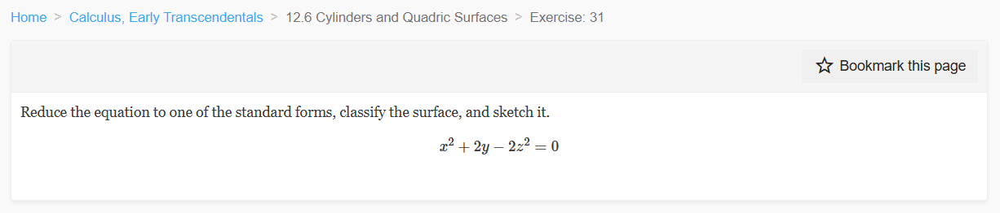
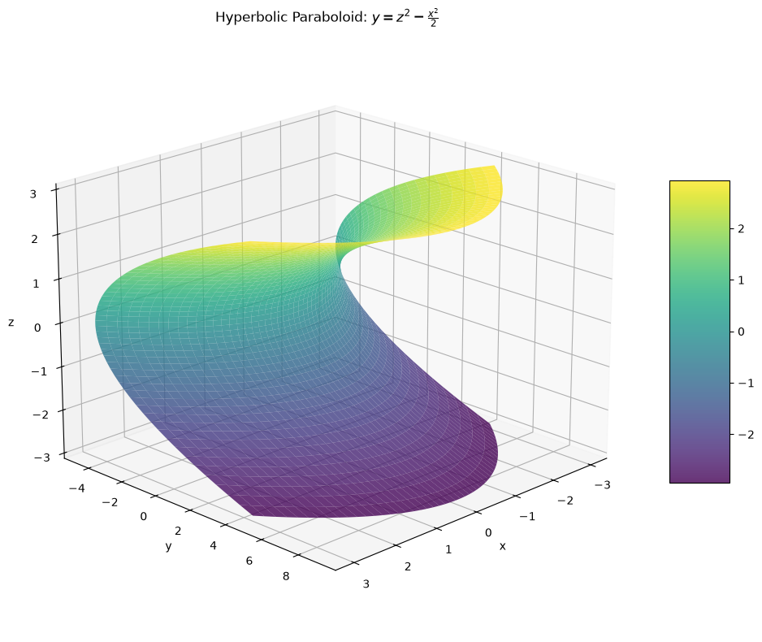
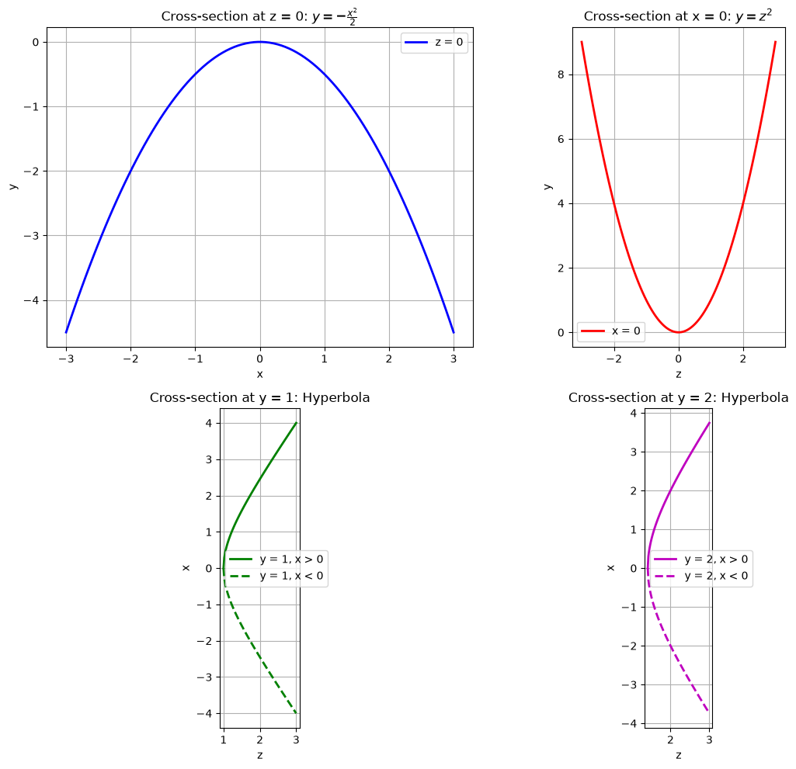
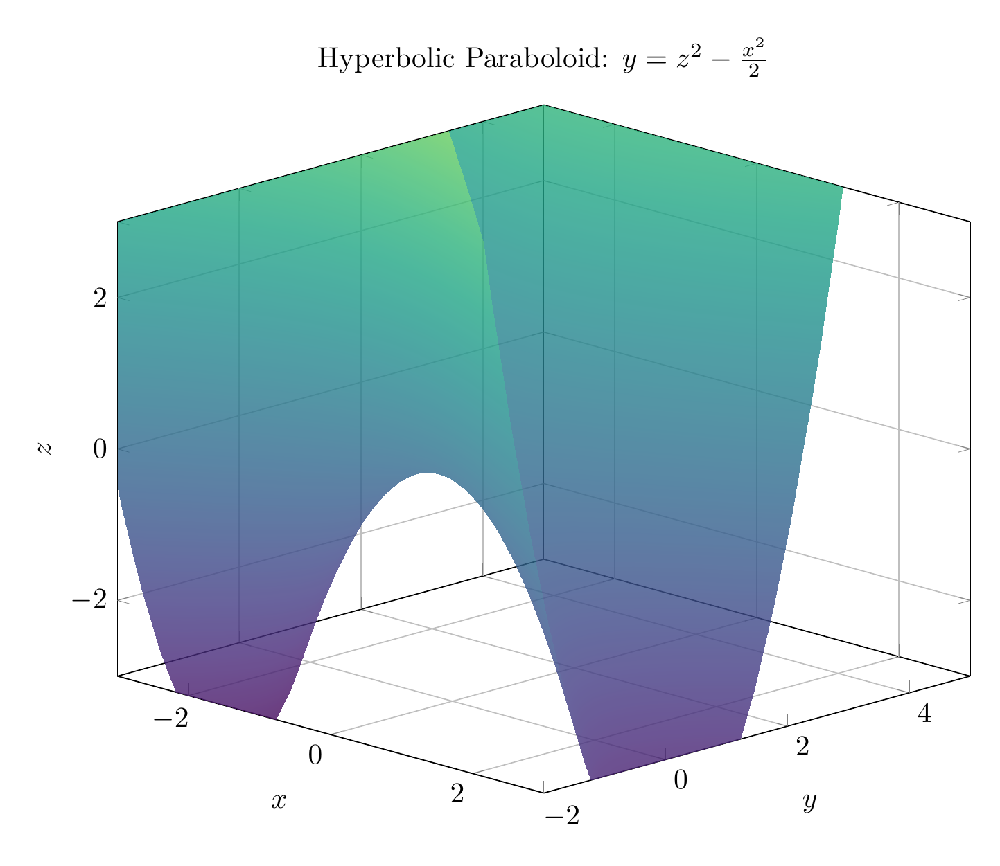
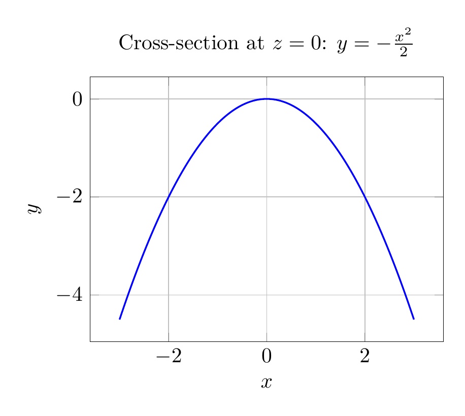

`[ Begin message. Type: HumanMessage. ]`

`[Begin Problem]`

Please solve the math problem in the image.


(Image `problem.png`. Alt text: Problem.)



`[End Problem]`

`[ End message. Type: HumanMessage. ]`

`[ Begin message. Type: AIMessage. ]`

`[Begin Answer]`

# Solution: Reducing and Classifying the Quadric Surface

## Problem
Reduce the equation to one of the standard forms, classify the surface, and sketch it:
$$x^2 + 2y - 2z^2 = 0$$

## Step 1: Reduce to Standard Form

Starting with the given equation:
$$x^2 + 2y - 2z^2 = 0$$

Solve for $y$:
$$2y = 2z^2 - x^2$$
$$y = z^2 - \frac{x^2}{2}$$

This is the **standard form** of the equation.

## Step 2: Classify the Surface

The equation $y = z^2 - \frac{x^2}{2}$ matches the standard form of a **hyperbolic paraboloid**:

$$\frac{y}{c} = \frac{z^2}{b^2} - \frac{x^2}{a^2}$$

where:
- $c = 1$
- $b = 1$
- $a = \sqrt{2}$

**Classification: Hyperbolic Paraboloid**

A hyperbolic paraboloid is a saddle-shaped surface that opens upward along one axis and downward along another. It's sometimes called a "saddle surface."

## Step 3: Analyze Cross-Sections

To understand the surface better, let's examine its traces:

### Traces in coordinate planes:

1. **When $z = 0$** (trace in $xy$-plane):
   $$y = -\frac{x^2}{2}$$
   This is a **parabola** opening downward.

2. **When $x = 0$** (trace in $yz$-plane):
   $$y = z^2$$
   This is a **parabola** opening upward.

3. **When $y = k$** (horizontal traces):
   $$k = z^2 - \frac{x^2}{2}$$
   $$\frac{x^2}{2} - z^2 = -k$$
   These are **hyperbolas** for $k \neq 0$.

## Key Characteristics

- **Axis**: The $y$-axis is the axis of the paraboloid
- **Vertex**: At the origin $(0, 0, 0)$
- **Shape**: Saddle-shaped (opens up in $z$-direction, down in $x$-direction)
- **Symmetry**: Symmetric with respect to the $yz$-plane and $xy$-plane

## Final Answer

$\boxed{\text{Standard form: } y = z^2 - \frac{x^2}{2}, \quad \text{Surface: Hyperbolic Paraboloid}}$

The plots above show:
1. The 3D surface visualization
2. Cross-sectional traces demonstrating the parabolic and hyperbolic nature of the surface

---


(Image `20260825_023500_570664_utc_0800_pyplot_0.png`. Alt text: pyplot-generated plot.)



(Image `20260825_023500_570664_utc_0800_pyplot_1.png`. Alt text: pyplot-generated plot.)




---

[PGFplots / tikz plot.](./20260825_023500_570664_utc_0800_pgfplots_0.tex)

```latex
\documentclass[border=10pt]{standalone}
\usepackage{pgfplots}
\usepgfplotslibrary{colormaps}
\pgfplotsset{compat=1.18}

\begin{document}
\begin{tikzpicture}
\begin{axis}[
    xlabel=$x$,
    ylabel=$y$,
    zlabel=$z$,
    title={Hyperbolic Paraboloid: $y = z^2 - \frac{x^2}{2}$},
    view={45}{20},
    colormap/viridis,
    width=12cm,
    height=10cm,
    grid=major,
    zmin=-3, zmax=3,
    xmin=-3, xmax=3,
    ymin=-2, ymax=5,
]
\addplot3[
    surf,
    shader=interp,
    domain=-3:3,
    y domain=-3:3,
    samples=40,
    opacity=0.8
] {y^2 - x^2/2};
\end{axis}
\end{tikzpicture}
\end{document}
```


(Image `20260825_023500_570664_utc_0800_pgfplots_0.png`. Alt text: PGFplots / tikz plot (converted to PNG).)




[PGFplots / tikz plot.](./20260825_023500_570664_utc_0800_pgfplots_1.tex)

```latex
\documentclass[border=10pt]{standalone}
\usepackage{pgfplots}
\pgfplotsset{compat=1.18}

\begin{document}
\begin{tikzpicture}
\begin{axis}[
    xlabel={$x$},
    ylabel={$y$},
    title={Cross-section at $z = 0$: $y = -\frac{x^2}{2}$},
    domain=-3:3,
    samples=100,
    width=8cm,
    height=6cm,
    grid=major,
    axis equal image,
]
\addplot[blue, thick, smooth] {-x^2/2};
\end{axis}
\end{tikzpicture}
\end{document}
```


(Image `20260825_023500_570664_utc_0800_pgfplots_1.png`. Alt text: PGFplots / tikz plot (converted to PNG).)



`[End Answer]`

`[ End message. Type: AIMessage. ]`