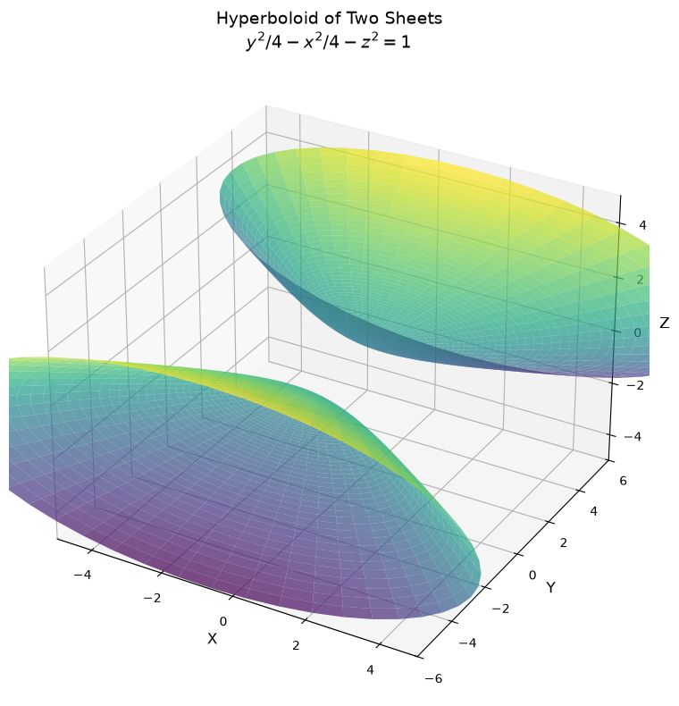
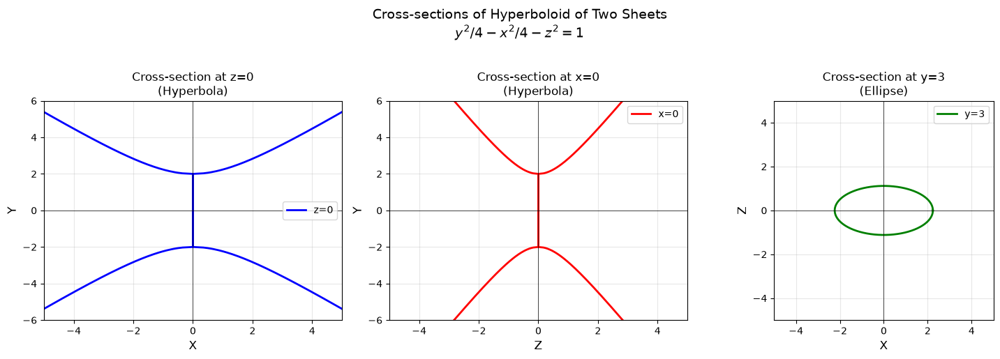
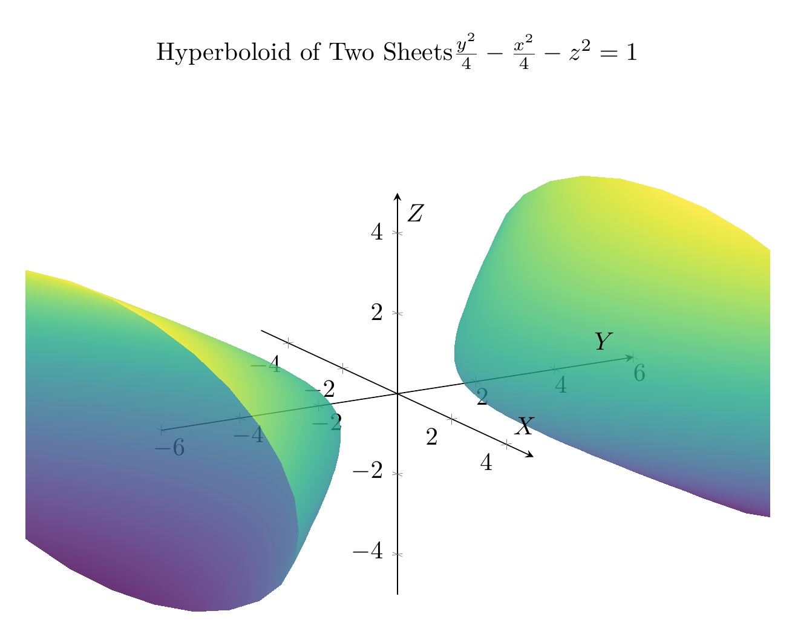
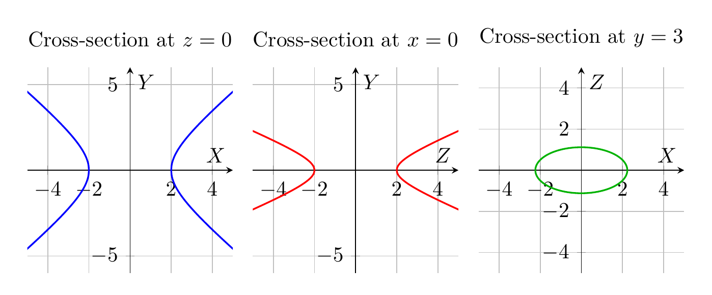

`[ Begin message. Type: HumanMessage. ]`

`[Begin Problem]`

Please solve the math problem in the image.


(Image `problem.png`. Alt text: Problem.)


`[End Problem]`

`[ End message. Type: HumanMessage. ]`

`[ Begin message. Type: AIMessage. ]`

`[Begin Answer]`

# Solution: Reducing and Classifying the Quadric Surface

## Problem
Reduce the equation to one of the standard forms, classify the surface, and sketch it:
$$y^2 = x^2 + 4z^2 + 4$$

## Step 1: Reduce to Standard Form

Starting with the given equation:
$$y^2 = x^2 + 4z^2 + 4$$

Rearrange all terms to one side:
$$y^2 - x^2 - 4z^2 = 4$$

Divide both sides by 4 to obtain the standard form:
$$\frac{y^2}{4} - \frac{x^2}{4} - \frac{4z^2}{4} = 1$$

$$\boxed{\frac{y^2}{4} - \frac{x^2}{4} - z^2 = 1}$$

Or written with explicit denominators:
$$\frac{y^2}{2^2} - \frac{x^2}{2^2} - \frac{z^2}{1^2} = 1$$

## Step 2: Classify the Surface

**Classification: Hyperboloid of Two Sheets**

### Reasoning:
The standard form $\frac{y^2}{a^2} - \frac{x^2}{b^2} - \frac{z^2}{c^2} = 1$ with one positive term and two negative terms identifies this as a **hyperboloid of two sheets**.

### Key Features:
- **Center**: $(0, 0, 0)$
- **Axis of symmetry**: $y$-axis (the variable with positive coefficient)
- **Vertices**: $(0, \pm 2, 0)$ - found by setting $x = z = 0$
- **Domain**: The surface exists only when $|y| \geq 2$
- **Two separate sheets**: One for $y \geq 2$ and one for $y \leq -2$

### Cross-sections:
1. **In the $xy$-plane** ($z = 0$): $\frac{y^2}{4} - \frac{x^2}{4} = 1$ → Hyperbola
2. **In the $yz$-plane** ($x = 0$): $\frac{y^2}{4} - z^2 = 1$ → Hyperbola  
3. **In planes parallel to $xz$-plane** ($y = k$, $|k| > 2$): Ellipses

## Step 3: Visualizations

The plots show:

**3D Plot (top figure)**: The complete hyperboloid of two sheets with:
- Upper sheet opening upward along the positive $y$-axis (starting at $y = 2$)
- Lower sheet opening downward along the negative $y$-axis (starting at $y = -2$)
- The two sheets are disconnected, with a gap between $y = -2$ and $y = 2$

**2D Cross-sections (bottom figure)**:
- **Left**: Cross-section at $z = 0$ showing a hyperbola in the $xy$-plane
- **Center**: Cross-section at $x = 0$ showing a hyperbola in the $yz$-plane
- **Right**: Cross-section at $y = 3$ showing an ellipse in the $xz$-plane

These cross-sections confirm the hyperboloid structure: hyperbolas in vertical planes and ellipses in horizontal planes.

$\boxed{\text{Hyperboloid of Two Sheets}, \frac{y^2}{4} - \frac{x^2}{4} - z^2 = 1}$

---


(Image `20260823_213513_307735_utc_0800_pyplot_0.png`. Alt text: pyplot-generated plot.)



(Image `20260823_213513_307735_utc_0800_pyplot_1.png`. Alt text: pyplot-generated plot.)




---

[PGFplots / tikz plot.](./20260823_213513_307735_utc_0800_pgfplots_0.tex)

```latex
\documentclass[border=10pt]{standalone}
\usepackage{pgfplots}
\pgfplotsset{compat=1.18}
\usepgfplotslibrary{colormaps}

\begin{document}
\begin{tikzpicture}
\begin{axis}[
    width=12cm,
    height=10cm,
    xlabel={$X$},
    ylabel={$Y$},
    zlabel={$Z$},
    title={Hyperboloid of Two Sheets \\ $\frac{y^2}{4} - \frac{x^2}{4} - z^2 = 1$},
    view={60}{20},
    grid=none,
    axis lines=center,
    enlargelimits=false,
    colormap/viridis,
    z buffer=sort,
    xmin=-5, xmax=5,
    ymin=-6, ymax=6,
    zmin=-5, zmax=5,
]

% Upper sheet
\addplot3[
    surf,
    domain=0:2,
    y domain=0:360,
    samples=30,
    samples y=30,
    opacity=0.8,
    shader=interp,
] ({2*sinh(x)*cos(y)}, {2*cosh(x)}, {sinh(x)*sin(y)});

% Lower sheet
\addplot3[
    surf,
    domain=0:2,
    y domain=0:360,
    samples=30,
    samples y=30,
    opacity=0.8,
    shader=interp,
] ({2*sinh(x)*cos(y)}, {-2*cosh(x)}, {sinh(x)*sin(y)});

\end{axis}
\end{tikzpicture}
\end{document}
```


(Image `20260823_213513_307735_utc_0800_pgfplots_0.png`. Alt text: PGFplots / tikz plot (converted to PNG).)




[PGFplots / tikz plot.](./20260823_213513_307735_utc_0800_pgfplots_1.tex)

```latex
\documentclass[border=10pt]{standalone}
\usepackage{pgfplots}
\pgfplotsset{compat=1.18}

\begin{document}
\begin{tikzpicture}
\begin{axis}[
    width=5cm,
    height=5cm,
    xlabel={$X$},
    ylabel={$Y$},
    title={Cross-section at $z=0$},
    grid=both,
    axis lines=center,
    xmin=-5, xmax=5,
    ymin=-6, ymax=6,
    domain=-6:6,
    samples=200,
]

% Hyperbola branches: x = ±sqrt(y^2 - 4)
\addplot[blue, thick, domain=2:6] {sqrt(x^2 - 4)};
\addplot[blue, thick, domain=2:6] {-sqrt(x^2 - 4)};
\addplot[blue, thick, domain=-6:-2] {sqrt(x^2 - 4)};
\addplot[blue, thick, domain=-6:-2] {-sqrt(x^2 - 4)};

\end{axis}
\end{tikzpicture}

\begin{tikzpicture}
\begin{axis}[
    width=5cm,
    height=5cm,
    xlabel={$Z$},
    ylabel={$Y$},
    title={Cross-section at $x=0$},
    grid=both,
    axis lines=center,
    xmin=-5, xmax=5,
    ymin=-6, ymax=6,
    domain=-6:6,
    samples=200,
]

% Hyperbola: z = ±sqrt(y^2/4 - 1)
\addplot[red, thick, domain=2:6] {sqrt(x^2/4 - 1)};
\addplot[red, thick, domain=2:6] {-sqrt(x^2/4 - 1)};
\addplot[red, thick, domain=-6:-2] {sqrt(x^2/4 - 1)};
\addplot[red, thick, domain=-6:-2] {-sqrt(x^2/4 - 1)};

\end{axis}
\end{tikzpicture}

\begin{tikzpicture}
\begin{axis}[
    width=5cm,
    height=5cm,
    xlabel={$X$},
    ylabel={$Z$},
    title={Cross-section at $y=3$},
    grid=both,
    axis lines=center,
    xmin=-5, xmax=5,
    ymin=-5, ymax=5,
    domain=0:360,
    samples=200,
    axis equal,
]

% Ellipse: x^2/5 + z^2/(5/4) = 1
\addplot[green!70!black, thick] ({sqrt(5)*cos(x)}, {sqrt(5/4)*sin(x)});

\end{axis}
\end{tikzpicture}
\end{document}
```


(Image `20260823_213513_307735_utc_0800_pgfplots_1.png`. Alt text: PGFplots / tikz plot (converted to PNG).)



`[End Answer]`

`[ End message. Type: AIMessage. ]`