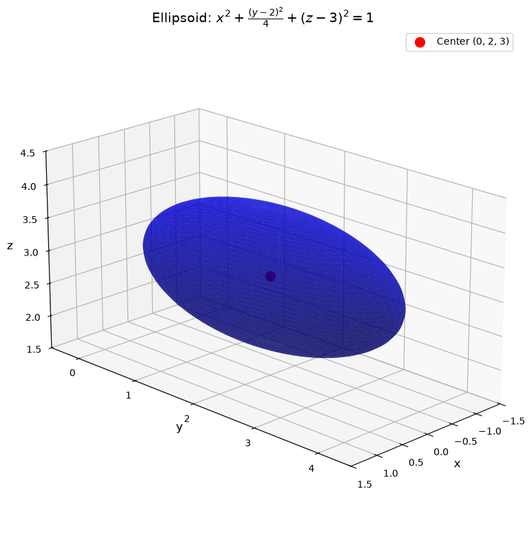
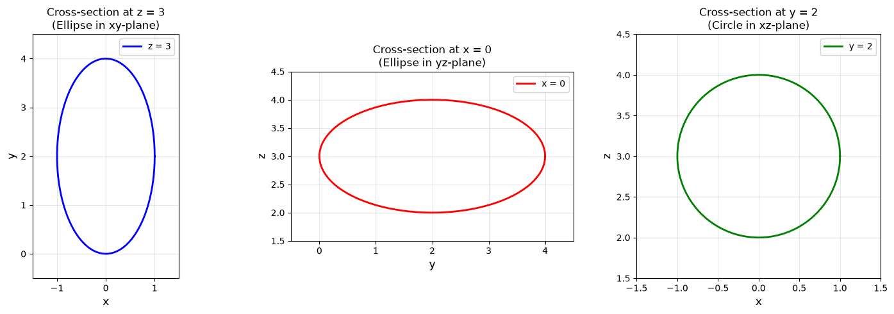
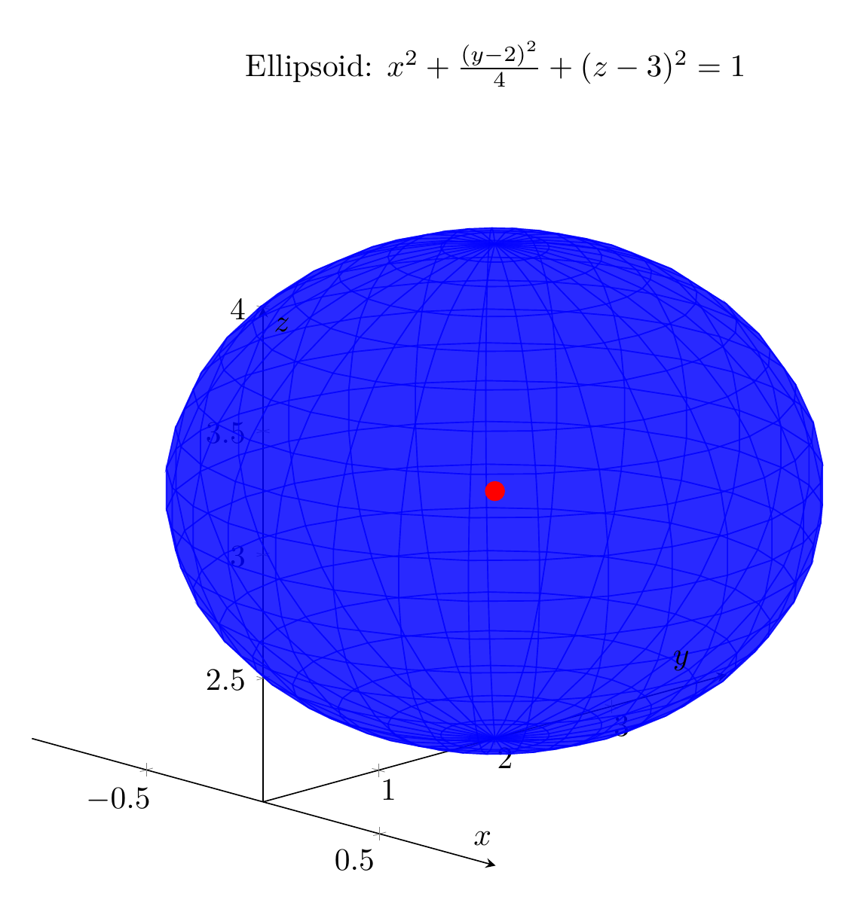
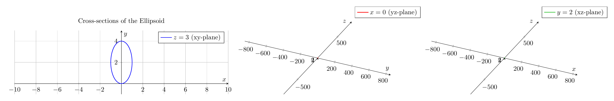

`[ Begin message. Type: AIMessage. ]`

# Solution: Classifying and Sketching the Quadric Surface

## Problem
Reduce the equation to one of the standard forms, classify the surface, and sketch it:
$$4x^2 + y^2 + 4z^2 - 4y - 24z + 36 = 0$$

## Step 1: Complete the Square

To reduce this equation to standard form, we need to complete the square for each variable.

### Group terms by variable:
$$4x^2 + (y^2 - 4y) + (4z^2 - 24z) + 36 = 0$$

### Complete the square for $y$:
$$y^2 - 4y = (y-2)^2 - 4$$

### Complete the square for $z$:
$$4z^2 - 24z = 4(z^2 - 6z) = 4[(z-3)^2 - 9] = 4(z-3)^2 - 36$$

### Substitute back into the equation:
$$4x^2 + [(y-2)^2 - 4] + [4(z-3)^2 - 36] + 36 = 0$$

### Simplify:
$$4x^2 + (y-2)^2 - 4 + 4(z-3)^2 - 36 + 36 = 0$$
$$4x^2 + (y-2)^2 + 4(z-3)^2 - 4 = 0$$
$$4x^2 + (y-2)^2 + 4(z-3)^2 = 4$$

### Divide by 4 to get standard form:
$$x^2 + \frac{(y-2)^2}{4} + (z-3)^2 = 1$$

Or written more clearly:
$$\frac{x^2}{1^2} + \frac{(y-2)^2}{2^2} + \frac{(z-3)^2}{1^2} = 1$$

## Step 2: Classify the Surface

This is the standard form of an **ellipsoid** with:
- **Center**: $(0, 2, 3)$
- **Semi-axes**: $a = 1$ (in $x$-direction), $b = 2$ (in $y$-direction), $c = 1$ (in $z$-direction)

The general form of an ellipsoid is:
$$\frac{(x-x_0)^2}{a^2} + \frac{(y-y_0)^2}{b^2} + \frac{(z-z_0)^2}{c^2} = 1$$

where $(x_0, y_0, z_0)$ is the center and $a$, $b$, $c$ are the semi-axes lengths.

## Step 3: Geometric Properties

- The ellipsoid is centered at $(0, 2, 3)$
- It extends from $x = -1$ to $x = 1$ (width of 2)
- It extends from $y = 0$ to $y = 4$ (width of 4)
- It extends from $z = 2$ to $z = 4$ (height of 2)
- Since $a = c = 1$ but $b = 2$, this is a **prolate ellipsoid** (elongated along the $y$-axis)
- Cross-sections perpendicular to the $y$-axis are circles
- Cross-sections perpendicular to the $x$ or $z$ axes are ellipses

## Key Characteristics

**Classification**: $\boxed{\text{Ellipsoid}}$

**Standard Form**: $\boxed{\frac{x^2}{1^2} + \frac{(y-2)^2}{2^2} + \frac{(z-3)^2}{1^2} = 1}$

**Center**: $\boxed{(0, 2, 3)}$

**Semi-axes**: $\boxed{a=1, \ b=2, \ c=1}$

The plots above show:
1. A 3D visualization of the ellipsoid surface
2. Cross-sections in the three principal planes, revealing the elliptical (and circular) nature of the surface

---


(Image `20260823_213515_421361_utc_0800_pyplot_0.png`. Alt text: pyplot-generated plot.)



(Image `20260823_213515_421361_utc_0800_pyplot_1.png`. Alt text: pyplot-generated plot.)




---

[PGFplots / tikz plot.](./20260823_213515_421361_utc_0800_pgfplots_0.tex)

```latex
\documentclass[border=10pt]{standalone}
\usepackage{pgfplots}
\pgfplotsset{compat=1.18}
\usepgfplotslibrary{colormaps}

\begin{document}
\begin{tikzpicture}
\begin{axis}[
    width=12cm,
    height=10cm,
    xlabel={$x$},
    ylabel={$y$},
    zlabel={$z$},
    title={Ellipsoid: $x^2 + \frac{(y-2)^2}{4} + (z-3)^2 = 1$},
    view={45}{20},
    axis lines=center,
    grid=major,
    colormap/viridis,
    z buffer=sort,
]

% Parametric ellipsoid surface
% x = cos(u)*sin(v), y = 2 + 2*sin(u)*sin(v), z = 3 + cos(v)
\addplot3[
    surf,
    opacity=0.6,
    shader=flat,
    domain=0:360,
    y domain=0:180,
    samples=30,
    samples y=20,
    blue
] ({cos(x)*sin(y)}, {2 + 2*sin(x)*sin(y)}, {3 + cos(y)});

% Center point
\addplot3[
    only marks,
    mark=*,
    mark size=3pt,
    red
] coordinates {(0, 2, 3)};

\end{axis}
\end{tikzpicture}
\end{document}
```


(Image `20260823_213515_421361_utc_0800_pgfplots_0.png`. Alt text: PGFplots / tikz plot (converted to PNG).)




[PGFplots / tikz plot.](./20260823_213515_421361_utc_0800_pgfplots_1.tex)

```latex
\documentclass[border=10pt]{standalone}
\usepackage{pgfplots}
\pgfplotsset{compat=1.18}

\begin{document}
\begin{tikzpicture}
\begin{axis}[
    width=13cm,
    height=5cm,
    axis lines=center,
    grid=major,
    xlabel={$x$},
    ylabel={$y$},
    title={Cross-sections of the Ellipsoid},
    xmin=-2, xmax=2,
    ymin=-1, ymax=5,
    axis equal,
]

% Cross-section at z=3 (in xy-plane): x^2 + (y-2)^2/4 = 1
% Parametric: x = cos(t), y = 2 + 2*sin(t)
\addplot[
    domain=0:360,
    samples=100,
    blue,
    thick
] ({cos(x)}, {2 + 2*sin(x)});
\addlegendentry{$z=3$ (xy-plane)}

\end{axis}
\end{tikzpicture}

\begin{tikzpicture}
\begin{axis}[
    width=13cm,
    height=5cm,
    axis lines=center,
    grid=major,
    xlabel={$y$},
    ylabel={$z$},
    ymin=-1, ymax=5,
    zmin=1, zmax=5,
    axis equal,
]

% Cross-section at x=0 (in yz-plane): (y-2)^2/4 + (z-3)^2 = 1
% Parametric: y = 2 + 2*cos(t), z = 3 + sin(t)
\addplot[
    domain=0:360,
    samples=100,
    red,
    thick
] ({2 + 2*cos(x)}, {3 + sin(x)});
\addlegendentry{$x=0$ (yz-plane)}

\end{axis}
\end{tikzpicture}

\begin{tikzpicture}
\begin{axis}[
    width=13cm,
    height=5cm,
    axis lines=center,
    grid=major,
    xlabel={$x$},
    ylabel={$z$},
    xmin=-2, xmax=2,
    zmin=1, zmax=5,
    axis equal,
]

% Cross-section at y=2 (in xz-plane): x^2 + (z-3)^2 = 1 (circle)
% Parametric: x = cos(t), z = 3 + sin(t)
\addplot[
    domain=0:360,
    samples=100,
    green!70!black,
    thick
] ({cos(x)}, {3 + sin(x)});
\addlegendentry{$y=2$ (xz-plane)}

\end{axis}
\end{tikzpicture}
\end{document}
```


(Image `20260823_213515_421361_utc_0800_pgfplots_1.png`. Alt text: PGFplots / tikz plot (converted to PNG).)



`[ End message. Type: AIMessage. ]`