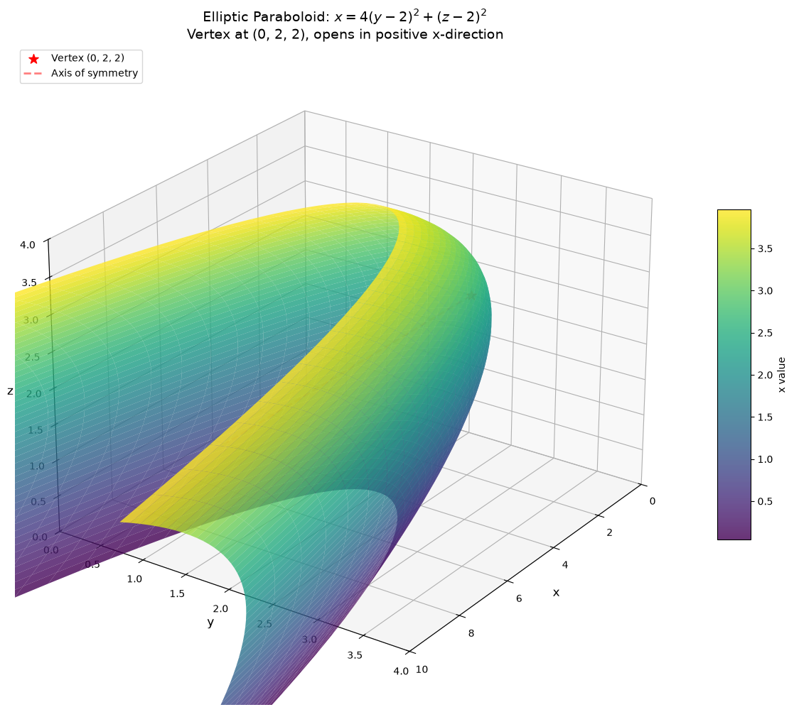
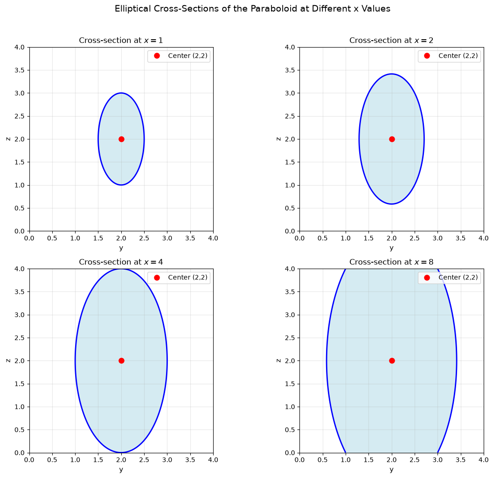
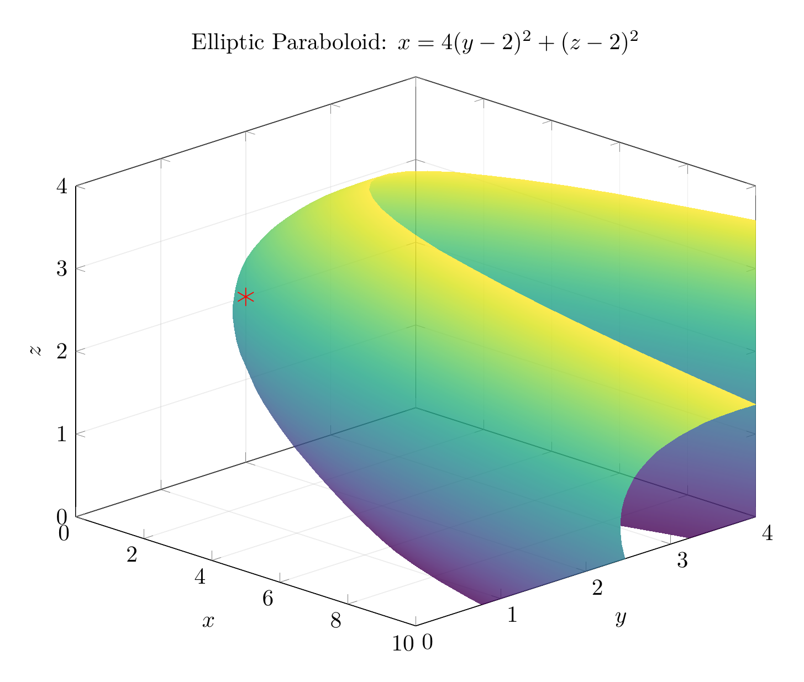
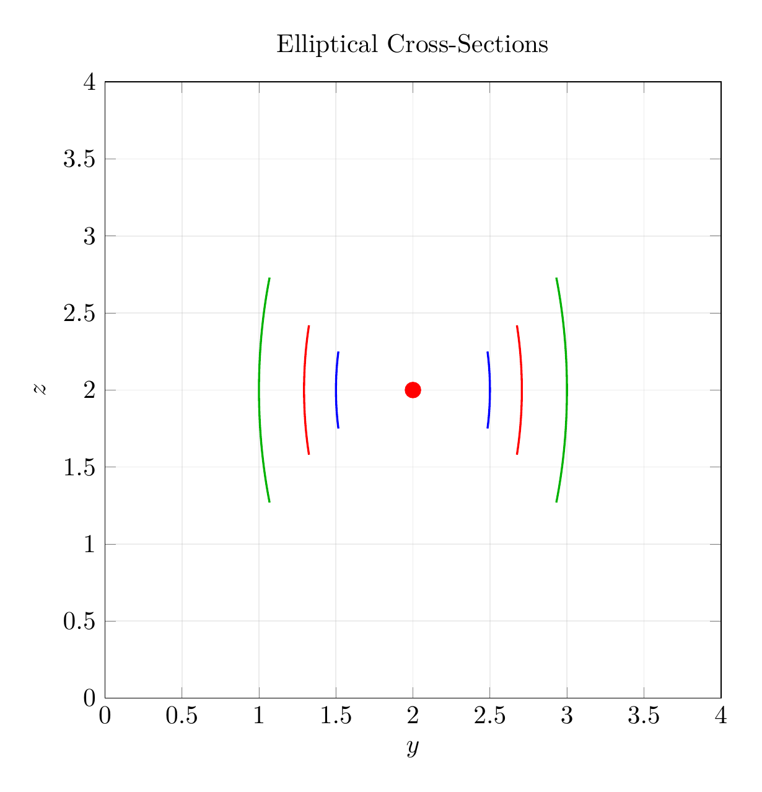

`[ Begin message. Type: HumanMessage. ]`

`[Begin Problem]`

Please solve the math problem in the image.


(Image `problem.png`. Alt text: Problem.)


`[End Problem]`

`[ End message. Type: HumanMessage. ]`

`[ Begin message. Type: AIMessage. ]`

`[Begin Answer]`

# Solution: Reducing and Classifying the Quadric Surface

## Problem
Reduce the equation to one of the standard forms, classify the surface, and sketch it:
$$4y^2 + z^2 - x - 16y - 4z + 20 = 0$$

## Step 1: Complete the Square

We need to complete the square for the $y$ and $z$ terms.

### For the $y$ terms:
$$4y^2 - 16y = 4(y^2 - 4y) = 4(y^2 - 4y + 4 - 4) = 4((y-2)^2 - 4) = 4(y-2)^2 - 16$$

### For the $z$ terms:
$$z^2 - 4z = z^2 - 4z + 4 - 4 = (z-2)^2 - 4$$

## Step 2: Substitute Back into the Original Equation

Substituting these completed squares back:
$$4(y-2)^2 - 16 + (z-2)^2 - 4 - x + 20 = 0$$

Simplifying:
$$4(y-2)^2 + (z-2)^2 - x - 20 + 20 = 0$$
$$4(y-2)^2 + (z-2)^2 - x = 0$$

## Step 3: Solve for $x$ (Standard Form)

$$\boxed{x = 4(y-2)^2 + (z-2)^2}$$

This is the **standard form** of the equation.

## Step 4: Classify the Surface

The equation $x = 4(y-2)^2 + (z-2)^2$ is in the form of an **elliptic paraboloid**.

### Key Characteristics:
- **Type**: Elliptic Paraboloid
- **Vertex**: $(0, 2, 2)$ (when $y=2$ and $z=2$, we get $x=0$)
- **Axis of symmetry**: The line $y=2, z=2$ (parallel to the $x$-axis)
- **Direction**: Opens in the positive $x$-direction
- **Cross-sections**:
  - Perpendicular to $x$-axis ($x = c > 0$): Ellipses centered at $(c, 2, 2)$
  - Perpendicular to $y$-axis: Parabolas opening in positive $x$-direction
  - Perpendicular to $z$-axis: Parabolas opening in positive $x$-direction

### Standard Form Recognition:
The general form of an elliptic paraboloid with axis parallel to the $x$-axis is:
$$x = a(y-k)^2 + b(z-h)^2 + x_0$$

where $(x_0, k, h)$ is the vertex. Our equation matches this with:
- $a = 4$
- $b = 1$
- Vertex at $(0, 2, 2)$

## Step 5: Sketch Description

The surface is an elliptic paraboloid that:
1. Has its vertex at the point $(0, 2, 2)$
2. Opens toward positive $x$-values
3. Has elliptical cross-sections perpendicular to the $x$-axis
4. The ellipses become larger as $x$ increases
5. The axis of symmetry is the line through $(0,2,2)$ parallel to the $x$-axis

The plots below show:
- **3D visualization**: The complete elliptic paraboloid surface
- **Cross-sections**: Elliptical slices at different $x$ values ($x=1, 2, 4$)
- The vertex is marked with a red asterisk at $(0, 2, 2)$

$\boxed{\text{Elliptic Paraboloid with vertex at }(0, 2, 2)\text{, opening in positive }x\text{-direction}}$

---


(Image `20260823_213605_401185_utc_0800_pyplot_0.png`. Alt text: pyplot-generated plot.)



(Image `20260823_213605_401185_utc_0800_pyplot_1.png`. Alt text: pyplot-generated plot.)




---

[PGFplots / tikz plot.](./20260823_213605_401185_utc_0800_pgfplots_0.tex)

```latex
\documentclass[border=10pt]{standalone}
\usepackage{pgfplots}
\usepgfplotslibrary{colormaps}
\pgfplotsset{compat=1.18}

\begin{document}
\begin{tikzpicture}
\begin{axis}[
    width=12cm,
    height=10cm,
    xlabel=$x$,
    ylabel=$y$,
    zlabel=$z$,
    title={Elliptic Paraboloid: $x = 4(y-2)^2 + (z-2)^2$},
    view={45}{25},
    colormap/viridis,
    grid=major,
    grid style={opacity=0.3},
    zmin=0, zmax=4,
    ymin=0, ymax=4,
    xmin=0, xmax=10,
]
\addplot3[
    surf,
    domain=0:4,
    y domain=0:4,
    samples=30,
    opacity=0.8,
    shader=interp,
] ({4*(y-2)^2 + (x-2)^2}, y, x);
% Mark vertex
\addplot3[only marks, mark=asterisk, mark size=4pt, red] coordinates {(0,2,2)};
\end{axis}
\end{tikzpicture}
\end{document}
```


(Image `20260823_213605_401185_utc_0800_pgfplots_0.png`. Alt text: PGFplots / tikz plot (converted to PNG).)




[PGFplots / tikz plot.](./20260823_213605_401185_utc_0800_pgfplots_1.tex)

```latex
\documentclass[border=10pt]{standalone}
\usepackage{pgfplots}
\pgfplotsset{compat=1.18}

\begin{document}
\begin{tikzpicture}
\begin{axis}[
    width=11cm,
    height=10cm,
    xlabel=$y$,
    ylabel=$z$,
    title={Elliptical Cross-Sections},
    axis equal image,
    grid=both,
    grid style={opacity=0.3},
    xmin=0, xmax=4,
    ymin=0, ymax=4,
]
% Cross-section at x=1: 4(y-2)^2 + (z-2)^2 = 1
\addplot[blue, thick, domain=1.75:2.25, samples=100] 
    ({2 + 0.5*sqrt(1 - (x-2)^2)}, x);
\addplot[blue, thick, domain=1.75:2.25, samples=100] 
    ({2 - 0.5*sqrt(1 - (x-2)^2)}, x);

% Cross-section at x=2: 4(y-2)^2 + (z-2)^2 = 2
\addplot[red, thick, domain=1.58:2.42, samples=100] 
    ({2 + 0.5*sqrt(2 - (x-2)^2)}, x);
\addplot[red, thick, domain=1.58:2.42, samples=100] 
    ({2 - 0.5*sqrt(2 - (x-2)^2)}, x);

% Cross-section at x=4: 4(y-2)^2 + (z-2)^2 = 4
\addplot[green!70!black, thick, domain=1.27:2.73, samples=100] 
    ({2 + 0.5*sqrt(4 - (x-2)^2)}, x);
\addplot[green!70!black, thick, domain=1.27:2.73, samples=100] 
    ({2 - 0.5*sqrt(4 - (x-2)^2)}, x);

% Mark center
\addplot[only marks, mark=*, mark size=3pt, red] coordinates {(2,2)};
\end{axis}
\end{tikzpicture}
\end{document}
```


(Image `20260823_213605_401185_utc_0800_pgfplots_1.png`. Alt text: PGFplots / tikz plot (converted to PNG).)



`[End Answer]`

`[ End message. Type: AIMessage. ]`