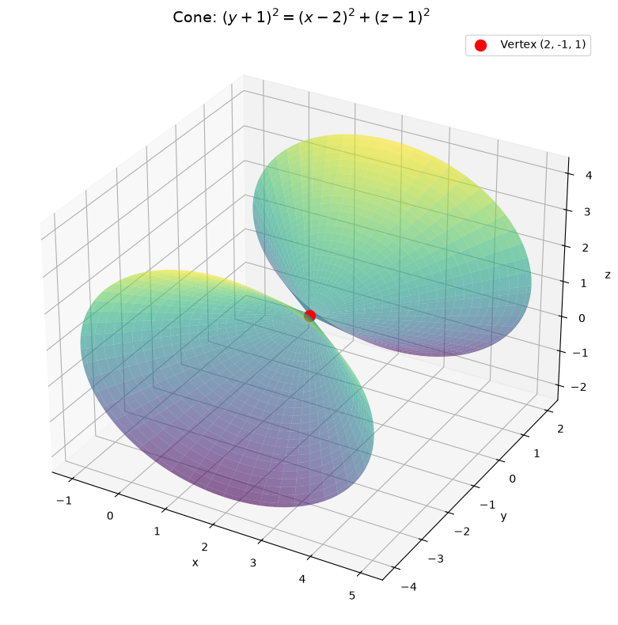
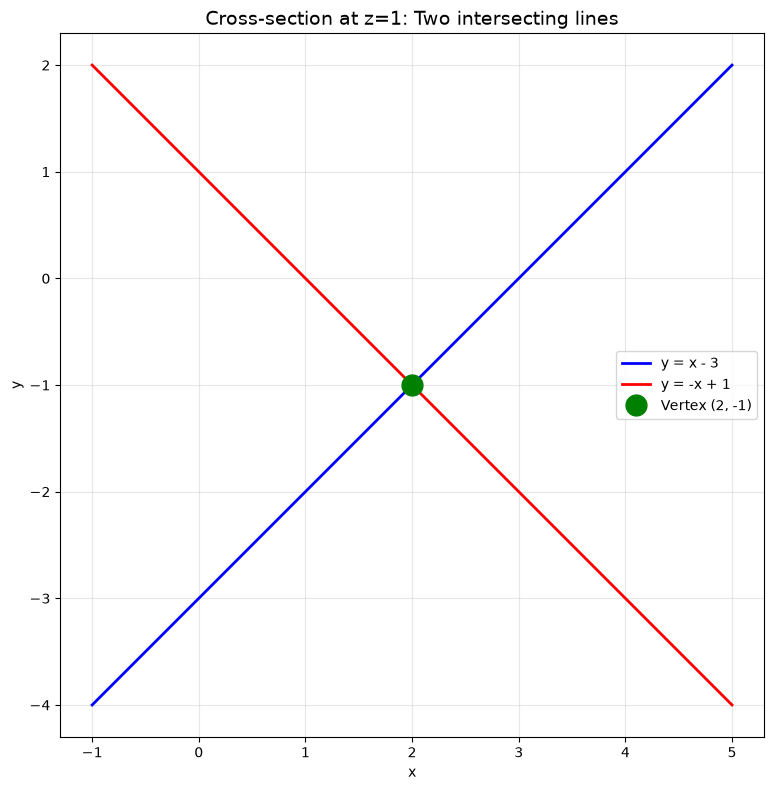
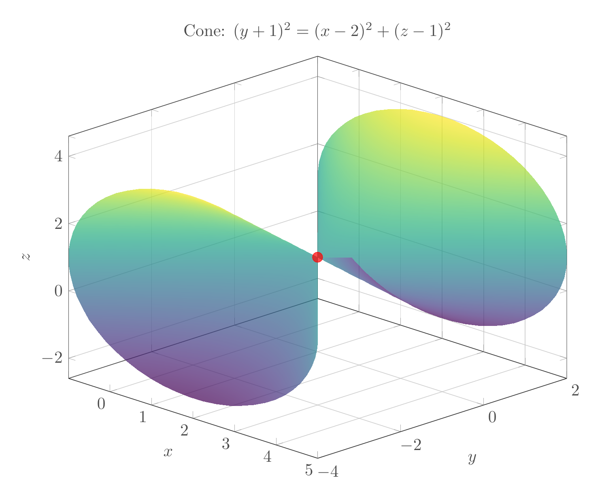
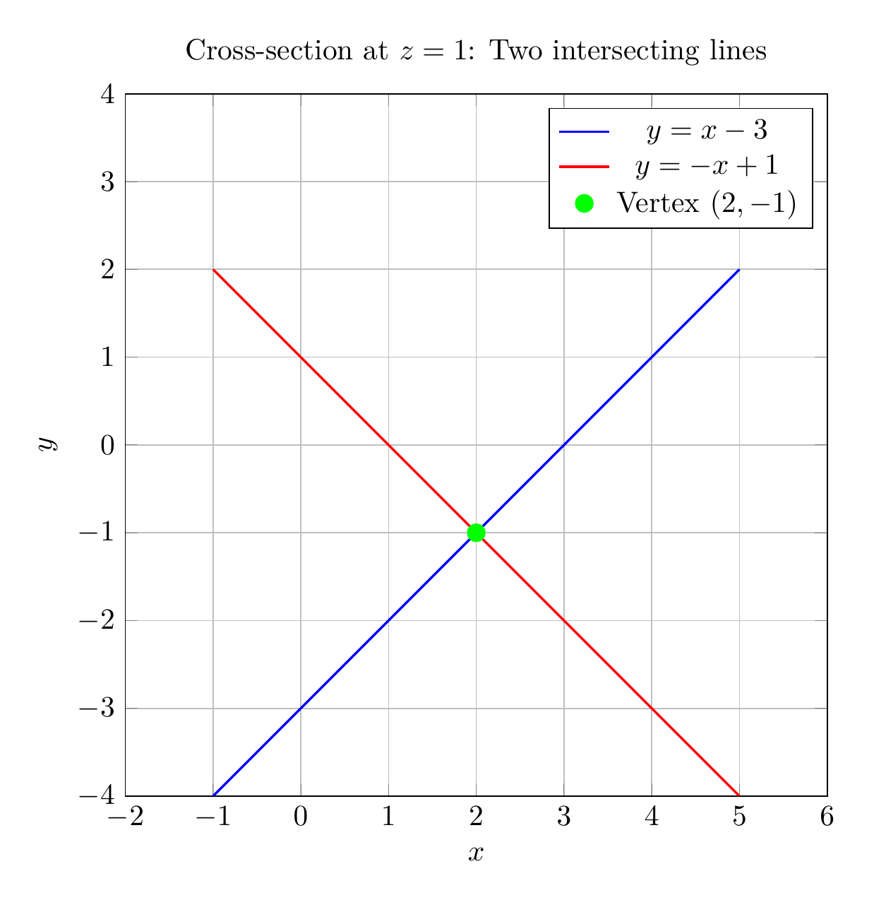

# Solution: Reducing the Equation to Standard Form

## Step 1: Complete the Square

Given equation:
$$x^2 - y^2 + z^2 - 4x - 2y - 2z + 4 = 0$$

Group terms by variable:
$$(x^2 - 4x) - (y^2 + 2y) + (z^2 - 2z) + 4 = 0$$

Complete the square for each variable:

**For $x$:**
$$x^2 - 4x = (x-2)^2 - 4$$

**For $y$:**
$$-(y^2 + 2y) = -[(y+1)^2 - 1] = -(y+1)^2 + 1$$

**For $z$:**
$$z^2 - 2z = (z-1)^2 - 1$$

Substitute back:
$$(x-2)^2 - 4 - (y+1)^2 + 1 + (z-1)^2 - 1 + 4 = 0$$

Simplify:
$$(x-2)^2 - (y+1)^2 + (z-1)^2 = 0$$

## Step 2: Standard Form

Rearrange to get the standard form:
$$(y+1)^2 = (x-2)^2 + (z-1)^2$$

## Step 3: Classification

This is the standard equation of a **cone** with:
- **Vertex**: $(2, -1, 1)$
- **Axis**: Along the $y$-direction (parallel to the $y$-axis)
- **Opening**: The cone opens in both positive and negative $y$-directions from the vertex

The general form of a cone with vertex at $(h, k, l)$ and axis along the $y$-direction is:
$$(y-k)^2 = (x-h)^2 + (z-l)^2$$

## Step 4: Geometric Interpretation

- Cross-sections perpendicular to the $y$-axis (constant $y$) are circles
- Cross-sections containing the axis (e.g., at $z=1$) are pairs of intersecting lines
- The cone has a "double-napped" structure with two parts meeting at the vertex

## Final Answer

$$\boxed{\text{Standard form: } (y+1)^2 = (x-2)^2 + (z-1)^2, \quad \text{Surface: Cone with vertex at } (2, -1, 1)}$$

---





---

[PGFplots / tikz plot.](./20260823_213513_653368_utc_0800_pgfplots_0.tex)

```latex
\documentclass[border=10pt]{standalone}
\usepackage{pgfplots}
\pgfplotsset{compat=1.18}
\usepgfplotslibrary{colormaps}

\begin{document}
\begin{tikzpicture}
\begin{axis}[
    width=12cm,
    height=10cm,
    xlabel=$x$,
    ylabel=$y$,
    zlabel=$z$,
    title={Cone: $(y+1)^2 = (x-2)^2 + (z-1)^2$},
    view={45}{25},
    grid=major,
    colormap/viridis,
    shader=interp,
    opacity=0.7,
]
% Upper cone
\addplot3[
    surf,
    domain=0:3,
    y domain=0:360,
    samples=30,
    samples y=60,
] 
({2 + x*cos(y)}, {-1 + x}, {1 + x*sin(y)});

% Lower cone
\addplot3[
    surf,
    domain=0:3,
    y domain=0:360,
    samples=30,
    samples y=60,
] 
({2 + x*cos(y)}, {-1 - x}, {1 + x*sin(y)});

% Vertex point
\addplot3[
    only marks,
    mark=*,
    mark size=3pt,
    red,
] coordinates {(2, -1, 1)};

\end{axis}
\end{tikzpicture}
\end{document}
```



[PGFplots / tikz plot.](./20260823_213513_653368_utc_0800_pgfplots_1.tex)

```latex
\documentclass[border=10pt]{standalone}
\usepackage{pgfplots}
\pgfplotsset{compat=1.18}

\begin{document}
\begin{tikzpicture}
\begin{axis}[
    width=10cm,
    height=10cm,
    xlabel=$x$,
    ylabel=$y$,
    title={Cross-section at $z=1$: Two intersecting lines},
    axis equal,
    grid=major,
    xmin=-1, xmax=5,
    ymin=-4, ymax=4,
]

% Line y = x - 3
\addplot[
    blue,
    domain=-1:5,
    thick,
] {x - 3};
\addlegendentry{$y = x - 3$}

% Line y = -x + 1
\addplot[
    red,
    domain=-1:5,
    thick,
] {-x + 1};
\addlegendentry{$y = -x + 1$}

% Vertex point
\addplot[
    only marks,
    mark=*,
    mark size=3pt,
    green,
] coordinates {(2, -1)};
\addlegendentry{Vertex $(2, -1)$}

\end{axis}
\end{tikzpicture}
\end{document}
```

