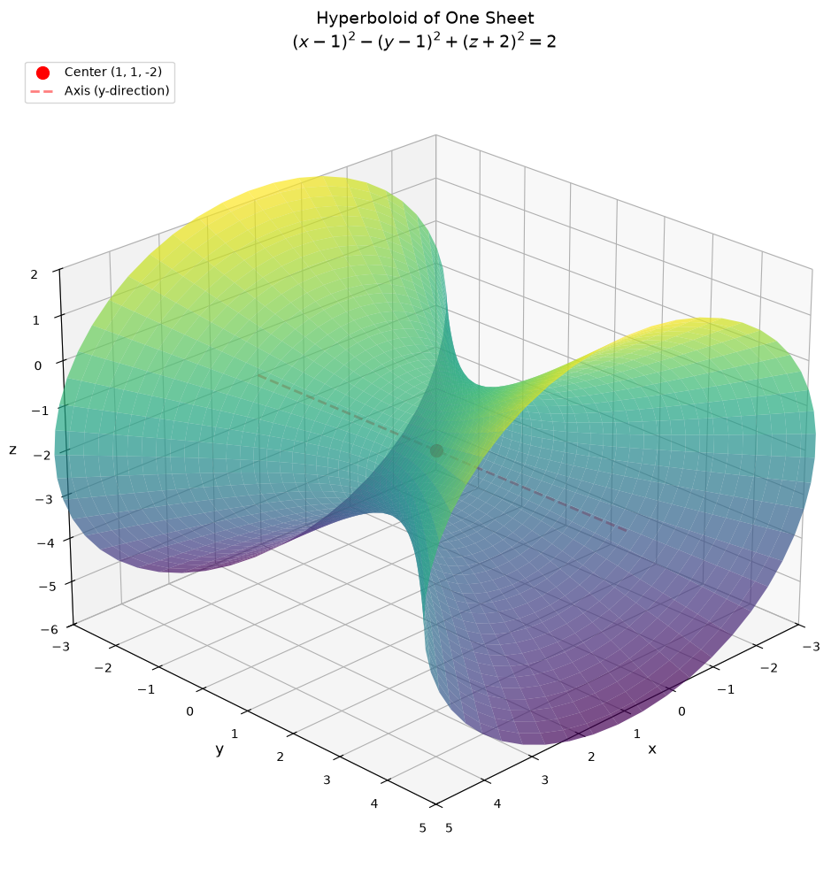
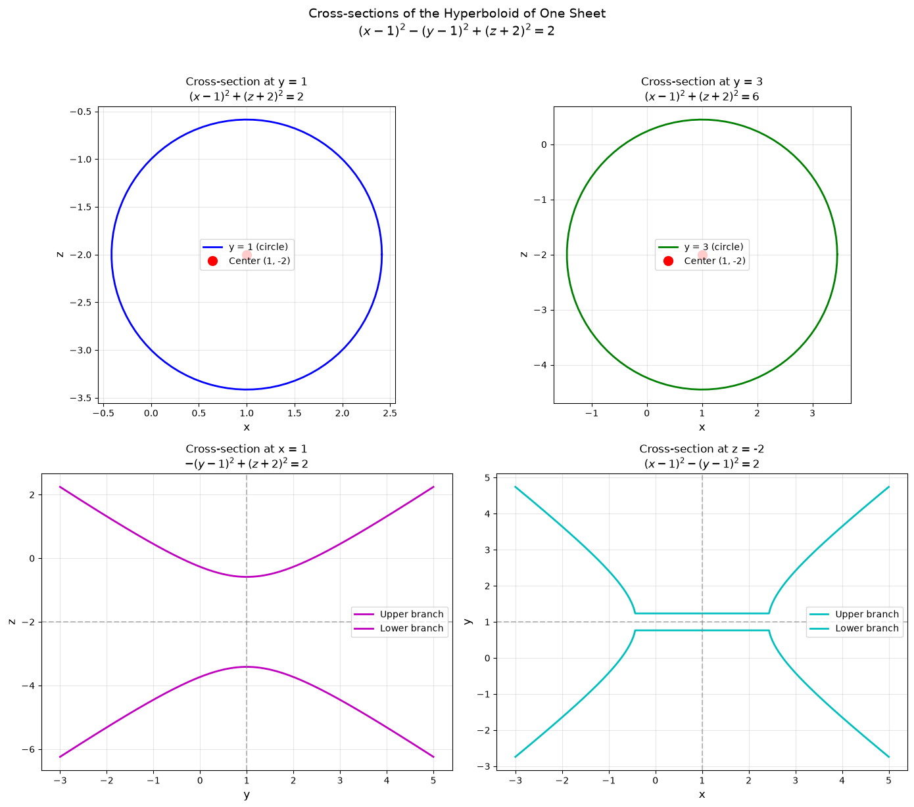
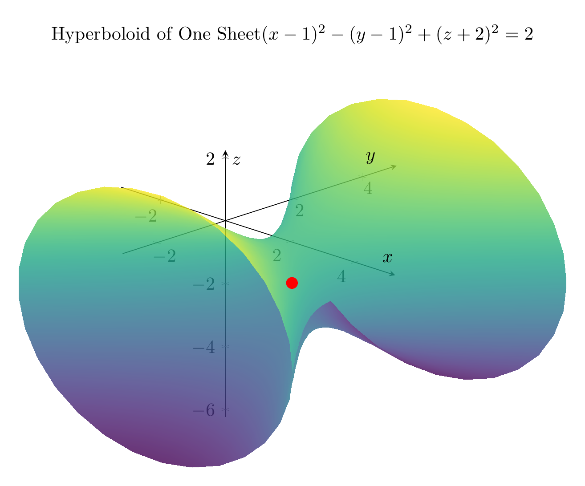
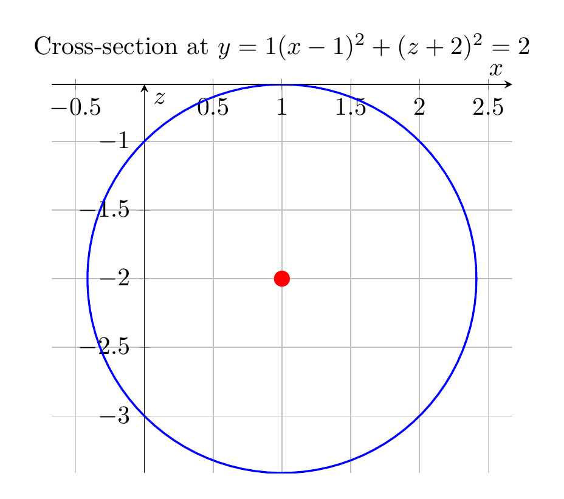

# Solution: Reducing the Equation to Standard Form

## Problem
Reduce the equation to one of the standard forms, classify the surface, and sketch it:
$$x^2 - y^2 + z^2 - 2x + 2y + 4z + 2 = 0$$

## Step 1: Complete the Square

To reduce this equation to standard form, we need to complete the square for each variable.

### For $x$ terms:
$$x^2 - 2x = (x-1)^2 - 1$$

### For $y$ terms:
$$-y^2 + 2y = -(y^2 - 2y) = -[(y-1)^2 - 1] = -(y-1)^2 + 1$$

### For $z$ terms:
$$z^2 + 4z = (z+2)^2 - 4$$

## Step 2: Substitute Back into the Original Equation

Substituting these completed squares:
$$(x-1)^2 - 1 - (y-1)^2 + 1 + (z+2)^2 - 4 + 2 = 0$$

Simplifying the constants:
$$(x-1)^2 - (y-1)^2 + (z+2)^2 - 2 = 0$$

## Step 3: Write in Standard Form

$$(x-1)^2 - (y-1)^2 + (z+2)^2 = 2$$

Dividing by 2 to get the canonical form:
$$\frac{(x-1)^2}{2} - \frac{(y-1)^2}{2} + \frac{(z+2)^2}{2} = 1$$

Or equivalently:
$$\boxed{\frac{(x-1)^2}{(\sqrt{2})^2} - \frac{(y-1)^2}{(\sqrt{2})^2} + \frac{(z+2)^2}{(\sqrt{2})^2} = 1}$$

## Step 4: Classify the Surface

This is a **hyperboloid of one sheet** with:
- **Center**: $(1, 1, -2)$
- **Axis**: The $y$-axis (the variable with the negative sign)
- **Semi-axes**: All equal to $\sqrt{2}$

### Key Characteristics:
1. **Cross-sections perpendicular to the axis** (constant $y$): Circles
2. **Cross-sections containing the axis** (constant $x$ or $z$): Hyperbolas
3. The surface is connected (one sheet) and extends infinitely along the $y$-axis

## Visual Representation

The plots show:
1. **3D visualization**: The complete hyperboloid of one sheet centered at $(1, 1, -2)$
2. **2D cross-sections**: 
   - Circular cross-sections at $y = 1$ and $y = 3$
   - Hyperbolic cross-sections at $x = 1$ and $z = -2$

The surface opens along the $y$-direction, with the "waist" (minimum cross-section) occurring at $y = 1$ where the radius is $\sqrt{2}$.

---





---

[PGFplots / tikz plot.](./20260823_213538_407428_utc_0800_pgfplots_0.tex)

```latex
\documentclass[border=10pt]{standalone}
\usepackage{pgfplots}
\pgfplotsset{compat=1.18}
\usepgfplotslibrary{colormaps}

\begin{document}
\begin{tikzpicture}
\begin{axis}[
    width=12cm,
    height=10cm,
    xlabel={$x$},
    ylabel={$y$},
    zlabel={$z$},
    title={Hyperboloid of One Sheet \\ $(x-1)^2 - (y-1)^2 + (z+2)^2 = 2$},
    view={45}{25},
    colormap/viridis,
    grid=major,
    axis lines=center,
    ]

    % Plot the hyperboloid of one sheet
    % Parametric form: x = 1 + sqrt(2+(y-1)^2)*cos(theta), z = -2 + sqrt(2+(y-1)^2)*sin(theta)
    \addplot3[
        surf,
        domain=-3:5,
        y domain=0:360,
        samples=30,
        samples y=30,
        opacity=0.8,
        shader=interp,
    ]
    ({1 + sqrt(2+(x-1)^2)*cos(y)}, {x}, {-2 + sqrt(2+(x-1)^2)*sin(y)});

    % Add center point
    \addplot3[red, only marks, mark=*, mark size=3pt] coordinates {(1,1,-2)};

\end{axis}
\end{tikzpicture}
\end{document}
```



[PGFplots / tikz plot.](./20260823_213538_407428_utc_0800_pgfplots_1.tex)

```latex
\documentclass[border=10pt]{standalone}
\usepackage{pgfplots}
\pgfplotsset{compat=1.18}

\begin{document}

% Cross-section 1: y = 1 (circle in xz-plane)
\begin{tikzpicture}
\begin{axis}[
    width=8cm,
    height=7cm,
    xlabel={$x$},
    ylabel={$z$},
    title={Cross-section at $y = 1$ \\ $(x-1)^2 + (z+2)^2 = 2$},
    axis equal,
    grid=major,
    axis lines=center,
    ]
    \addplot[blue, thick, domain=0:360, samples=100] 
        ({1 + sqrt(2)*cos(x)}, {-2 + sqrt(2)*sin(x)});
    \addplot[red, only marks, mark=*, mark size=3pt] coordinates {(1,-2)};
\end{axis}
\end{tikzpicture}

\end{document}
```

