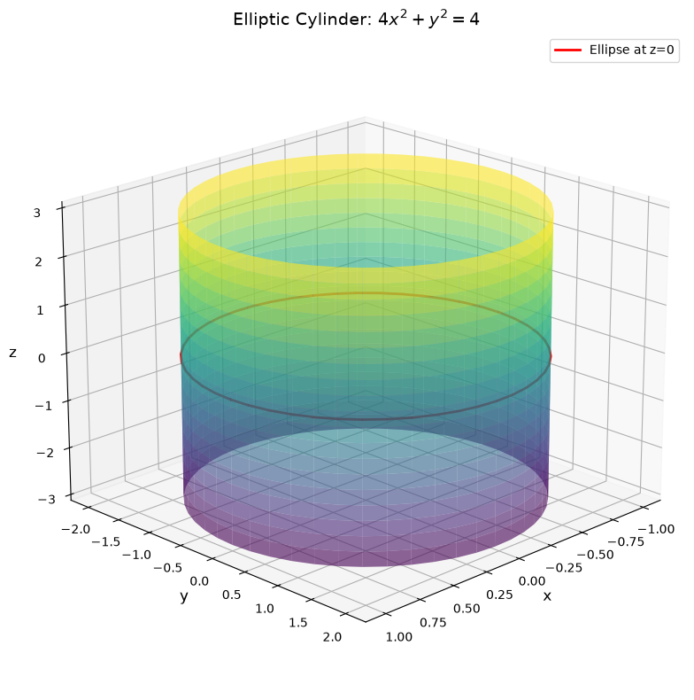
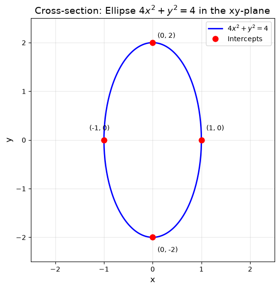
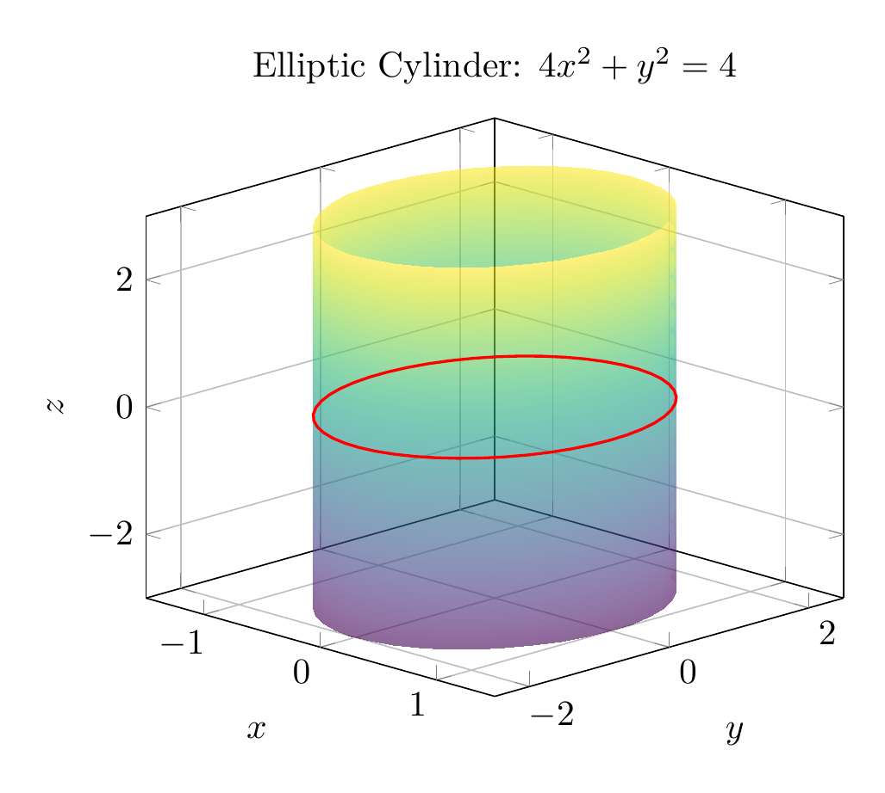
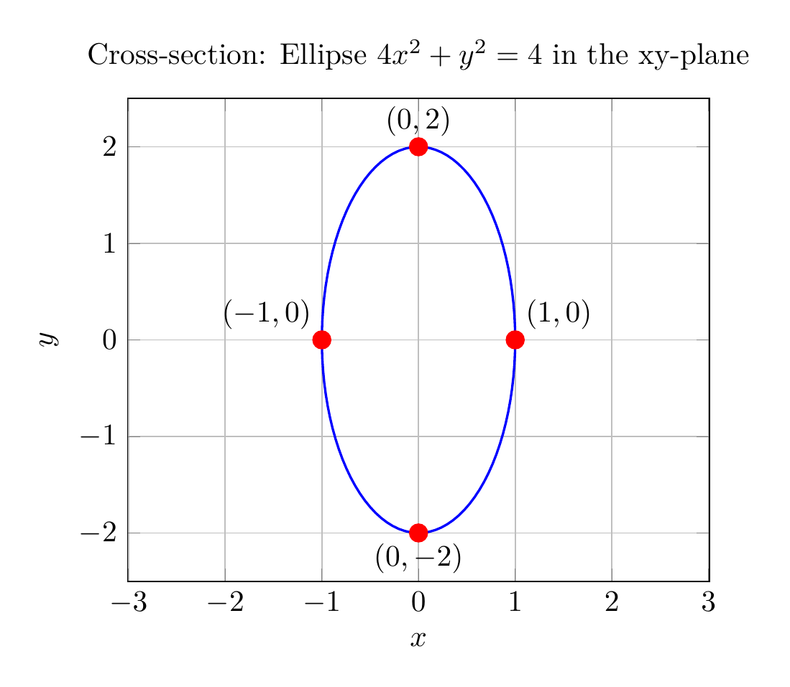

# Solution: Describe and Sketch the Surface $4x^2 + y^2 = 4$

## Step 1: Analyze the Equation

The given equation is:
$$4x^2 + y^2 = 4$$

**Key Observation:** Notice that the variable $z$ does not appear in this equation. This is a crucial clue about the nature of the surface.

## Step 2: Identify the Cross-Section

In the $xy$-plane (or any plane $z = c$ where $c$ is constant), we can rewrite the equation in standard form:

$$\frac{x^2}{1} + \frac{y^2}{4} = 1$$

This is the equation of an **ellipse** with:
- Semi-major axis: $a = 2$ (along the $y$-axis)
- Semi-minor axis: $b = 1$ (along the $x$-axis)
- Center: $(0, 0)$

The intercepts are:
- $x$-intercepts: $(\pm 1, 0)$
- $y$-intercepts: $(0, \pm 2)$

## Step 3: Identify the Surface Type

Since the equation $4x^2 + y^2 = 4$ does not involve $z$, this means:
- For **any** value of $z$, the cross-section parallel to the $xy$-plane is the same ellipse
- The surface extends infinitely in both the positive and negative $z$-directions

This describes an **elliptic cylinder** with the $z$-axis as its central axis.

## Step 4: Classification

**Surface Type:** Elliptic Cylinder

**Standard Form:** $\frac{x^2}{a^2} + \frac{y^2}{b^2} = 1$ where $a = 1$ and $b = 2$

**Axis:** The cylinder's axis is the $z$-axis (the variable missing from the equation)

**Cross-sections:**
- Parallel to $xy$-plane: Ellipses $4x^2 + y^2 = 4$
- Parallel to $xz$-plane: Pairs of lines $x = \pm 1$
- Parallel to $yz$-plane: Pairs of lines $y = \pm 2$

## Summary

The surface $4x^2 + y^2 = 4$ is an **elliptic cylinder** that:
- Has elliptical cross-sections with semi-axes 1 and 2
- Extends infinitely along the $z$-axis
- Is centered on the $z$-axis
- Has the equation independent of $z$

$\boxed{\text{Elliptic Cylinder}}$

---





---

[PGFplots / tikz plot.](./20260823_213406_012519_utc_0800_pgfplots_0.tex)

```latex
\documentclass[border=10pt]{standalone}
\usepackage{pgfplots}
\pgfplotsset{compat=1.18}
\usepgfplotslibrary{colormaps}

\begin{document}
\begin{tikzpicture}
\begin{axis}[
    view={45}{20},
    xlabel={$x$},
    ylabel={$y$},
    zlabel={$z$},
    title={Elliptic Cylinder: $4x^2 + y^2 = 4$},
    grid=major,
    colormap/viridis,
    zmin=-3, zmax=3,
    xmin=-1.5, xmax=1.5,
    ymin=-2.5, ymax=2.5,
    ]

    % Plot the cylinder surface using parametric equations
    \addplot3[
        surf,
        shader=interp,
        opacity=0.6,
        domain=0:360,
        y domain=-3:3,
        samples=40,
        samples y=15,
    ]
    ({cos(x)}, {2*sin(x)}, {y});

    % Add reference ellipse at z=0
    \addplot3[
        domain=0:360,
        samples=50,
        thick,
        red,
    ]
    ({cos(x)}, {2*sin(x)}, 0);

\end{axis}
\end{tikzpicture}
\end{document}
```



[PGFplots / tikz plot.](./20260823_213406_012519_utc_0800_pgfplots_1.tex)

```latex
\documentclass[border=10pt]{standalone}
\usepackage{pgfplots}
\pgfplotsset{compat=1.18}

\begin{document}
\begin{tikzpicture}
\begin{axis}[
    xlabel={$x$},
    ylabel={$y$},
    title={Cross-section: Ellipse $4x^2 + y^2 = 4$ in the xy-plane},
    axis equal,
    grid=major,
    xmin=-2.5, xmax=2.5,
    ymin=-2.5, ymax=2.5,
    ]

    % Plot the ellipse using parametric equations
    \addplot[
        domain=0:360,
        samples=100,
        thick,
        blue,
    ]
    ({cos(x)}, {2*sin(x)});

    % Mark the intercepts
    \addplot[only marks, red, mark=*, mark size=3pt] 
        coordinates {(1,0) (-1,0) (0,2) (0,-2)};

    % Add labels for intercepts
    \node[anchor=south west] at (axis cs:1,0) {$(1, 0)$};
    \node[anchor=south east] at (axis cs:-1,0) {$(-1, 0)$};
    \node[anchor=south] at (axis cs:0,2) {$(0, 2)$};
    \node[anchor=north] at (axis cs:0,-2) {$(0, -2)$};

\end{axis}
\end{tikzpicture}
\end{document}
```

