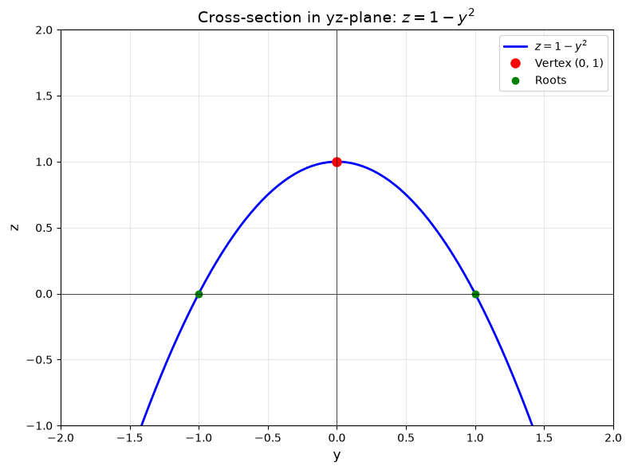

`[ Begin message. Type: HumanMessage. ]`

`[Begin Problem]`

Please solve the math problem in the image.


(Image `problem.png`. Alt text: Problem.)


`[End Problem]`

`[ End message. Type: HumanMessage. ]`

`[ Begin message. Type: AIMessage. ]`

`[Begin Answer]`

# Surface Description: $z = 1 - y^2$

## Analysis

The equation $z = 1 - y^2$ describes a **parabolic cylinder**. Here's how to understand this surface:

### Key Characteristics

1. **Missing Variable**: Notice that the variable $x$ does not appear in the equation. This is the defining characteristic of a cylinder in 3D space. When one variable is missing from the equation, the surface extends infinitely in the direction of that missing variable.

2. **Cross-Section Analysis**: 
   - In the $yz$-plane (where $x = 0$), the equation becomes $z = 1 - y^2$, which is a **parabola** opening downward
   - The vertex is at $(y, z) = (0, 1)$
   - The parabola crosses the $y$-axis at $y = \pm 1$ (where $z = 0$)

3. **3D Structure**:
   - Since $x$ is absent, this parabola is **extruded** (extended) infinitely in both directions along the $x$-axis
   - Every cross-section parallel to the $yz$-plane (at any fixed $x$-value) gives the same parabola $z = 1 - y^2$
   - The surface looks like a "trough" or "valley" that runs parallel to the $x$-axis

### Geometric Properties

- **Type**: Parabolic cylinder (a quadric surface)
- **Axis**: Parallel to the $x$-axis
- **Vertex line**: The line $(x, 0, 1)$ for all $x \in \mathbb{R}$ (the highest points of the surface)
- **Direction**: Opens downward in the $z$-direction
- **Symmetry**: Symmetric about the $xz$-plane (the plane $y = 0$)

## Sketch Description

The surface resembles an infinitely long gutter or trough:
- The "bottom" of the trough follows the parabola $z = 1 - y^2$
- The trough extends infinitely in both the positive and negative $x$-directions
- The highest points form a straight line at height $z = 1$ along the $x$-axis
- As you move away from $y = 0$ in either direction, the surface curves downward

This is a classic example of how a 2D curve (parabola) generates a 3D surface (cylinder) when extended along an axis perpendicular to its plane.

$\boxed{\text{Parabolic cylinder extending along the } x\text{-axis, with parabolic cross-section } z = 1 - y^2 \text{ in the } yz\text{-plane}}$

---


(Image `20260823_213401_758817_utc_0800_pyplot_0.png`. Alt text: pyplot-generated plot.)


(Image `20260823_213401_758817_utc_0800_pyplot_1.png`. Alt text: pyplot-generated plot.)




---

[PGFplots / tikz plot.](./20260823_213401_758817_utc_0800_pgfplots_0.tex)

```latex
\documentclass[border=10pt]{standalone}
\usepackage{pgfplots}
\usepgfplotslibrary{colormaps}
\pgfplotsset{compat=1.18}

\begin{document}
\begin{tikzpicture}
\begin{axis}[
    xlabel={$x$},
    ylabel={$y$},
    zlabel={$z$},
    title={Surface: $z = 1 - y^2$},
    view={-60}{20},
    colormap/viridis,
    grid=major,
    width=12cm,
    height=10cm,
    zmin=-2,
    zmax=2,
]
\addplot3[
    surf,
    domain=-3:3,
    y domain=-2:2,
    samples=40,
    samples y=30,
    opacity=0.8,
] {1 - y^2};
\end{axis}
\end{tikzpicture}
\end{document}
```


(Image `20260823_213401_758817_utc_0800_pgfplots_0.png`. Alt text: PGFplots / tikz plot (converted to PNG).)


[PGFplots / tikz plot.](./20260823_213401_758817_utc_0800_pgfplots_1.tex)

```latex
\documentclass[border=10pt]{standalone}
\usepackage{pgfplots}
\pgfplotsset{compat=1.18}

\begin{document}
\begin{tikzpicture}
\begin{axis}[
    xlabel={$y$},
    ylabel={$z$},
    title={Cross-section in $yz$-plane: $z = 1 - y^2$},
    domain=-2:2,
    samples=100,
    grid=major,
    width=10cm,
    height=8cm,
    ymin=-2,
    ymax=2,
    zmin=-1,
    zmax=2,
    axis lines=center,
]
\addplot[blue, thick, domain=-2:2] {1 - x^2};
\addplot[red, only marks, mark=*] coordinates {(0,1)} node[above right] {Vertex $(0,1)$};
\addplot[green, only marks, mark=*] coordinates {(-1,0) (1,0)};
\end{axis}
\end{tikzpicture}
\end{document}
```


(Image `20260823_213401_758817_utc_0800_pgfplots_1.png`. Alt text: PGFplots / tikz plot (converted to PNG).)


`[End Answer]`

`[ End message. Type: AIMessage. ]`