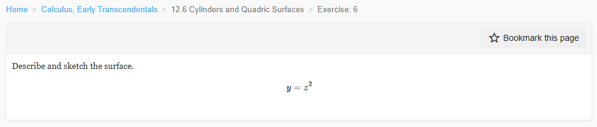
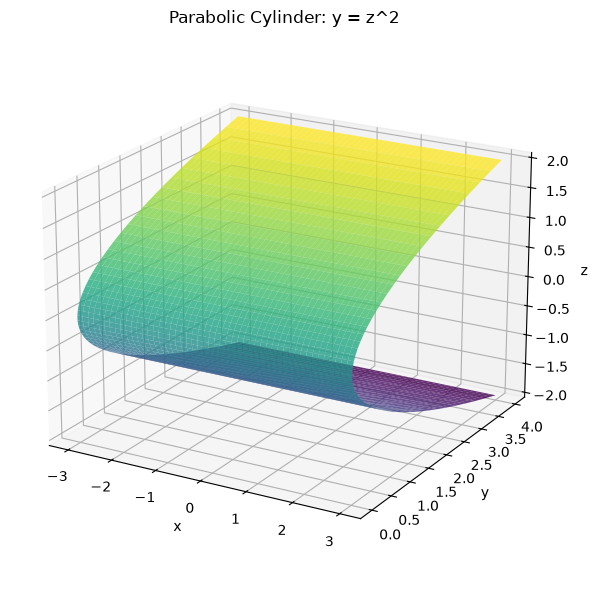
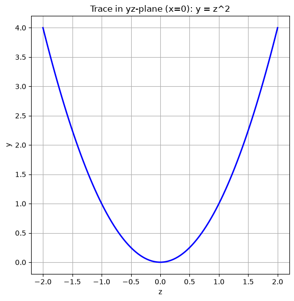
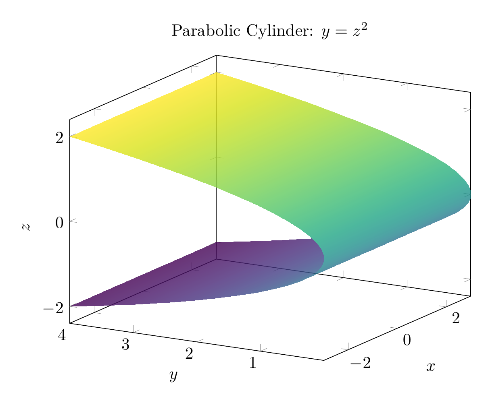
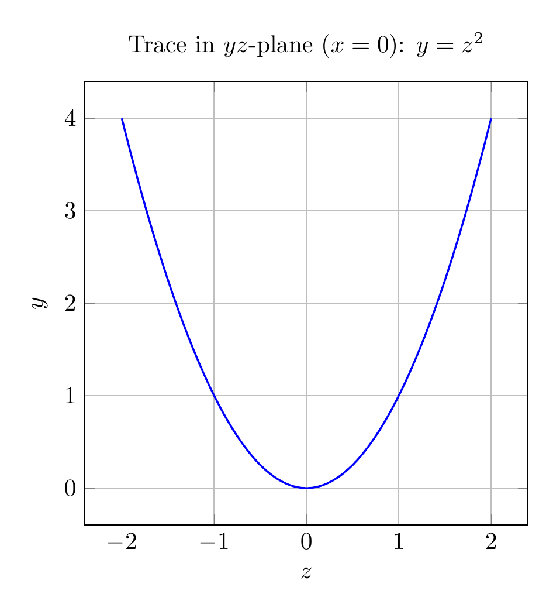

`[ Begin message. Type: HumanMessage. ]`

`[Begin Problem]`

Please solve the math problem in the image.


(Image `problem.png`. Alt text: Problem.)



`[End Problem]`

`[ End message. Type: HumanMessage. ]`

`[ Begin message. Type: AIMessage. ]`

`[Begin Answer]`

# Solution: Describe and Sketch the Surface $y = z^2$

## Analysis

The equation $y = z^2$ describes a **parabolic cylinder** in three-dimensional space.

### Key Characteristics:

1. **Missing Variable**: The equation does not contain the variable $x$. This means that $x$ can take any real value, and the surface extends infinitely in both directions along the $x$-axis.

2. **Cross-Section**: In any plane where $x = c$ (constant), the trace is the parabola $y = z^2$ in the $yz$-plane. This parabola:
   - Opens in the positive $y$-direction
   - Has its vertex at the origin $(0, 0, 0)$
   - Is symmetric about the $y$-axis (in the $yz$-plane)

3. **Surface Type**: Since the same parabolic cross-section is repeated for all values of $x$, this creates a **cylindrical surface** called a **parabolic cylinder**.

### Geometric Description:

The surface consists of all points $(x, y, z)$ where $y$ equals the square of $z$, regardless of the value of $x$. Imagine taking the parabola $y = z^2$ in the $yz$-plane and extruding it infinitely in both directions along the $x$-axis.

## Visualizations

The plots show:
- **3D View**: The parabolic cylinder extending along the $x$-axis
- **2D Trace**: The parabola $y = z^2$ in the $yz$-plane (when $x = 0$)

$\\boxed{\text{Parabolic cylinder extending along the } x\text{-axis}}$

---


(Image `20260823_213417_647402_utc_0800_pyplot_0.png`. Alt text: pyplot-generated plot.)



(Image `20260823_213417_647402_utc_0800_pyplot_1.png`. Alt text: pyplot-generated plot.)




---

[PGFplots / tikz plot.](./20260823_213417_647402_utc_0800_pgfplots_0.tex)

```latex
\documentclass[border=10pt]{standalone}
\usepackage{pgfplots}
\pgfplotsset{compat=1.18}
\usepgfplotslibrary{colormaps}

\begin{document}
\begin{tikzpicture}
\begin{axis}[
    width=10cm,
    height=8cm,
    xlabel=$x$,
    ylabel=$y$,
    zlabel=$z$,
    title={Parabolic Cylinder: $y = z^2$},
    view={-60}{20},
    colormap/viridis,
    grid=none,
    samples=30,
    domain=-3:3,
    y domain=-2:2,
]
\addplot3[surf, shader=interp, opacity=0.8] ({x}, {y^2}, {y});
\end{axis}
\end{tikzpicture}
\end{document}
```


(Image `20260823_213417_647402_utc_0800_pgfplots_0.png`. Alt text: PGFplots / tikz plot (converted to PNG).)




[PGFplots / tikz plot.](./20260823_213417_647402_utc_0800_pgfplots_1.tex)

```latex
\documentclass[border=10pt]{standalone}
\usepackage{pgfplots}
\pgfplotsset{compat=1.18}

\begin{document}
\begin{tikzpicture}
\begin{axis}[
    width=8cm,
    height=8cm,
    xlabel=$z$,
    ylabel=$y$,
    title={Trace in $yz$-plane ($x=0$): $y = z^2$},
    grid=both,
    axis equal image,
    domain=-2:2,
    samples=100,
]
\addplot[blue, thick] {x^2};
\end{axis}
\end{tikzpicture}
\end{document}
```


(Image `20260823_213417_647402_utc_0800_pgfplots_1.png`. Alt text: PGFplots / tikz plot (converted to PNG).)



`[End Answer]`

`[ End message. Type: AIMessage. ]`