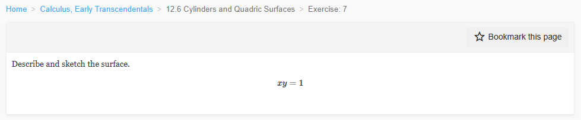
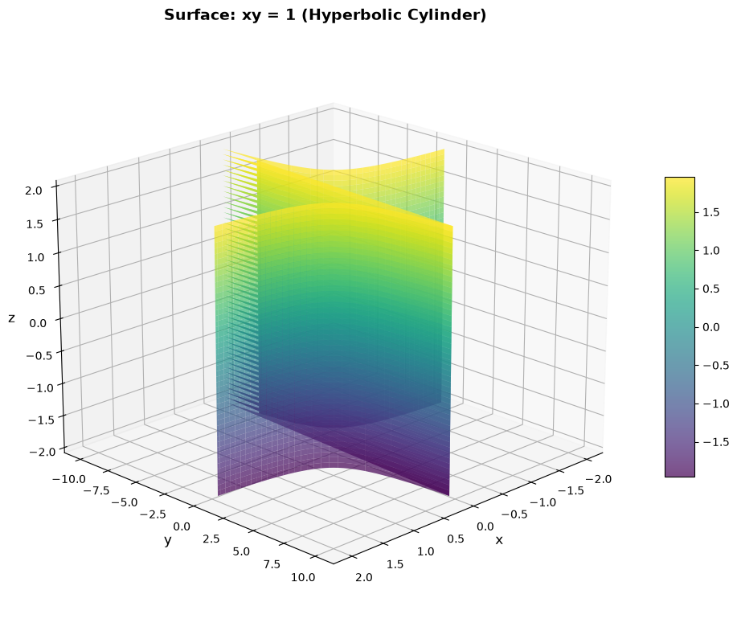
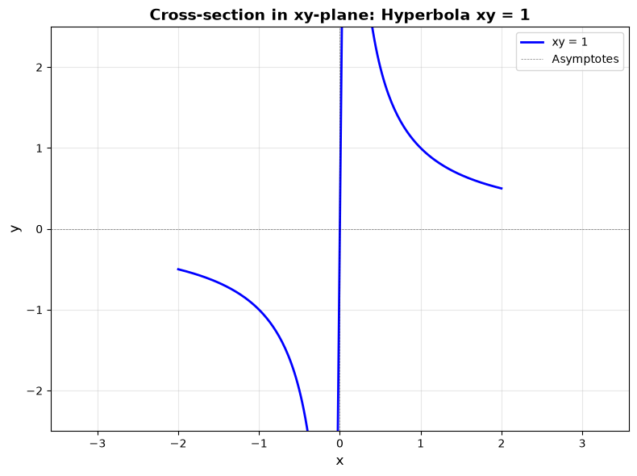
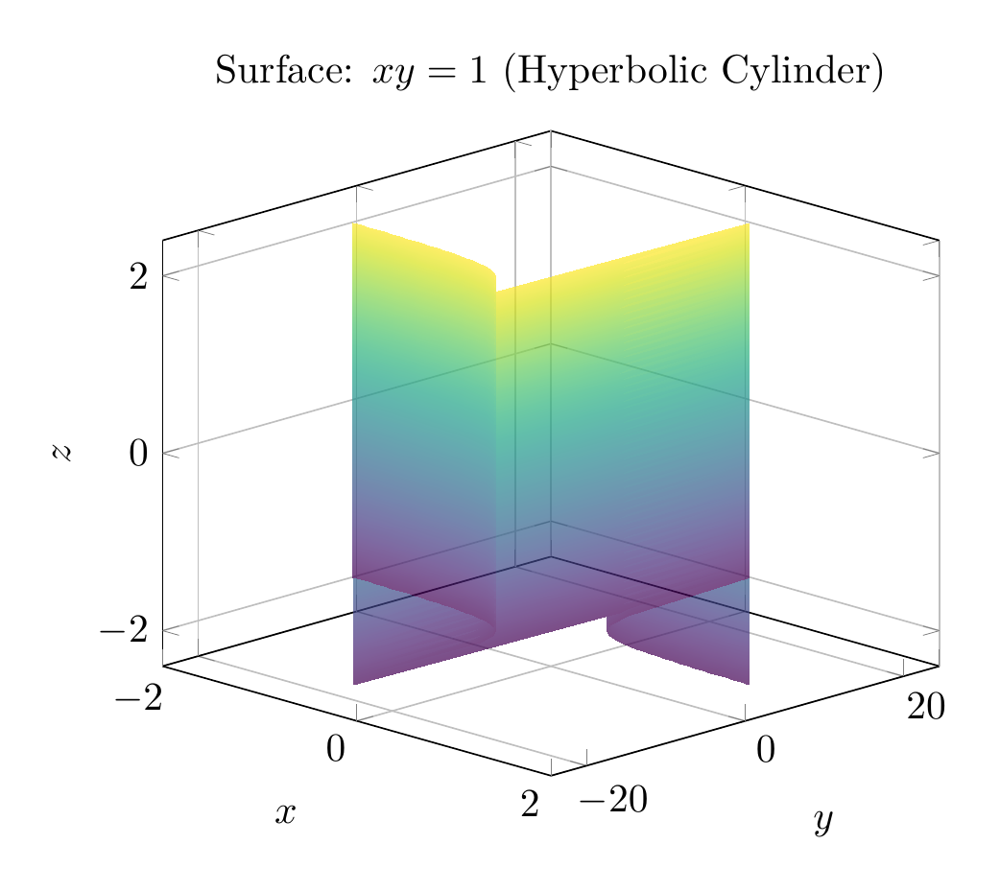
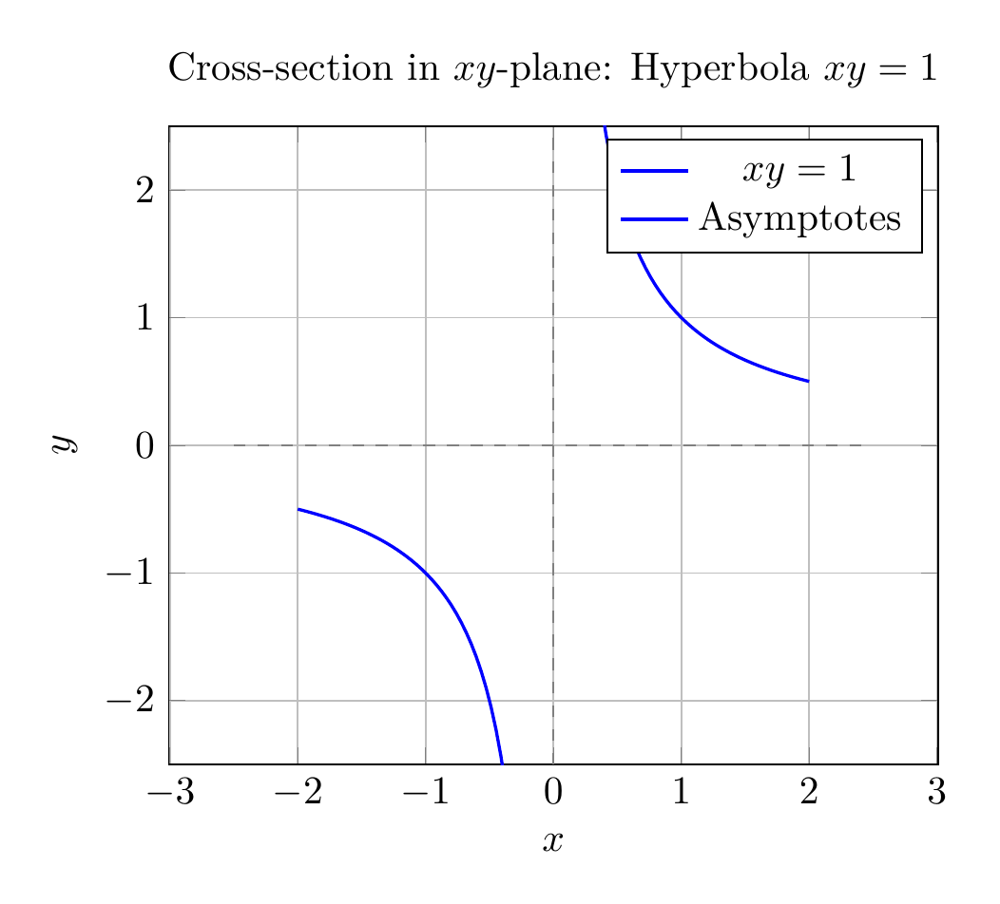

`[ Begin message. Type: HumanMessage. ]`

`[Begin Problem]`

Please solve the math problem in the image.


(Image `problem.png`. Alt text: Problem.)



`[End Problem]`

`[ End message. Type: HumanMessage. ]`

`[ Begin message. Type: AIMessage. ]`

`[Begin Answer]`

# Solution: Describe and Sketch the Surface $xy = 1$

## Analysis

The equation $xy = 1$ describes a surface in three-dimensional space $\mathbb{R}^3$. Let's analyze this step by step.

### Step 1: Understanding the Equation

The equation $xy = 1$ can be rewritten as:
$$y = \frac{1}{x}$$

**Key observation:** The variable $z$ does not appear in the equation. This means that $z$ can take any real value while the relationship between $x$ and $y$ remains fixed.

### Step 2: Identifying the Surface Type

When an equation in $\mathbb{R}^3$ is missing one variable, the surface is a **cylinder**. Specifically:

- In the $xy$-plane (when $z = 0$), the equation $xy = 1$ represents a **hyperbola**
- Since $z$ is absent, this hyperbola is extended infinitely in both directions along the $z$-axis
- This creates a **hyperbolic cylinder**

### Step 3: Properties of the Surface

1. **Base curve:** The hyperbola $xy = 1$ in the $xy$-plane has:
   - Two branches: one in the first quadrant ($x > 0, y > 0$) and one in the third quadrant ($x < 0, y < 0$)
   - Asymptotes: $x = 0$ (the $y$-axis) and $y = 0$ (the $x$-axis)
   - The hyperbola never touches either axis

2. **Cylinder structure:** 
   - The surface consists of two separate sheets (corresponding to the two branches of the hyperbola)
   - Each sheet extends infinitely in the $\pm z$ direction
   - The rulings (generating lines) of the cylinder are parallel to the $z$-axis

3. **Domain restrictions:**
   - $x \neq 0$ (since division by zero is undefined)
   - $y \neq 0$ (since $xy = 1 \neq 0$)

### Step 4: Classification

The surface $xy = 1$ is a **quadric surface** known as a **hyperbolic cylinder**. It is characterized by:
- Having a hyperbola as its cross-section in planes perpendicular to the $z$-axis
- Being translationally invariant along the $z$-axis
- Consisting of two disconnected components

## Summary

The surface $xy = 1$ is a **hyperbolic cylinder** with:
- **Base curve:** Hyperbola $xy = 1$ in the $xy$-plane
- **Axis:** Parallel to the $z$-axis
- **Structure:** Two separate sheets extending infinitely in the $\pm z$ direction
- **Asymptotic planes:** $x = 0$ and $y = 0$

$\\boxed{\text{Hyperbolic Cylinder}}$

---


(Image `20260823_213413_122990_utc_0800_pyplot_0.png`. Alt text: pyplot-generated plot.)



(Image `20260823_213413_122990_utc_0800_pyplot_1.png`. Alt text: pyplot-generated plot.)




---

[PGFplots / tikz plot.](./20260823_213413_122990_utc_0800_pgfplots_0.tex)

```latex
\documentclass[border=10pt]{standalone}
\usepackage{pgfplots}
\usepgfplotslibrary{colormaps}
\pgfplotsset{compat=1.18}

\begin{document}
\begin{tikzpicture}
\begin{axis}[
    xlabel={$x$},
    ylabel={$y$},
    zlabel={$z$},
    title={Surface: $xy = 1$ (Hyperbolic Cylinder)},
    view={45}{20},
    colormap/viridis,
    grid=major,
    domain=-2:2,
    y domain=-2:2,
    samples=50,
    unbounded coords=jump,
    restrict z to domain=-2:2,
    ]
    \addplot3[surf, opacity=0.7, shader=interp] 
        ({x}, {1/x}, {y});
\end{axis}
\end{tikzpicture}
\end{document}
```


(Image `20260823_213413_122990_utc_0800_pgfplots_0.png`. Alt text: PGFplots / tikz plot (converted to PNG).)




[PGFplots / tikz plot.](./20260823_213413_122990_utc_0800_pgfplots_1.tex)

```latex
\documentclass[border=10pt]{standalone}
\usepackage{pgfplots}
\pgfplotsset{compat=1.18}

\begin{document}
\begin{tikzpicture}
\begin{axis}[
    xlabel={$x$},
    ylabel={$y$},
    title={Cross-section in $xy$-plane: Hyperbola $xy = 1$},
    axis equal,
    grid=major,
    domain=-2.5:2.5,
    samples=100,
    unbounded coords=jump,
    xmin=-2.5, xmax=2.5,
    ymin=-2.5, ymax=2.5,
    ]
    \addplot[blue, thick, domain=-2:-0.1, samples=50] {1/x};
    \addplot[blue, thick, domain=0.1:2, samples=50] {1/x};
    \addplot[dashed, gray, thin] coordinates {(-2.5, 0) (2.5, 0)};
    \addplot[dashed, gray, thin] coordinates {(0, -2.5) (0, 2.5)};
    \legend{$xy = 1$, Asymptotes}
\end{axis}
\end{tikzpicture}
\end{document}
```


(Image `20260823_213413_122990_utc_0800_pgfplots_1.png`. Alt text: PGFplots / tikz plot (converted to PNG).)



`[End Answer]`

`[ End message. Type: AIMessage. ]`