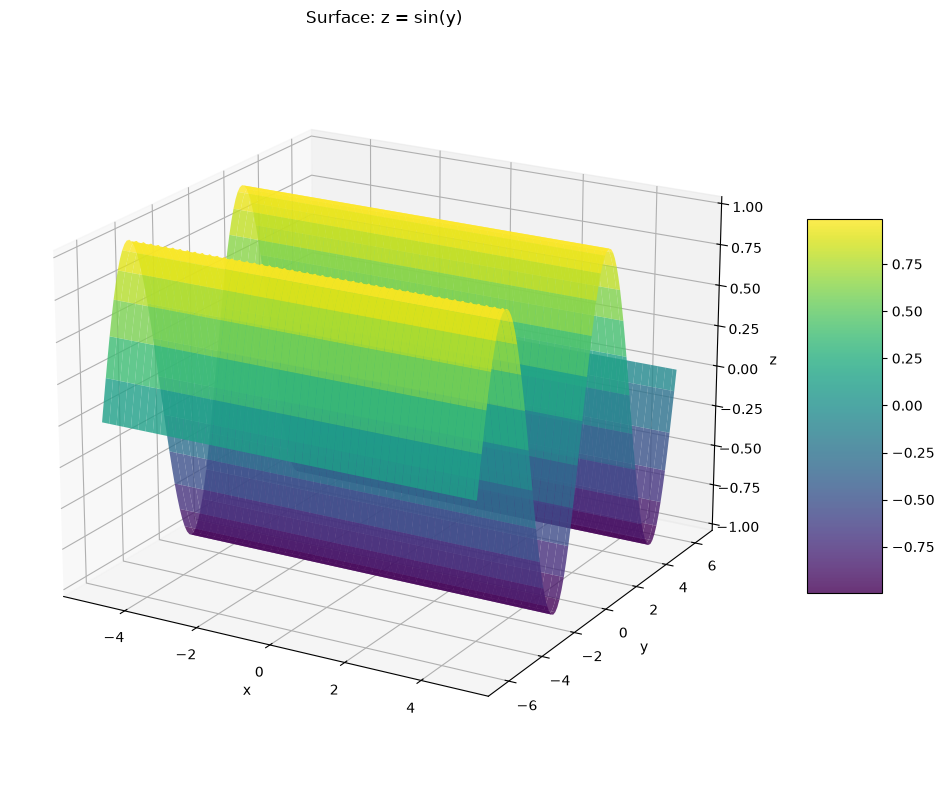
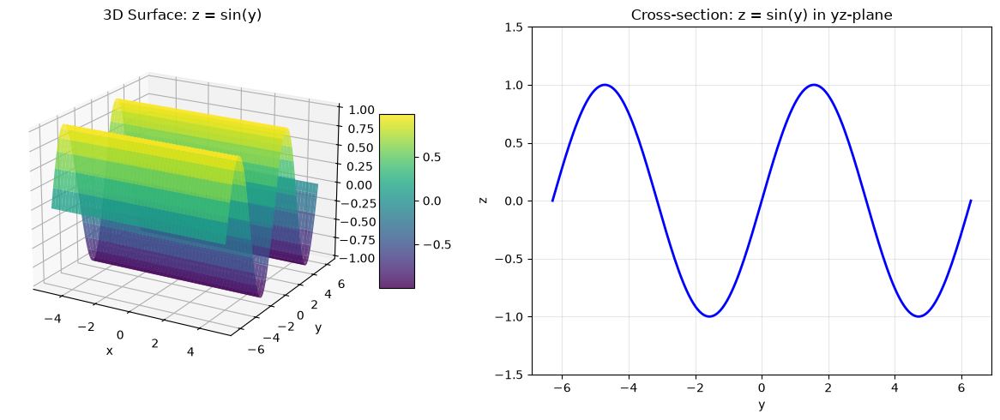
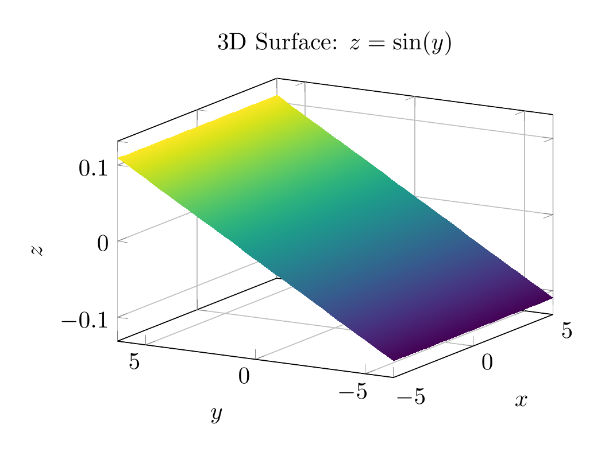
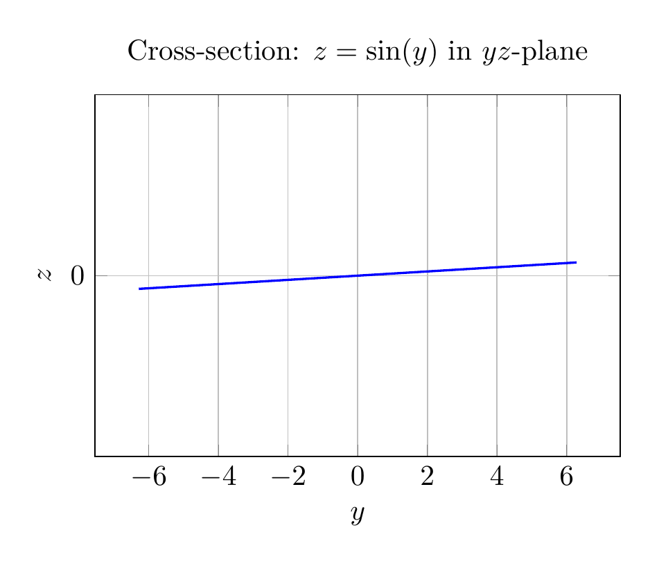

`[ Begin message. Type: AIMessage. ]`

# Solution: Describe and Sketch the Surface $z = \sin(y)$

## Description

The surface $z = \sin(y)$ is a **cylindrical surface** (specifically, a **trigonometric cylinder**). Here's why:

### Key Characteristics:

1. **Independent of $x$**: The equation $z = \sin(y)$ does not contain the variable $x$. This means that for any fixed value of $y$, the value of $z$ remains constant regardless of what $x$ is. 

2. **Cylindrical nature**: Since the equation is independent of $x$, the surface extends infinitely in both the positive and negative $x$-directions. Every cross-section parallel to the $yz$-plane (i.e., for any fixed $x = c$) gives the same curve: $z = \sin(y)$.

3. **Generating curve**: In the $yz$-plane (where $x = 0$), the equation traces out the familiar sine wave $z = \sin(y)$, which oscillates between $z = -1$ and $z = 1$ with period $2\pi$.

4. **Surface formation**: The complete surface is formed by taking this sine curve in the $yz$-plane and translating (extruding) it parallel to the $x$-axis. This creates a "wavy wall" or "corrugated sheet" that extends infinitely in the $x$-direction.

### Geometric Properties:

- **Periodicity**: The surface is periodic in the $y$-direction with period $2\pi$
- **Bounds**: $-1 \leq z \leq 1$ for all points on the surface
- **Symmetry**: The surface is symmetric with respect to the $xz$-plane (since $\sin(-y) = -\sin(y)$, it has odd symmetry in $y$)
- **Rulings**: The surface contains straight lines (rulings) parallel to the $x$-axis, making it a ruled surface

## Classification

This is a **cylinder** in the mathematical sense (not necessarily circular). In multivariable calculus, a cylinder is defined as a surface consisting of all lines (called rulings) that are parallel to a given line and pass through a given plane curve. Here:
- The plane curve is $z = \sin(y)$ in the $yz$-plane
- The rulings are parallel to the $x$-axis

## Visual Representation

The plots below show:
1. **3D view**: The complete surface showing how the sine wave extends along the $x$-axis
2. **2D cross-section**: The generating curve $z = \sin(y)$ in the $yz$-plane

$\boxed{\text{The surface } z = \sin(y) \text{ is a cylindrical surface formed by extruding the sine curve } z = \sin(y) \text{ along the } x\text{-axis.}}$

---


(Image `20260825_141342_235586_utc_0800_pyplot_0.png`. Alt text: pyplot-generated plot.)



(Image `20260825_141342_235586_utc_0800_pyplot_1.png`. Alt text: pyplot-generated plot.)




---

[PGFplots / tikz plot.](./20260825_141342_235586_utc_0800_pgfplots_0.tex)

```latex
\documentclass[border=10pt]{standalone}
\usepackage{pgfplots}
\usepgfplotslibrary{colormaps}
\pgfplotsset{compat=1.18}

\begin{document}
\begin{tikzpicture}
\begin{axis}[
    xlabel={$x$},
    ylabel={$y$},
    zlabel={$z$},
    title={3D Surface: $z = \sin(y)$},
    view={-60}{20},
    colormap/viridis,
    grid=major,
    width=8cm,
    height=6cm,
]
\addplot3[
    surf,
    shader=interp,
    domain=-5:5,
    y domain=-2*pi:2*pi,
    samples=40,
    samples y=40,
] {sin(y)};
\end{axis}
\end{tikzpicture}
\end{document}
```


(Image `20260825_141342_235586_utc_0800_pgfplots_0.png`. Alt text: PGFplots / tikz plot (converted to PNG).)




[PGFplots / tikz plot.](./20260825_141342_235586_utc_0800_pgfplots_1.tex)

```latex
\documentclass[border=10pt]{standalone}
\usepackage{pgfplots}
\pgfplotsset{compat=1.18}

\begin{document}
\begin{tikzpicture}
\begin{axis}[
    xlabel={$y$},
    ylabel={$z$},
    title={Cross-section: $z = \sin(y)$ in $yz$-plane},
    grid=major,
    width=8cm,
    height=6cm,
    ymin=-2*pi,
    ymax=2*pi,
    ymax=6.28,
    ymin=-6.28,
    ytick={-6.28, -4.71, -3.14, -1.57, 0, 1.57, 3.14, 4.71, 6.28},
    yticklabels={$-2\pi$, $-\frac{3\pi}{2}$, $-\pi$, $-\frac{\pi}{2}$, $0$, $\frac{\pi}{2}$, $\pi$, $\frac{3\pi}{2}$, $2\pi$},
    ymax=1.5,
    ymin=-1.5,
]
\addplot[
    domain=-2*pi:2*pi,
    samples=100,
    thick,
    blue,
] {sin(x)};
\end{axis}
\end{tikzpicture}
\end{document}
```


(Image `20260825_141342_235586_utc_0800_pgfplots_1.png`. Alt text: PGFplots / tikz plot (converted to PNG).)



`[ End message. Type: AIMessage. ]`