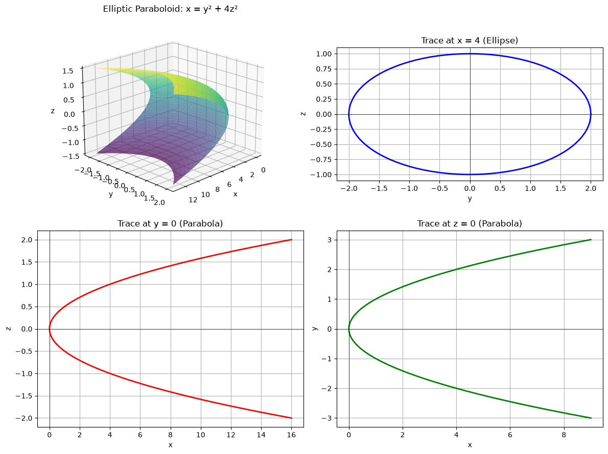
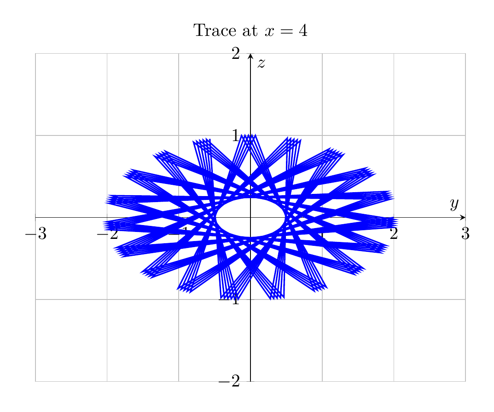

`[ Begin message. Type: HumanMessage. ]`

`[Begin Problem]`

`[ Begin message. Type: HumanMessage. ]`

Please solve the math problem in the image.


(Image `problem.png`. Alt text: Problem.)


(Image `20260826_233535_748686_utc_0800_0.png`. Alt text: Image: 20260826_233535_748686_utc_0800_human)


`[ End message. Type: HumanMessage. ]`

`[End Problem]`

`[ End message. Type: HumanMessage. ]`

`[ Begin message. Type: AIMessage. ]`

`[Begin Answer]`

## Solution: Identify the Surface $x = y^2 + 4z^2$

### Step 1: Find Traces

To identify the surface, we examine traces in various planes:

**Trace in plane $x = k$ (constant $x$):**
Setting $x = k$:
$$k = y^2 + 4z^2$$

- If $k < 0$: No real points (empty set)
- If $k = 0$: Single point at origin $(0, 0, 0)$
- If $k > 0$: This is an **ellipse**
  - Standard form: $\frac{y^2}{k} + \frac{z^2}{k/4} = 1$
  - Semi-axes: $\sqrt{k}$ in $y$-direction, $\frac{\sqrt{k}}{2}$ in $z$-direction

**Trace in plane $y = k$ (constant $y$):**
Setting $y = k$:
$$x = k^2 + 4z^2$$
This is a **parabola** in the $xz$-plane, opening in the positive $x$-direction.

**Trace in plane $z = k$ (constant $z$):**
Setting $z = k$:
$$x = y^2 + 4k^2$$
This is a **parabola** in the $xy$-plane, opening in the positive $x$-direction.

### Step 2: Identify the Surface

From the traces:
- Cross-sections perpendicular to the $x$-axis are **ellipses**
- Cross-sections perpendicular to the $y$-axis are **parabolas**
- Cross-sections perpendicular to the $z$-axis are **parabolas**

This identifies the surface as an **elliptic paraboloid** opening along the positive $x$-axis.

The standard form is:
$$x = \frac{y^2}{a^2} + \frac{z^2}{b^2}$$

Comparing with $x = y^2 + 4z^2$:
- $a^2 = 1$, so $a = 1$
- $b^2 = \frac{1}{4}$, so $b = \frac{1}{2}$

$\boxed{\text{Elliptic Paraboloid}}$

---


(Image `20260826_234100_924089_utc_0800_pyplot_0.png`. Alt text: pyplot-generated plot.)




---

[PGFplots / tikz plot.](./20260826_234100_924089_utc_0800_pgfplots_0.tex)

```latex
\documentclass[border=10pt]{standalone}
\usepackage{pgfplots}
\pgfplotsset{compat=1.18}

\begin{document}
\begin{tikzpicture}
\begin{axis}[
    xlabel={$y$},
    ylabel={$z$},
    title={Trace at $x=4$},
    grid=major,
    axis lines=middle,
    xmin=-3, xmax=3,
    ymin=-2, ymax=2,
    width=10cm,
    height=8cm
]
\addplot[domain=0:360, samples=100, thick, blue] 
    ({2*cos(deg(x))}, {sin(deg(x))});
\end{axis}
\end{tikzpicture}
\end{document}
```


(Image `20260826_234100_924089_utc_0800_pgfplots_0.png`. Alt text: PGFplots / tikz plot (converted to PNG).)



`[End Answer]`

`[ End message. Type: AIMessage. ]`