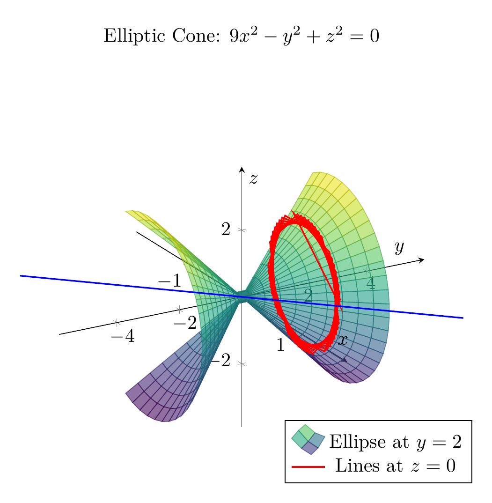

## Solution: Identifying the Surface 9x² - y² + z² = 0

### Step 1: Analyze Traces in Coordinate Planes

**Trace in xy-plane (z = 0):**
$$9x^2 - y^2 = 0 \implies y = \pm 3x$$
Result: Two intersecting lines through the origin.

**Trace in yz-plane (x = 0):**
$$-y^2 + z^2 = 0 \implies z = \pm y$$
Result: Two intersecting lines through the origin.

**Trace in xz-plane (y = 0):**
$$9x^2 + z^2 = 0 \implies x = 0, z = 0$$
Result: Only the origin point.

### Step 2: Analyze Traces in Parallel Planes

**Traces where y = k (constant, k ≠ 0):**
$$9x^2 + z^2 = k^2 \implies \frac{x^2}{(k/3)^2} + \frac{z^2}{k^2} = 1$$
Result: Ellipses with semi-axes k/3 (in x-direction) and k (in z-direction).

**Traces where x = k (constant, k ≠ 0):**
$$y^2 - z^2 = 9k^2$$
Result: Hyperbolas opening in the y-direction.

**Traces where z = k (constant, k ≠ 0):**
$$y^2 - 9x^2 = k^2$$
Result: Hyperbolas opening in the y-direction.

### Step 3: Identify the Surface

Rewriting the equation:
$$y^2 = 9x^2 + z^2$$

In standard form:
$$\frac{y^2}{1^2} = \frac{x^2}{(1/3)^2} + \frac{z^2}{1^2}$$

This is the equation of an **elliptic cone** with:
- **Vertex**: Origin (0, 0, 0)
- **Axis of symmetry**: y-axis
- **Cross-sections perpendicular to y-axis**: Ellipses
- **Cross-sections containing y-axis**: Pairs of intersecting lines

The cone opens along both positive and negative y-directions, with elliptical cross-sections that grow larger as |y| increases.

$\boxed{\text{Elliptic Cone}}$

---


---

[PGFplots / tikz plot.](./20260826_235358_714526_utc_0800_pgfplots_0.tex)

```latex
\documentclass[border=10pt]{standalone}
\usepackage{pgfplots}
\usepgfplotslibrary{colormaps}
\pgfplotsset{compat=1.18}

\begin{document}
\begin{tikzpicture}
\begin{axis}[
    view={60}{30},
    xlabel={$x$},
    ylabel={$y$},
    zlabel={$z$},
    title={Elliptic Cone: $9x^2 - y^2 + z^2 = 0$},
    width=12cm,
    height=10cm,
    domain=-2:2,
    y domain=-3:3,
    samples=30,
    samples y=20,
    colormap/viridis,
    axis lines=center,
    enlargelimits=0.15,
    grid=major,
    legend style={at={(0.9,0.1)},anchor=south east},
]

% The elliptic cone surface
\addplot3[surf, opacity=0.6] ({abs(y)/3*cos(deg(x))}, {y}, {abs(y)*sin(deg(x))});

% Trace at y = 2 (ellipse)
\addplot3[domain=0:360, samples=50, thick, red] 
    ({2/3*cos(deg(x))}, {2}, {2*sin(deg(x))});
\addlegendentry{Ellipse at $y=2$}

% Trace lines at z = 0
\addplot3[domain=-1.5:1.5, samples=20, thick, blue] (x, {3*x}, 0);
\addlegendentry{Lines at $z=0$}

\end{axis}
\end{tikzpicture}
\end{document}

```

