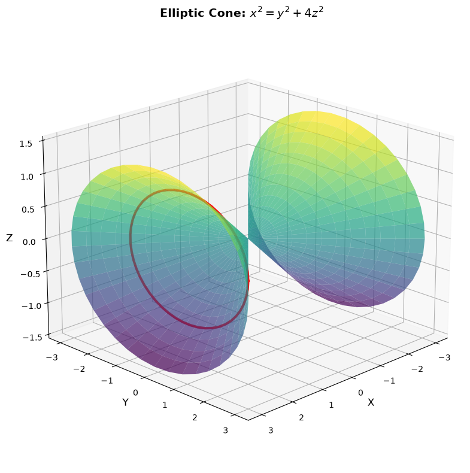
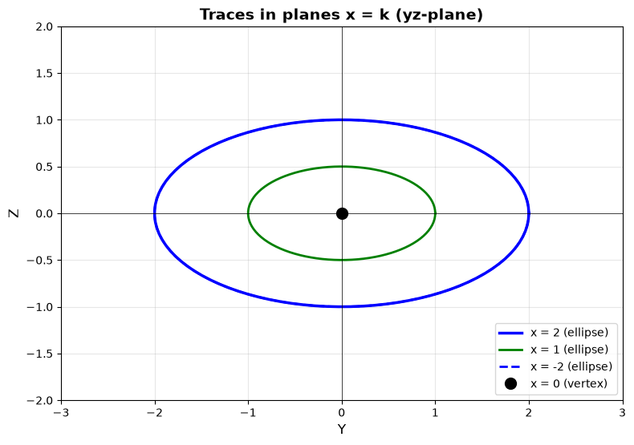
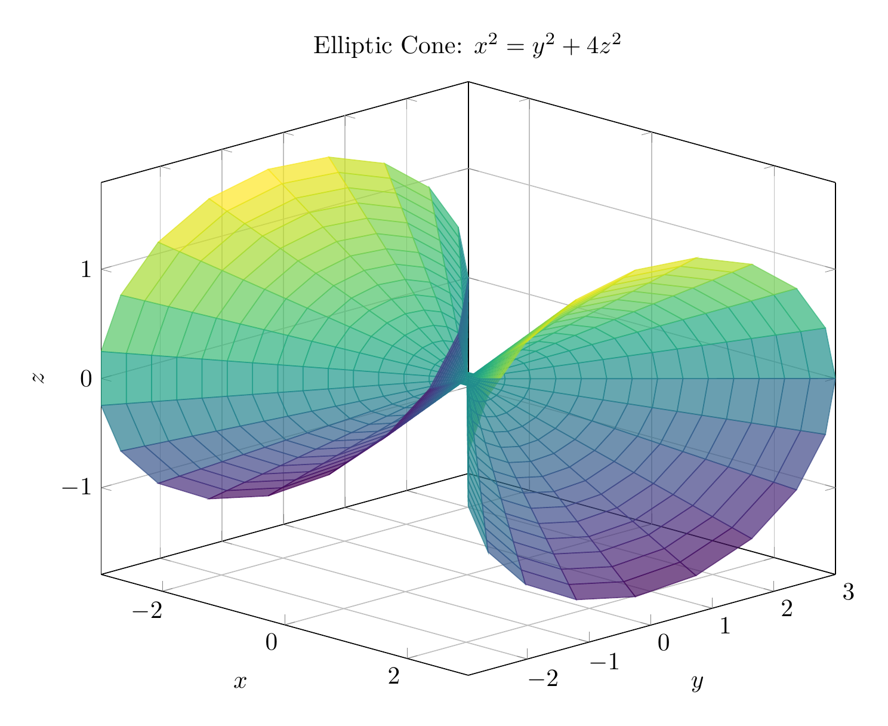
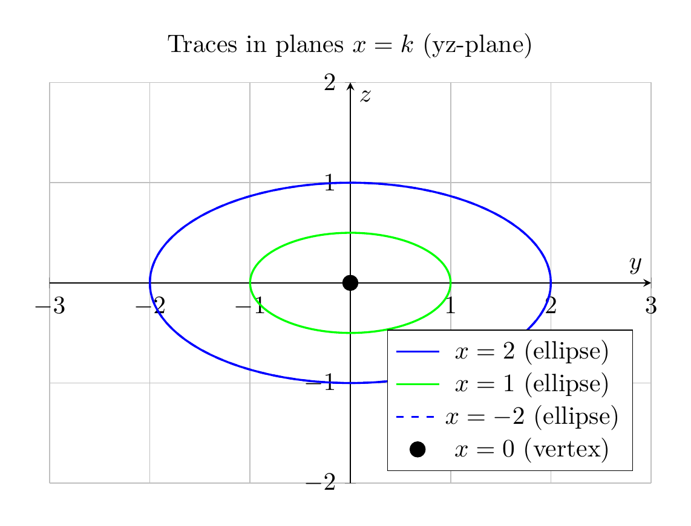

## Solution: Identifying the Surface $x^2 = y^2 + 4z^2$

### Step 1: Rewrite in Standard Form

The given equation is:
$$x^2 = y^2 + 4z^2$$

Rearranging:
$$x^2 - y^2 - 4z^2 = 0$$

Or in standard form:
$$\frac{x^2}{1^2} - \frac{y^2}{1^2} - \frac{z^2}{(1/2)^2} = 0$$

This matches the form $\frac{x^2}{a^2} - \frac{y^2}{b^2} - \frac{z^2}{c^2} = 0$, which identifies this as an **elliptic cone** with vertex at the origin.

### Step 2: Analyze Traces

**Trace in plane $x = k$ (parallel to yz-plane):**
- If $k = 0$: $0 = y^2 + 4z^2 \Rightarrow y = 0, z = 0$ (vertex point at origin)
- If $k \neq 0$: $y^2 + 4z^2 = k^2$, or $\frac{y^2}{k^2} + \frac{z^2}{(k/2)^2} = 1$

This is an **ellipse** with semi-major axis $|k|$ and semi-minor axis $|k|/2$.

**Trace in plane $y = k$ (parallel to xz-plane):**
- $x^2 = k^2 + 4z^2 \Rightarrow x^2 - 4z^2 = k^2$

This is a **hyperbola** opening along the x-axis.

**Trace in plane $z = k$ (parallel to xy-plane):**
- $x^2 = y^2 + 4k^2 \Rightarrow x^2 - y^2 = 4k^2$

This is also a **hyperbola** opening along the x-axis.

### Step 3: Geometric Description

The surface is an **elliptic cone** that:
- Has its **vertex at the origin** $(0, 0, 0)$
- Opens along the **x-axis** (both positive and negative directions)
- Has **elliptical cross-sections** perpendicular to the x-axis
- The ellipses have semi-axes ratio 2:1 (the z-axis is "compressed" by factor 2)

$\boxed{\text{Elliptic cone with vertex at origin, opening along the x-axis}}$

---





---

[PGFplots / tikz plot.](./20260827_000741_940868_utc_0800_pgfplots_0.tex)

```latex
\documentclass[border=10pt]{standalone}
\usepackage{pgfplots}
\usepgfplotslibrary{colormaps}
\pgfplotsset{compat=1.18}

\begin{document}
\begin{tikzpicture}
\begin{axis}[
    view={45}{20},
    xlabel={$x$},
    ylabel={$y$},
    zlabel={$z$},
    title={Elliptic Cone: $x^2 = y^2 + 4z^2$},
    colormap/viridis,
    grid=major,
    width=12cm,
    height=10cm,
    domain=-3:3,
    y domain=0:2*pi,
    samples=30,
    samples y=20,
]
% Parametric surface: x = x, y = |x|*cos(theta), z = |x|/2*sin(theta)
\addplot3[surf, shader=flat corner, opacity=0.7] 
    ({x}, {abs(x)*cos(deg(y))}, {abs(x)/2*sin(deg(y))});
\end{axis}
\end{tikzpicture}
\end{document}

```



[PGFplots / tikz plot.](./20260827_000741_940868_utc_0800_pgfplots_1.tex)

```latex
\documentclass[border=10pt]{standalone}
\usepackage{pgfplots}
\pgfplotsset{compat=1.18}

\begin{document}
\begin{tikzpicture}
\begin{axis}[
    xlabel={$y$},
    ylabel={$z$},
    title={Traces in planes $x = k$ (yz-plane)},
    axis lines=middle,
    grid=major,
    width=10cm,
    height=8cm,
    xmin=-3, xmax=3,
    ymin=-2, ymax=2,
    axis equal image,
    legend pos=south east,
]
% Trace at x = 2: y^2 + 4z^2 = 4 (ellipse)
\addplot[domain=0:360, samples=100, thick, blue] ({2*cos(x)}, {sin(x)});
\addlegendentry{$x = 2$ (ellipse)}

% Trace at x = 1: y^2 + 4z^2 = 1 (smaller ellipse)
\addplot[domain=0:360, samples=100, thick, green] ({cos(x)}, {0.5*sin(x)});
\addlegendentry{$x = 1$ (ellipse)}

% Trace at x = -2: y^2 + 4z^2 = 4 (ellipse, shifted)
\addplot[domain=0:360, samples=100, thick, blue, dashed] ({-2*cos(x)}, {sin(x)});
\addlegendentry{$x = -2$ (ellipse)}

% Vertex at origin
\addplot[only marks, mark=*, mark size=3pt, black] coordinates {(0,0)};
\addlegendentry{$x = 0$ (vertex)}

\end{axis}
\end{tikzpicture}
\end{document}

```

