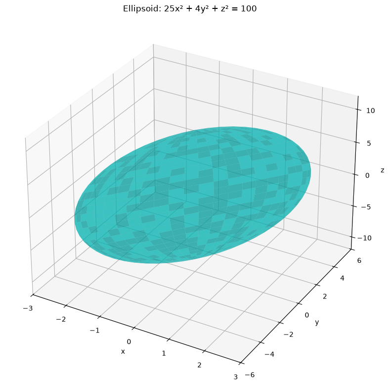
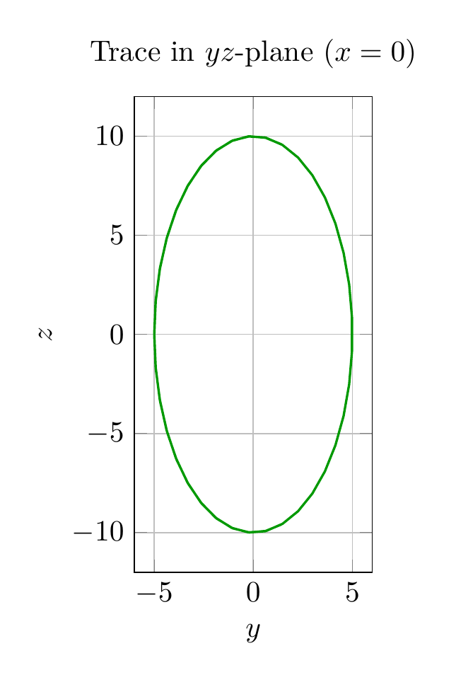

`[ Begin message. Type: AIMessage. ]`

## Solution: Identify the Surface $25x^2 + 4y^2 + z^2 = 100$

**Standard Form:**
$$\frac{x^2}{2^2} + \frac{y^2}{5^2} + \frac{z^2}{10^2} = 1$$

**Surface Type:** Ellipsoid centered at the origin

**Semi-axes:** $a = 2$ (along $x$), $b = 5$ (along $y$), $c = 10$ (along $z$)

**Traces:**
- $xy$-plane ($z=0$): Ellipse $\frac{x^2}{4} + \frac{y^2}{25} = 1$
- $xz$-plane ($y=0$): Ellipse $\frac{x^2}{4} + \frac{z^2}{100} = 1$
- $yz$-plane ($x=0$): Ellipse $\frac{y^2}{25} + \frac{z^2}{100} = 1$

**Intercepts:** $(\pm 2, 0, 0)$, $(0, \pm 5, 0)$, $(0, 0, \pm 10)$

$\boxed{\text{Ellipsoid}}$

---


(Image `20260827_000752_109552_utc_0800_pyplot_0.png`. Alt text: pyplot-generated plot.)



(Image `20260827_000752_109552_utc_0800_pyplot_1.png`. Alt text: pyplot-generated plot.)


---

[PGFplots / tikz plot.](./20260827_000752_109552_utc_0800_pgfplots_0.tex)

```latex
\documentclass[border=10pt]{standalone}
\usepackage{pgfplots}
\pgfplotsset{compat=1.18}
\begin{document}
\begin{tikzpicture}
\begin{axis}[
xlabel={$x$},
ylabel={$y$},
xmin=-3, xmax=3,
ymin=-6, ymax=6,
axis equal image,
grid=major,
title={Trace in $xy$-plane ($z=0$)}
]
\addplot[blue, thick, samples=60] ({2*cos(deg(x))}, {5*sin(deg(x))});
\end{axis}
\end{tikzpicture}
\end{document}
```


(Image `20260827_000752_109552_utc_0800_pgfplots_0.png`. Alt text: PGFplots / tikz plot (converted to PNG).)


[PGFplots / tikz plot.](./20260827_000752_109552_utc_0800_pgfplots_1.tex)

```latex
\documentclass[border=10pt]{standalone}
\usepackage{pgfplots}
\pgfplotsset{compat=1.18}
\begin{document}
\begin{tikzpicture}
\begin{axis}[
xlabel={$y$},
ylabel={$z$},
xmin=-6, xmax=6,
ymin=-12, ymax=12,
axis equal image,
grid=major,
title={Trace in $yz$-plane ($x=0$)}
]
\addplot[green!60!black, thick, samples=60] ({5*cos(deg(x))}, {10*sin(deg(x))});
\end{axis}
\end{tikzpicture}
\end{document}
```


(Image `20260827_000752_109552_utc_0800_pgfplots_1.png`. Alt text: PGFplots / tikz plot (converted to PNG).)



`[ End message. Type: AIMessage. ]`