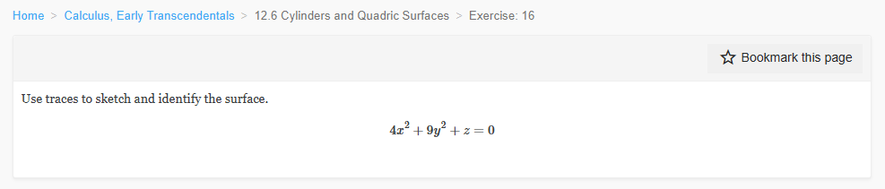
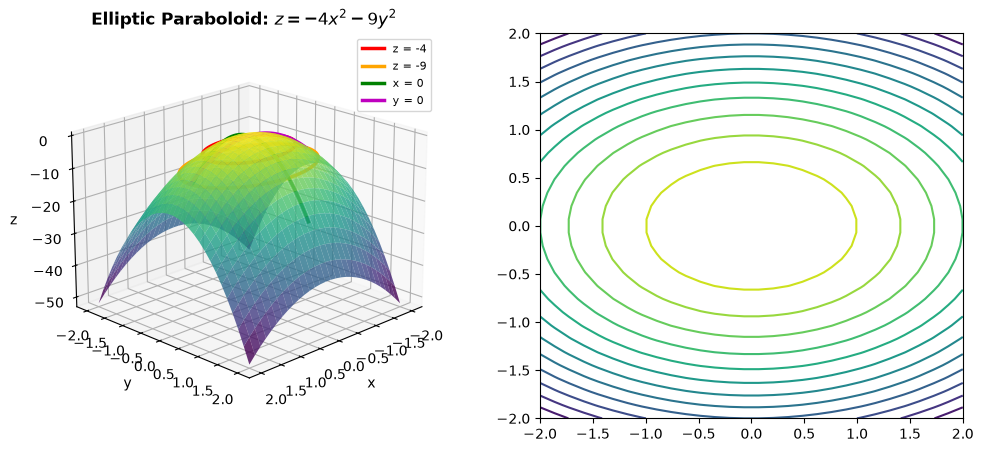
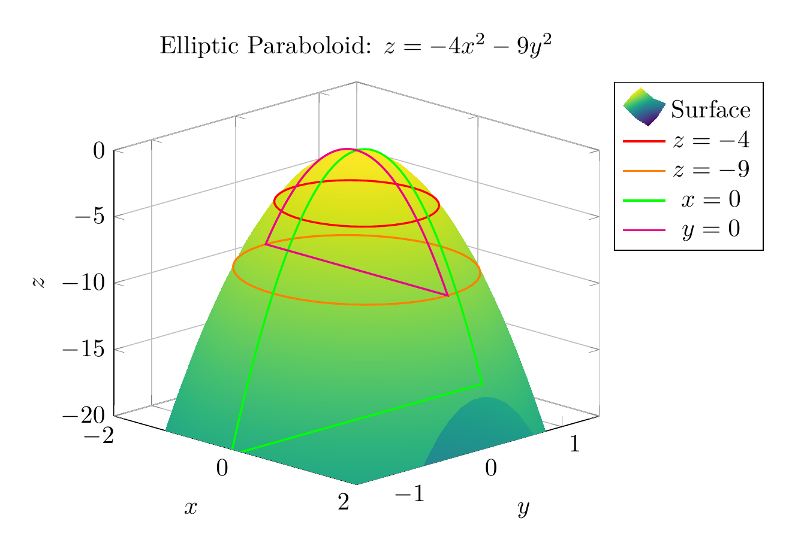
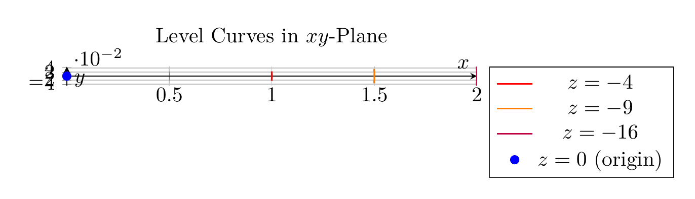

`[ Begin message. Type: HumanMessage. ]`

`[Begin Problem]`

`[ Begin message. Type: HumanMessage. ]`

Please solve the math problem in the image.


(Image `problem.png`. Alt text: Problem.)


(Image `20260827_000854_643599_utc_0800_0.png`. Alt text: Image: 20260827_000854_643599_utc_0800_human)




`[ End message. Type: HumanMessage. ]`

`[End Problem]`

`[ End message. Type: HumanMessage. ]`

`[ Begin message. Type: AIMessage. ]`

`[Begin Answer]`

## Solution: Identifying the Quadric Surface

### Given Equation
$$4x^2 + 9y^2 + z = 0$$

### Step 1: Rearrange the Equation
Solving for $z$:
$$z = -4x^2 - 9y^2$$

### Step 2: Analyze the Traces

**Horizontal Traces ($z = k$):**
Setting $z = k$:
$$k = -4x^2 - 9y^2 \implies 4x^2 + 9y^2 = -k$$

- **When $k < 0$**: We obtain ellipses: $\frac{x^2}{(-k)/4} + \frac{y^2}{(-k)/9} = 1$
  - At $z = -4$: Ellipse with semi-axes 1 and 2/3
  - At $z = -9$: Ellipse with semi-axes 3/2 and 1
- **When $k = 0$**: Single point at the origin $(0, 0, 0)$
- **When $k > 0$**: No real points

**Vertical Traces ($x = h$):**
$$z = -4h^2 - 9y^2$$
Downward-opening parabolas in the $yz$-plane.

**Vertical Traces ($y = k$):**
$$z = -4x^2 - 9k^2$$
Downward-opening parabolas in the $xz$-plane.

### Step 3: Identify the Surface

**Characteristics:**
- Horizontal traces: Ellipses
- Vertical traces: Parabolas opening downward
- Vertex: Origin $(0, 0, 0)$
- Opens: Downward along negative $z$-axis

**Conclusion:** This is an **elliptic paraboloid opening downward along the negative $z$-axis**.

$\boxed{\text{Elliptic Paraboloid opening downward along the negative } z\text{-axis}}$

---


(Image `20260827_001235_938119_utc_0800_pyplot_0.png`. Alt text: pyplot-generated plot.)



(Image `20260827_001235_938119_utc_0800_pyplot_1.png`. Alt text: pyplot-generated plot.)


---

[PGFplots / tikz plot.](./20260827_001235_938119_utc_0800_pgfplots_0.tex)

```latex
\documentclass[border=10pt]{standalone}
\usepackage{pgfplots}
\usepgfplotslibrary{colormaps}
\pgfplotsset{compat=1.18}

\begin{document}
\begin{tikzpicture}
\begin{axis}[
    view={45}{20},
    xlabel={$x$},
    ylabel={$y$},
    zlabel={$z$},
    title={Elliptic Paraboloid: $z = -4x^2 - 9y^2$},
    colormap/viridis,
    domain=-2:2,
    y domain=-2:2,
    samples=30,
    zmin=-20,
    zmax=0,
    enlargelimits=false,
    grid=major,
    legend pos=outer north east,
]
% Main surface
\addplot3[surf, shader=interp] {-4*x^2 - 9*y^2};

% Horizontal trace at z = -4 (ellipse)
\addplot3[domain=0:360, samples=50, thick, red] ({cos(\x)}, {(2/3)*sin(\x)}, {-4});

% Horizontal trace at z = -9 (ellipse)
\addplot3[domain=0:360, samples=50, thick, orange] ({1.5*cos(\x)}, {sin(\x)}, {-9});

% Vertical trace at x = 0 (parabola)
\addplot3[domain=-1.5:1.5, samples=50, thick, green] ({0}, {x}, {-9*x^2});

% Vertical trace at y = 0 (parabola)
\addplot3[domain=-1.5:1.5, samples=50, thick, magenta] ({x}, {0}, {-4*x^2});

\legend{Surface, $z=-4$, $z=-9$, $x=0$, $y=0$}
\end{axis}
\end{tikzpicture}
\end{document}

```


(Image `20260827_001235_938119_utc_0800_pgfplots_0.png`. Alt text: PGFplots / tikz plot (converted to PNG).)




[PGFplots / tikz plot.](./20260827_001235_938119_utc_0800_pgfplots_1.tex)

```latex
\documentclass[border=10pt]{standalone}
\usepackage{pgfplots}
\usepgfplotslibrary{colormaps}
\pgfplotsset{compat=1.18}

\begin{document}
\begin{tikzpicture}
\begin{axis}[
    xlabel={$x$},
    ylabel={$y$},
    title={Level Curves in $xy$-Plane},
    domain=-2:2,
    samples=50,
    axis lines=center,
    grid=major,
    axis equal image,
    legend pos=outer north east,
]
% Ellipse at z = -4: x^2/1 + y^2/(4/9) = 1
\addplot[thick, red] ({cos(\x)}, {(2/3)*sin(\x)});

% Ellipse at z = -9: x^2/(9/4) + y^2/1 = 1
\addplot[thick, orange] ({1.5*cos(\x)}, {sin(\x)});

% Ellipse at z = -16: x^2/4 + y^2/(16/9) = 1
\addplot[thick, purple] ({2*cos(\x)}, {(4/3)*sin(\x)});

% Point at z = 0
\addplot[only marks, mark=*, blue] coordinates {(0,0)};

\legend{$z=-4$, $z=-9$, $z=-16$, $z=0$ (origin)}
\end{axis}
\end{tikzpicture}
\end{document}

```


(Image `20260827_001235_938119_utc_0800_pgfplots_1.png`. Alt text: PGFplots / tikz plot (converted to PNG).)



`[End Answer]`

`[ End message. Type: AIMessage. ]`