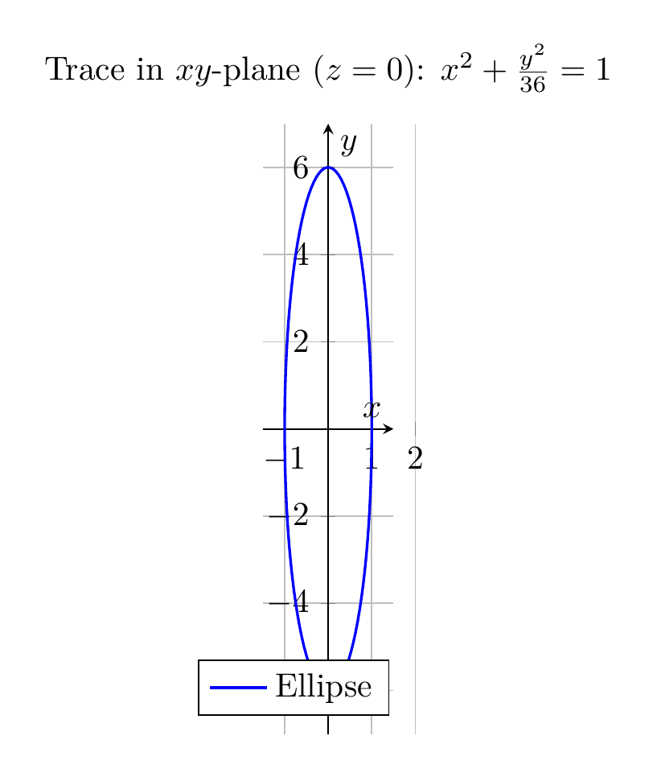
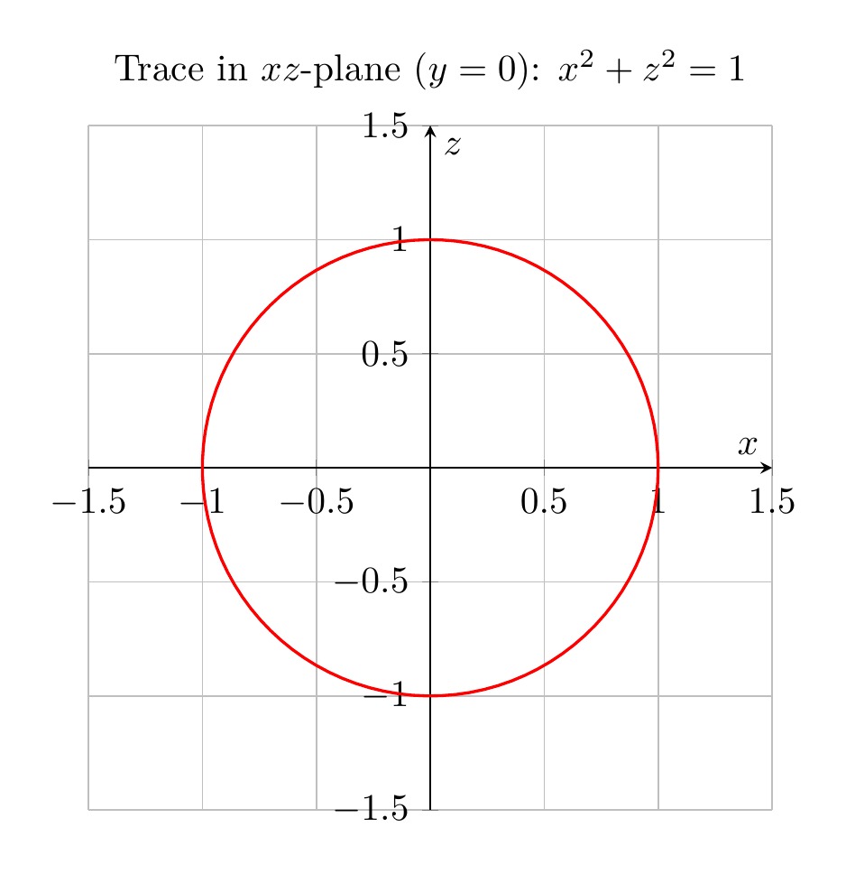

## Solution: Identifying the Surface Using Traces

### Given Equation
$$36x^2 + y^2 + 36z^2 = 36$$

### Step 1: Convert to Standard Form
Divide both sides by 36:
$$x^2 + \frac{y^2}{36} + z^2 = 1$$

Or equivalently:
$$\frac{x^2}{1^2} + \frac{y^2}{6^2} + \frac{z^2}{1^2} = 1$$

This is the **standard equation of an ellipsoid** centered at the origin $(0,0,0)$.

### Step 2: Identify the Semi-Axes
- Semi-axis in x-direction: $a = 1$
- Semi-axis in y-direction: $b = 6$
- Semi-axis in z-direction: $c = 1$

### Step 3: Analyze the Traces

**Trace in the xy-plane ($z = 0$):**
$$36x^2 + y^2 = 36 \implies \frac{x^2}{1^2} + \frac{y^2}{6^2} = 1$$
An **ellipse** with semi-axes 1 (x-direction) and 6 (y-direction).

**Trace in the xz-plane ($y = 0$):**
$$36x^2 + 36z^2 = 36 \implies x^2 + z^2 = 1$$
A **circle** with radius 1.

**Trace in the yz-plane ($x = 0$):**
$$y^2 + 36z^2 = 36 \implies \frac{y^2}{6^2} + \frac{z^2}{1^2} = 1$$
An **ellipse** with semi-axes 6 (y-direction) and 1 (z-direction).

**Trace in planes $y = k$ (constant, $|k| < 6$):**
$$36x^2 + 36z^2 = 36 - k^2 \implies x^2 + z^2 = 1 - \frac{k^2}{36}$$
These are **circles** with radius $\sqrt{1 - \frac{k^2}{36}}$.

### Step 4: Identify the Surface

The surface is an **ellipsoid** (specifically, a prolate spheroid or ellipsoid of revolution) centered at the origin, elongated along the y-axis. Since the x and z semi-axes are equal ($a = c = 1$), this ellipsoid is rotationally symmetric about the y-axis.

### Key Geometric Properties
- **Center:** $(0, 0, 0)$
- **Vertices:** $(\pm 1, 0, 0)$, $(0, \pm 6, 0)$, $(0, 0, \pm 1)$
- **Symmetry:** Symmetric about all three coordinate planes and rotationally symmetric about the y-axis
- **Shape:** Oblong/elongated along the y-axis (6 times longer than in x or z directions)

$\boxed{\text{The surface is an ellipsoid (prolate spheroid) centered at the origin with semi-axes } a=1, b=6, c=1}$


---


---

[PGFplots / tikz plot.](./20260827_001551_016461_utc_0800_pgfplots_0.tex)

```latex
\documentclass[border=10pt]{standalone}
\usepackage{pgfplots}
\usepgfplotslibrary{colormaps}
\pgfplotsset{compat=1.18}

\begin{document}
\begin{tikzpicture}
\begin{axis}[
    width=12cm,
    height=8cm,
    xlabel=$x$,
    ylabel=$y$,
    title={Trace in $xy$-plane ($z=0$): $x^2 + \frac{y^2}{36} = 1$},
    axis lines=middle,
    xmin=-1.5, xmax=1.5,
    ymin=-7, ymax=7,
    axis equal image,
    grid=major,
    legend pos=south east,
    samples=100,
    domain=0:360,
]
\addplot+[mark=none, thick, blue] ({cos(x)}, {6*sin(x)});
\addlegendentry{Ellipse}
\end{axis}
\end{tikzpicture}
\end{document}

```



[PGFplots / tikz plot.](./20260827_001551_016461_utc_0800_pgfplots_1.tex)

```latex
\documentclass[border=10pt]{standalone}
\usepackage{pgfplots}
\usepgfplotslibrary{colormaps}
\pgfplotsset{compat=1.18}

\begin{document}
\begin{tikzpicture}
\begin{axis}[
    width=10cm,
    height=8cm,
    xlabel=$x$,
    ylabel=$z$,
    title={Trace in $xz$-plane ($y=0$): $x^2 + z^2 = 1$},
    axis lines=middle,
    xmin=-1.5, xmax=1.5,
    ymin=-1.5, ymax=1.5,
    axis equal image,
    grid=major,
    samples=100,
    domain=0:360,
]
\addplot+[mark=none, thick, red] ({cos(x)}, {sin(x)});
\end{axis}
\end{tikzpicture}
\end{document}

```

