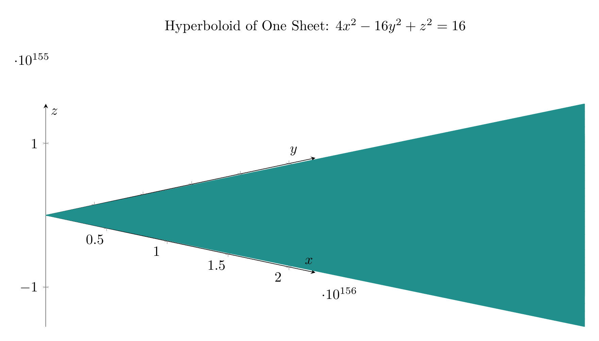
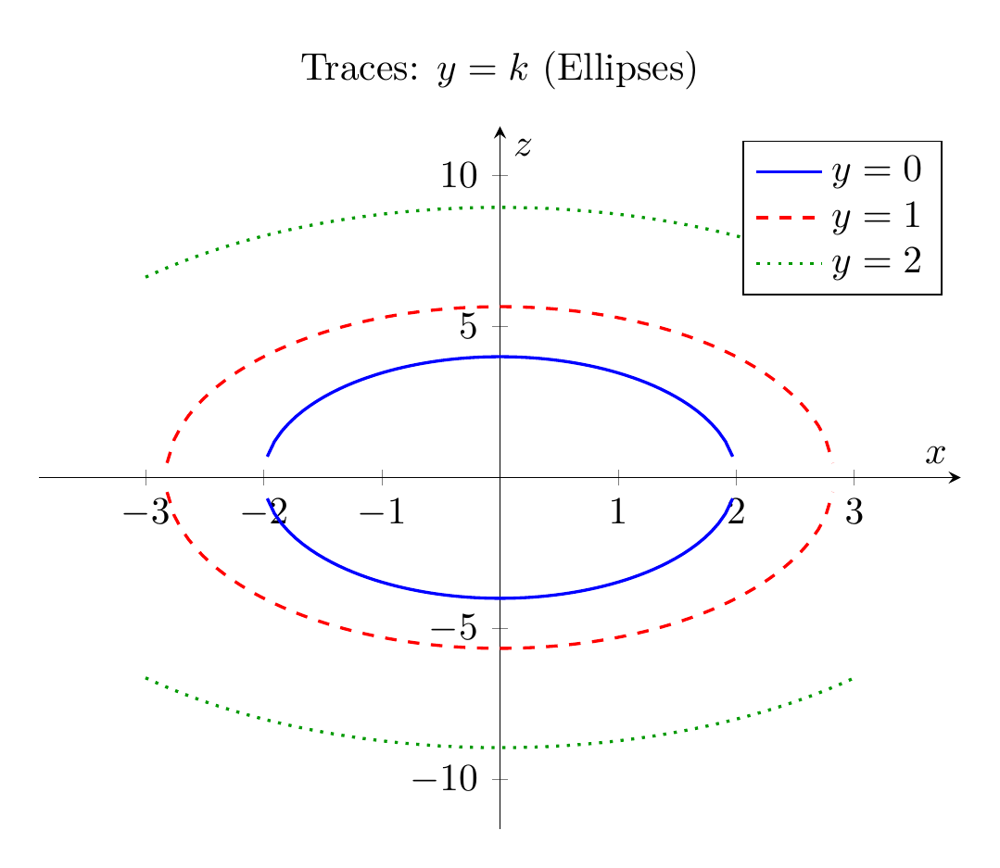

## Step-by-Step Solution

### Step 1: Convert to Standard Form

Given the equation:
$$
4x^2 - 16y^2 + z^2 = 16
$$

Divide both sides by 16 to obtain the standard form:
$$
\frac{x^2}{4} - \frac{y^2}{1} + \frac{z^2}{16} = 1
$$

Or equivalently:
$$
\frac{x^2}{2^2} - \frac{y^2}{1^2} + \frac{z^2}{4^2} = 1
$$

### Step 2: Identify the Surface Type

The standard form has:
- Two positive terms ($x^2$ and $z^2$)
- One negative term ($y^2$)
- Equal to 1

This identifies the surface as a **hyperboloid of one sheet** with the axis of symmetry along the $y$-axis (the variable with the negative coefficient).

### Step 3: Analyze Traces

**Traces in planes $y = k$ (parallel to $xz$-plane):**
$$
\frac{x^2}{4} + \frac{z^2}{16} = 1 + k^2
$$
These are **ellipses** that grow larger as $|k|$ increases. When $k = 0$, we get the smallest ellipse: $\frac{x^2}{4} + \frac{z^2}{16} = 1$.

**Traces in planes $x = k$ (parallel to $yz$-plane):**
$$
-\frac{y^2}{1} + \frac{z^2}{16} = 1 - \frac{k^2}{4}
$$
These are **hyperbolas**. When $|k| < 2$, they open along the $z$-axis. When $|k| = 2$, we get two intersecting lines. When $|k| > 2$, they open along the $y$-axis.

**Traces in planes $z = k$ (parallel to $xy$-plane):**
$$
\frac{x^2}{4} - \frac{y^2}{1} = 1 - \frac{k^2}{16}
$$
These are **hyperbolas**. When $|k| < 4$, they open along the $x$-axis. When $|k| = 4$, we get two intersecting lines. When $|k| > 4$, they open along the $y$-axis.

### Conclusion

The surface is a **hyperboloid of one sheet** centered at the origin, with its axis of symmetry along the $y$-axis.

$\boxed{\text{Hyperboloid of one sheet}}$


---


---

[PGFplots / tikz plot.](./20260827_002111_130052_utc_0800_pgfplots_0.tex)

```latex
\documentclass[border=10pt]{standalone}
\usepackage{pgfplots}
\usepgfplotslibrary{colormaps}
\pgfplotsset{compat=1.18}

\begin{document}
\begin{tikzpicture}
\begin{axis}[
    view={45}{20},
    xlabel=$x$,
    ylabel=$y$,
    zlabel=$z$,
    title={Hyperboloid of One Sheet: $4x^2 - 16y^2 + z^2 = 16$},
    colormap/viridis,
    width=15cm,
    height=10cm,
    axis lines=center,
    enlargelimits=false,
    samples=30,
    domain=-2:2,
    y domain=0:360,
]
\addplot3[surf, shader=flat corner] (
    {2*cos(x)*cosh(y)},
    {sinh(y)},
    {4*sin(x)*cosh(y)}
);
\end{axis}
\end{tikzpicture}
\end{document}

```



[PGFplots / tikz plot.](./20260827_002111_130052_utc_0800_pgfplots_1.tex)

```latex
\documentclass[border=10pt]{standalone}
\usepackage{pgfplots}
\usepgfplotslibrary{colormaps}
\pgfplotsset{compat=1.18}

\begin{document}
\begin{tikzpicture}
\begin{axis}[
    xlabel=$x$,
    ylabel=$z$,
    title={Traces: $y = k$ (Ellipses)},
    width=10cm,
    height=8cm,
    axis lines=center,
    enlargelimits=0.15,
    samples=100,
    domain=-3:3,
]
\addplot[blue, thick] {sqrt(16 - 4*x^2)};
\addplot[blue, thick] {-sqrt(16 - 4*x^2)};
\addplot[red, thick, dashed] {sqrt(32 - 4*x^2)};
\addplot[red, thick, dashed] {-sqrt(32 - 4*x^2)};
\addplot[green!60!black, thick, dotted] {sqrt(80 - 4*x^2)};
\addplot[green!60!black, thick, dotted] {-sqrt(80 - 4*x^2)};
\legend{$y=0$, , $y=1$, , $y=2$, }
\end{axis}
\end{tikzpicture}
\end{document}

```

