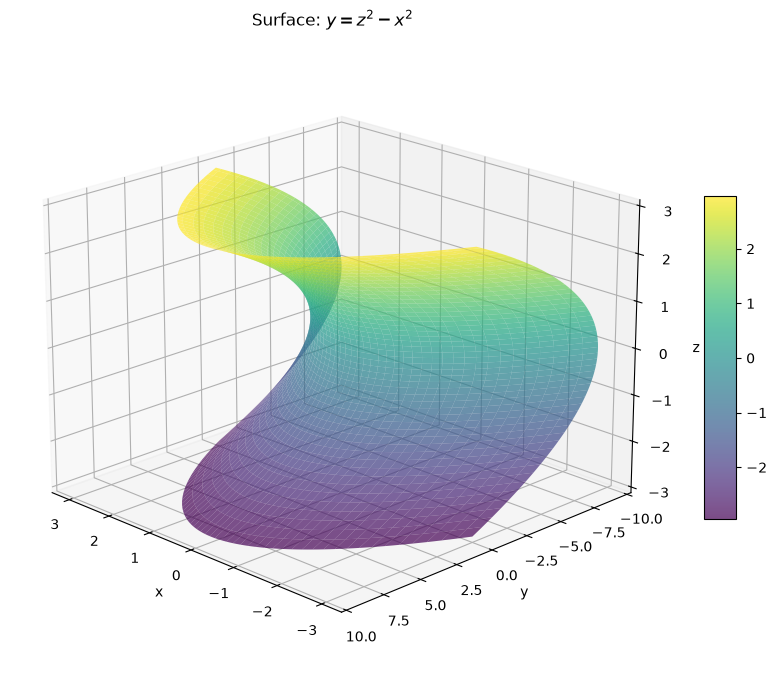
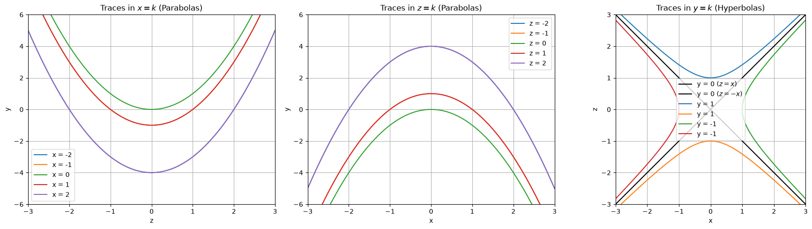
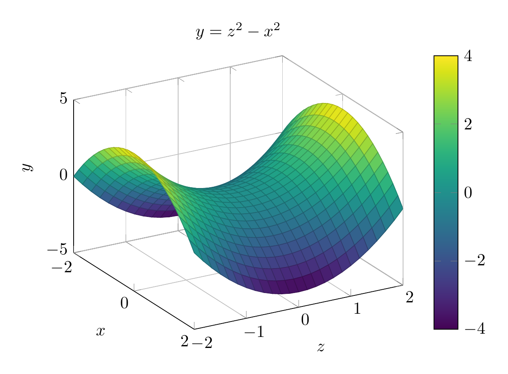
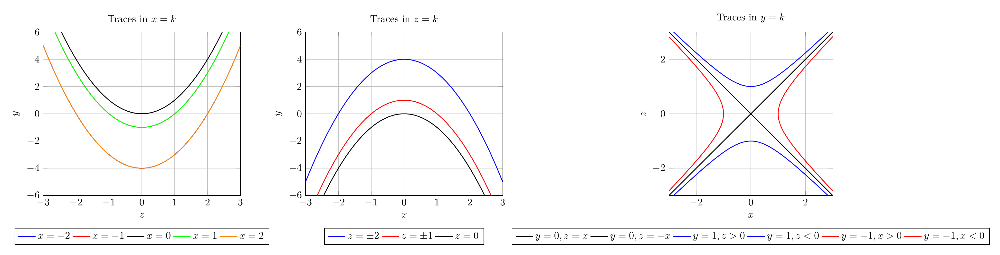

`[ Begin message. Type: HumanMessage. ]`

`[Begin Problem]`

`[ Begin message. Type: HumanMessage. ]`

Please solve the math problem in the image.


(Image `problem.png`. Alt text: Problem.)


(Image `20260827_001733_681903_utc_0800_0.png`. Alt text: Image: 20260827_001733_681903_utc_0800_human)


`[ End message. Type: HumanMessage. ]`

`[End Problem]`

`[ End message. Type: HumanMessage. ]`

`[ Begin message. Type: AIMessage. ]`

`[Begin Answer]`

To identify the surface $y = z^2 - x^2$, we examine its traces:

1.  **Traces in $x = k$:** $y = z^2 - k^2$. These are parabolas opening in the positive $y$ direction.
2.  **Traces in $z = k$:** $y = k^2 - x^2$. These are parabolas opening in the negative $y$ direction.
3.  **Traces in $y = k$:** $z^2 - x^2 = k$. These are hyperbolas (or intersecting lines when $k=0$).

A surface with parabolic traces in two directions and hyperbolic traces in the third is a **hyperbolic paraboloid**.
$\\boxed{\text{hyperbolic paraboloid}}$

---


(Image `20260827_003653_898367_utc_0800_pyplot_0.png`. Alt text: pyplot-generated plot.)



(Image `20260827_003653_898367_utc_0800_pyplot_1.png`. Alt text: pyplot-generated plot.)




---

[PGFplots / tikz plot.](./20260827_003653_898367_utc_0800_pgfplots_0.tex)

```latex
\documentclass[border=10pt]{standalone}
\usepackage{pgfplots}
\pgfplotsset{compat=1.18}
\begin{document}
\begin{tikzpicture}
\begin{axis}[
    view={60}{30},
    xlabel={$x$},
    ylabel={$z$},
    zlabel={$y$},
    title={$y = z^2 - x^2$},
    domain=-2:2,
    y domain=-2:2,
    samples=25,
    colormap/viridis,
    colorbar,
    grid=major,
    zmin=-5,
    zmax=5
]
% Map: x_plot = x, y_plot = z, z_plot = y = z^2 - x^2 = y_plot^2 - x_plot^2
\addplot3[surf] {y^2 - x^2};
\end{axis}
\end{tikzpicture}
\end{document}
```


(Image `20260827_003653_898367_utc_0800_pgfplots_0.png`. Alt text: PGFplots / tikz plot (converted to PNG).)




[PGFplots / tikz plot.](./20260827_003653_898367_utc_0800_pgfplots_1.tex)

```latex
\documentclass[border=10pt]{standalone}
\usepackage{pgfplots}
\pgfplotsset{compat=1.18}
\begin{document}
\begin{tikzpicture}
\begin{axis}[
    xlabel={$z$},
    ylabel={$y$},
    title={Traces in $x=k$},
    domain=-3:3,
    samples=50,
    grid=major,
    legend style={at={(0.5,-0.2)}, anchor=north, legend columns=-1},
    ymin=-6, ymax=6,
    xmin=-3, xmax=3
]
\addplot[blue, thick] {x^2 - 4}; \addlegendentry{$x=-2$}
\addplot[red, thick] {x^2 - 1}; \addlegendentry{$x=-1$}
\addplot[black, thick] {x^2}; \addlegendentry{$x=0$}
\addplot[green, thick] {x^2 - 1}; \addlegendentry{$x=1$}
\addplot[orange, thick] {x^2 - 4}; \addlegendentry{$x=2$}
\end{axis}
\end{tikzpicture}
\begin{tikzpicture}
\begin{axis}[
    xlabel={$x$},
    ylabel={$y$},
    title={Traces in $z=k$},
    domain=-3:3,
    samples=50,
    grid=major,
    legend style={at={(0.5,-0.2)}, anchor=north, legend columns=-1},
    ymin=-6, ymax=6,
    xmin=-3, xmax=3
]
\addplot[blue, thick] {4 - x^2}; \addlegendentry{$z=\pm2$}
\addplot[red, thick] {1 - x^2}; \addlegendentry{$z=\pm1$}
\addplot[black, thick] {-x^2}; \addlegendentry{$z=0$}
\end{axis}
\end{tikzpicture}
\begin{tikzpicture}
\begin{axis}[
    xlabel={$x$},
    ylabel={$z$},
    title={Traces in $y=k$},
    domain=-3:3,
    samples=50,
    grid=major,
    legend style={at={(0.5,-0.2)}, anchor=north, legend columns=-1},
    ymin=-3, ymax=3,
    xmin=-3, xmax=3,
    axis equal image
]
\addplot[black, thick] {x}; \addlegendentry{$y=0, z=x$}
\addplot[black, thick] {-x}; \addlegendentry{$y=0, z=-x$}
\addplot[blue, thick] {sqrt(x^2 + 1)}; \addlegendentry{$y=1, z>0$}
\addplot[blue, thick] {-sqrt(x^2 + 1)}; \addlegendentry{$y=1, z<0$}
\addplot[red, thick] (sqrt(x^2 + 1), x); \addlegendentry{$y=-1, x>0$}
\addplot[red, thick] (-sqrt(x^2 + 1), x); \addlegendentry{$y=-1, x<0$}
\end{axis}
\end{tikzpicture}
\end{document}
```


(Image `20260827_003653_898367_utc_0800_pgfplots_1.png`. Alt text: PGFplots / tikz plot (converted to PNG).)



`[End Answer]`

`[ End message. Type: AIMessage. ]`