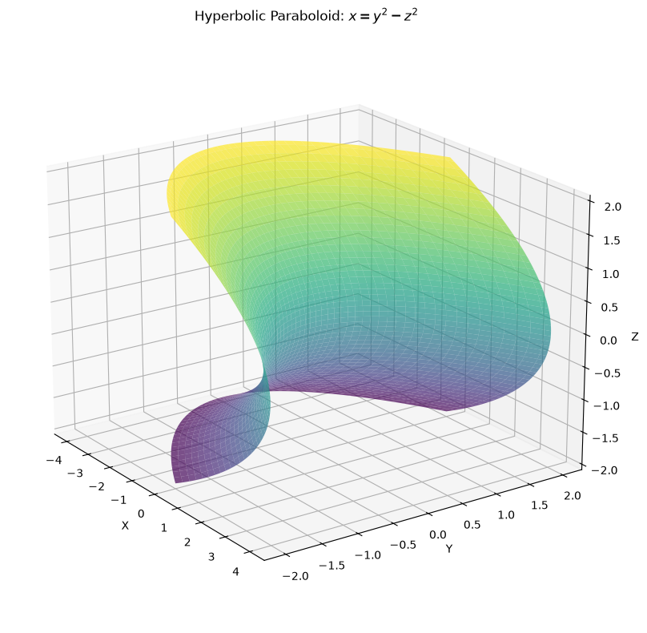
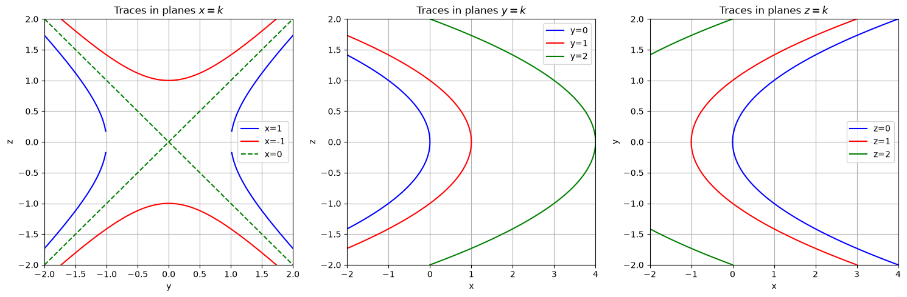
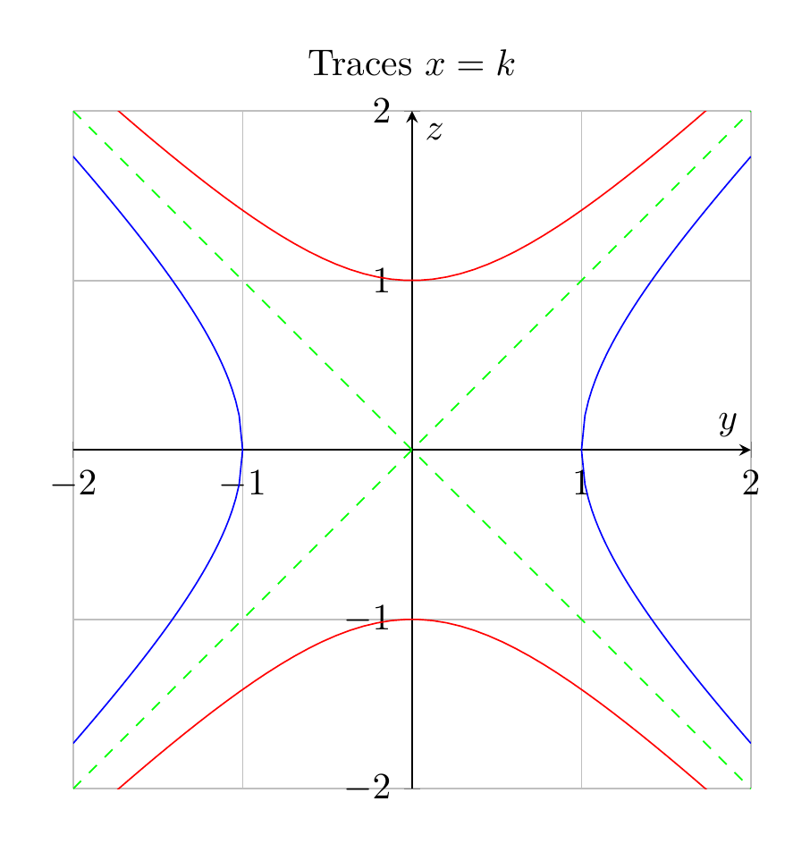
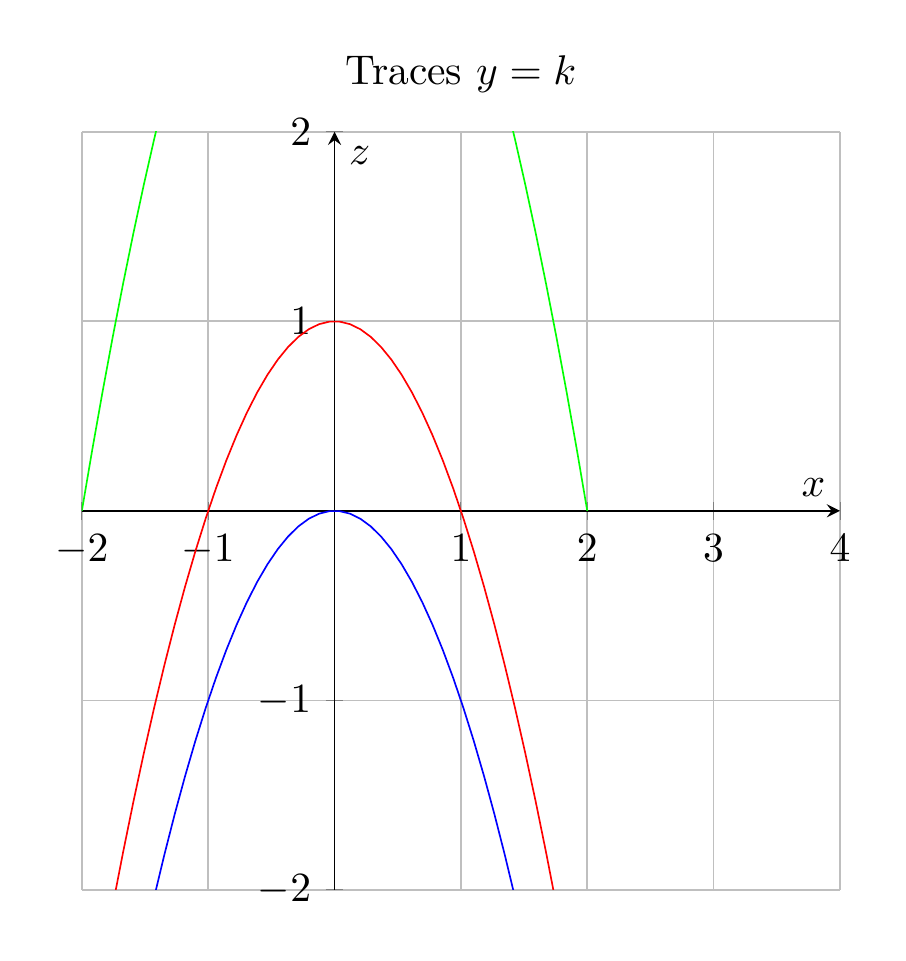

`[ Begin message. Type: AIMessage. ]`

To identify the surface $x = y^2 - z^2$, we examine traces in three families of planes:

**1. Traces in planes $x = k$:**
$$k = y^2 - z^2$$
These are hyperbolas:
- For $k > 0$: Hyperbolas opening along the $y$-axis
- For $k < 0$: Hyperbolas opening along the $z$-axis
- For $k = 0$: Two intersecting lines $y = \pm z$

**2. Traces in planes $y = k$:**
$$x = k^2 - z^2$$
These are parabolas opening in the **negative $x$ direction** with vertex at $(k^2, 0)$.

**3. Traces in planes $z = k$:**
$$x = y^2 - k^2$$
These are parabolas opening in the **positive $x$ direction** with vertex at $(-k^2, 0)$.

**Conclusion:** The surface is a **hyperbolic paraboloid** (saddle surface). It has hyperbolic traces in one direction and parabolic traces in the other two directions, with the parabolas opening in opposite directions.

$\boxed{\text{Hyperbolic Paraboloid}}$

---


(Image `20260827_093919_506029_utc_0800_pyplot_0.png`. Alt text: pyplot-generated plot.)



(Image `20260827_093919_506029_utc_0800_pyplot_1.png`. Alt text: pyplot-generated plot.)




---

[PGFplots / tikz plot.](./20260827_093919_506029_utc_0800_pgfplots_0.tex)

```latex
\documentclass[border=10pt]{standalone}
\usepackage{pgfplots}
\pgfplotsset{compat=1.18}
\begin{document}
\begin{tikzpicture}
\begin{axis}[
    xlabel={$y$},
    ylabel={$z$},
    title={Traces $x=k$},
    xmin=-2, xmax=2,
    ymin=-2, ymax=2,
    axis lines=center,
    grid=major,
    width=8cm,
    height=8cm,
]
\addplot[blue, domain=1:2, samples=50] {sqrt(x^2-1)};
\addplot[blue, domain=1:2, samples=50] {-sqrt(x^2-1)};
\addplot[blue, domain=-2:-1, samples=50] {sqrt(x^2-1)};
\addplot[blue, domain=-2:-1, samples=50] {-sqrt(x^2-1)};
\addplot[red, domain=-2:2, samples=50] {sqrt(1+x^2)};
\addplot[red, domain=-2:2, samples=50] {-sqrt(1+x^2)};
\addplot[green, dashed, domain=-2:2, samples=2] {x};
\addplot[green, dashed, domain=-2:2, samples=2] {-x};
\end{axis}
\end{tikzpicture}
\end{document}
```


(Image `20260827_093919_506029_utc_0800_pgfplots_0.png`. Alt text: PGFplots / tikz plot (converted to PNG).)




[PGFplots / tikz plot.](./20260827_093919_506029_utc_0800_pgfplots_1.tex)

```latex
\documentclass[border=10pt]{standalone}
\usepackage{pgfplots}
\pgfplotsset{compat=1.18}
\begin{document}
\begin{tikzpicture}
\begin{axis}[
    xlabel={$x$},
    ylabel={$z$},
    title={Traces $y=k$},
    xmin=-2, xmax=4,
    ymin=-2, ymax=2,
    axis lines=center,
    grid=major,
    width=8cm,
    height=8cm,
]
% y=0: x = -z^2
\addplot[blue, domain=-2:2, samples=50] {-x^2};
% y=1: x = 1-z^2
\addplot[red, domain=-2:2, samples=50] {1-x^2};
% y=2: x = 4-z^2
\addplot[green, domain=-2:2, samples=50] {4-x^2};
\end{axis}
\end{tikzpicture}
\end{document}
```


(Image `20260827_093919_506029_utc_0800_pgfplots_1.png`. Alt text: PGFplots / tikz plot (converted to PNG).)



`[ End message. Type: AIMessage. ]`