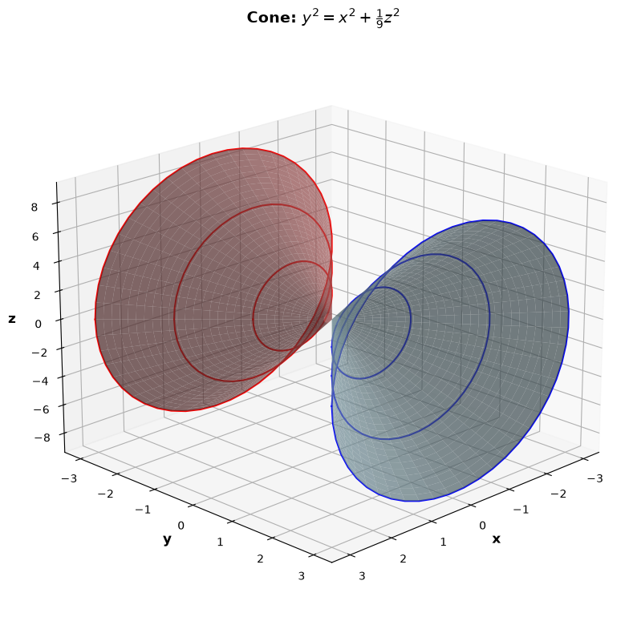
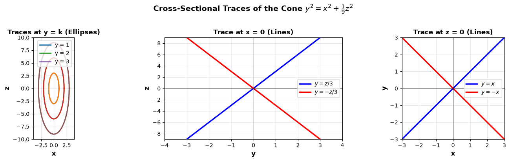
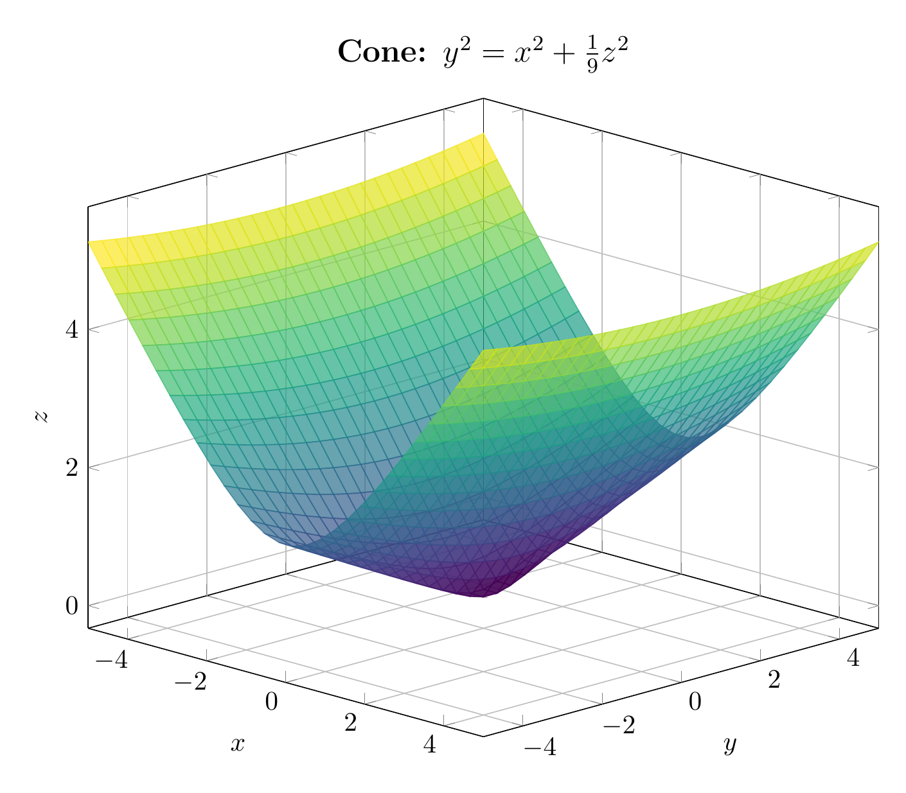
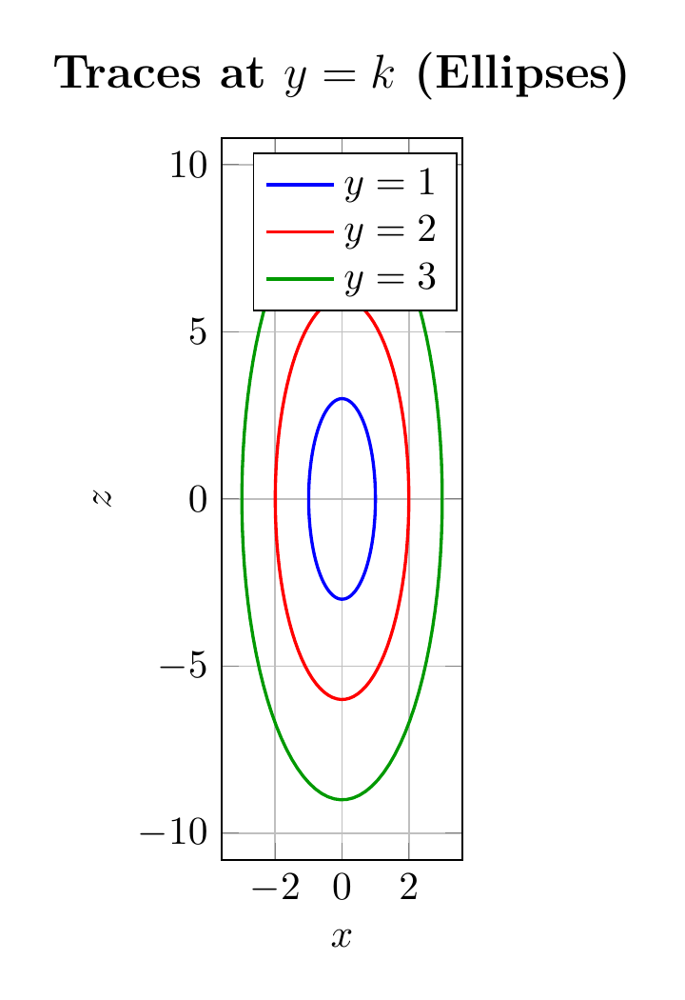

`[ Begin message. Type: AIMessage. ]`

## Solution

### Step 1: Reduce to Standard Form

The given equation is:
$$y^2 = x^2 + \frac{1}{9}z^2$$

Rearranging to standard form:
$$y^2 - x^2 - \frac{1}{9}z^2 = 0$$

Writing with denominators to match standard quadric surface forms:
$$\frac{y^2}{1^2} - \frac{x^2}{1^2} - \frac{z^2}{3^2} = 0$$

Or equivalently:
$$\frac{y^2}{1^2} = \frac{x^2}{1^2} + \frac{z^2}{3^2}$$

### Step 2: Classify the Surface

This equation matches the **standard form of an elliptic cone**:
$$\frac{y^2}{c^2} = \frac{x^2}{a^2} + \frac{z^2}{b^2}$$

where $a = 1$, $b = 3$, and $c = 1$.

**Classification: Elliptic Cone** (opening along the $y$-axis)

### Step 3: Key Features

- **Vertex**: At the origin $(0, 0, 0)$
- **Axis of symmetry**: The $y$-axis
- **Two nappes**: The cone extends in both positive and negative $y$ directions

### Step 4: Cross-Sectional Traces

1. **Horizontal traces** ($y = k$ where $k \neq 0$):
   $$k^2 = x^2 + \frac{1}{9}z^2 \implies \frac{x^2}{k^2} + \frac{z^2}{9k^2} = 1$$
   These are **ellipses** with semi-axes $|k|$ (in $x$-direction) and $3|k|$ (in $z$-direction).

2. **Trace at $y = 0$**: Just the point $(0, 0, 0)$ — the vertex.

3. **Trace at $x = 0$**: 
   $$y^2 = \frac{1}{9}z^2 \implies y = \pm\frac{z}{3}$$
   These are two intersecting lines in the $yz$-plane.

4. **Trace at $z = 0$**:
   $$y^2 = x^2 \implies y = \pm x$$
   These are two intersecting lines in the $xy$-plane.

### Summary

The surface is an **elliptic cone** with vertex at the origin, opening along the $y$-axis, with elliptical cross-sections whose $z$-semi-axis is 3 times the $x$-semi-axis.

$\boxed{\text{Elliptic Cone: } \frac{y^2}{1^2} = \frac{x^2}{1^2} + \frac{z^2}{3^2}}$

---


(Image `20260827_004648_000723_utc_0800_pyplot_0.png`. Alt text: pyplot-generated plot.)



(Image `20260827_004648_000723_utc_0800_pyplot_1.png`. Alt text: pyplot-generated plot.)




---

[PGFplots / tikz plot.](./20260827_004648_000723_utc_0800_pgfplots_0.tex)

```latex
\documentclass[border=10pt]{standalone}
\usepackage{pgfplots}
\usepgfplotslibrary{colormaps}
\pgfplotsset{compat=1.18}

\begin{document}
\begin{tikzpicture}
\begin{axis}[
    view={45}{20},
    xlabel={$x$},
    ylabel={$y$},
    zlabel={$z$},
    title={Cone: $y^2 = x^2 + \frac{1}{9}z^2$},
    xlabel style={font=\bfseries},
    ylabel style={font=\bfseries},
    zlabel style={font=\bfseries},
    title style={font=\bfseries\large},
    colormap/viridis,
    grid=major,
    width=12cm,
    height=10cm
]
% Positive nappe: y = sqrt(x^2 + z^2/9)
\addplot3[surf, shader=flat corner, samples=30, opacity=0.7] 
    {sqrt(x^2 + y^2/9)};
\end{axis}
\end{tikzpicture}
\end{document}
```


(Image `20260827_004648_000723_utc_0800_pgfplots_0.png`. Alt text: PGFplots / tikz plot (converted to PNG).)




[PGFplots / tikz plot.](./20260827_004648_000723_utc_0800_pgfplots_1.tex)

```latex
\documentclass[border=10pt]{standalone}
\usepackage{pgfplots}
\usepgfplotslibrary{colormaps}
\pgfplotsset{compat=1.18}

\begin{document}
\begin{tikzpicture}
\begin{axis}[
    xlabel={$x$},
    ylabel={$z$},
    title={Traces at $y = k$ (Ellipses)},
    xlabel style={font=\bfseries},
    ylabel style={font=\bfseries},
    title style={font=\bfseries\large},
    grid=major,
    axis equal image,
    width=10cm,
    height=8cm,
    legend style={at={(0.98,0.98)}, anchor=north east}
]
% Ellipse at y = 1: x^2 + z^2/9 = 1
\addplot[domain=0:360, samples=100, thick, blue] ({cos(x)}, {3*sin(x)});
\addlegendentry{$y = 1$}

% Ellipse at y = 2: x^2 + z^2/9 = 4
\addplot[domain=0:360, samples=100, thick, red] ({2*cos(x)}, {6*sin(x)});
\addlegendentry{$y = 2$}

% Ellipse at y = 3: x^2 + z^2/9 = 9
\addplot[domain=0:360, samples=100, thick, green!60!black] ({3*cos(x)}, {9*sin(x)});
\addlegendentry{$y = 3$}

\end{axis}
\end{tikzpicture}
\end{document}
```


(Image `20260827_004648_000723_utc_0800_pgfplots_1.png`. Alt text: PGFplots / tikz plot (converted to PNG).)



`[ End message. Type: AIMessage. ]`