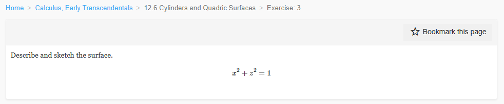
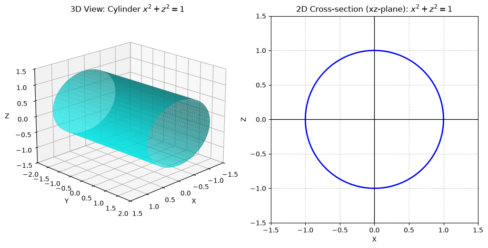
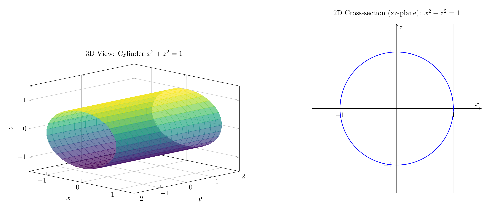

`[ Begin message. Type: HumanMessage. ]`

`[Begin Problem]`

`[ Begin message. Type: HumanMessage. ]`

Please solve the math problem in the image.


(Image `problem.png`. Alt text: Problem.)


(Image `20260826_231103_198517_utc_0800_0.png`. Alt text: Image: 20260826_231103_198517_utc_0800_human)




`[ End message. Type: HumanMessage. ]`

`[End Problem]`

`[ End message. Type: HumanMessage. ]`

`[ Begin message. Type: AIMessage. ]`

`[Begin Answer]`

**Problem:** Describe and sketch the surface $x^2 + z^2 = 1$.

**Solution:**

The given equation is:
$$x^2 + z^2 = 1$$

**Analysis:**
1. The equation involves only the variables $x$ and $z$. The variable $y$ is missing.
2. In the $xz$-plane (where $y = 0$), the equation $x^2 + z^2 = 1$ represents a **circle** centered at the origin with radius $r = 1$.
3. Since $y$ does not appear in the equation, it can take any real value. This means the cross-section of the surface in any plane $y = c$ (for any constant $c$) is the same circle $x^2 + z^2 = 1$.
4. A surface generated by translating a curve along a straight line is called a **cylinder**.

**Description:**
The surface is a **circular cylinder** with:
- **Radius:** $1$
- **Axis:** The $y$-axis (the axis parallel to the missing variable)
- It extends infinitely in both the positive and negative $y$ directions.

**Sketch:**
The 3D view shows the cylinder extending along the $y$-axis. The 2D cross-section in the $xz$-plane is a unit circle.

$\boxed{\text{Circular cylinder of radius 1 with axis along the } y\text{-axis}}$

---


(Image `20260826_231342_504736_utc_0800_pyplot_0.png`. Alt text: pyplot-generated plot.)




---

[PGFplots / tikz plot.](./20260826_231342_504736_utc_0800_pgfplots_0.tex)

```latex
\documentclass[border=10pt]{standalone}
\usepackage{pgfplots}
\usepgfplotslibrary{colormaps}
\pgfplotsset{compat=newest}

\begin{document}
\begin{tikzpicture}

% 3D Cylinder Plot
\begin{axis}[
    view={45}{20},
    xlabel={$x$},
    ylabel={$y$},
    zlabel={$z$},
    title={3D View: Cylinder $x^2 + z^2 = 1$},
    xmin=-1.5, xmax=1.5,
    ymin=-2, ymax=2,
    zmin=-1.5, zmax=1.5,
    colormap/viridis,
    samples=30,
    samples y=20,
    domain=0:360,
    y domain=-2:2,
    grid=major,
    width=12cm,
    height=8cm
]
\addplot3[surf, shader=flat corner, opacity=0.7] 
({cos(x)}, {y}, {sin(x)});
\end{axis}

% 2D Cross-section Plot
\begin{axis}[
    shift={(14cm, 0)},
    xlabel={$x$},
    ylabel={$z$},
    title={2D Cross-section (xz-plane): $x^2 + z^2 = 1$},
    axis equal image,
    xmin=-1.5, xmax=1.5,
    ymin=-1.5, ymax=1.5,
    grid=major,
    width=10cm,
    height=10cm,
    axis lines=center,
    xtick={-1, 0, 1},
    ytick={-1, 0, 1}
]
\addplot[domain=0:360, samples=100, thick, blue] ({cos(x)}, {sin(x)});
\end{axis}

\end{tikzpicture}
\end{document}

```


(Image `20260826_231342_504736_utc_0800_pgfplots_0.png`. Alt text: PGFplots / tikz plot (converted to PNG).)



`[End Answer]`

`[ End message. Type: AIMessage. ]`