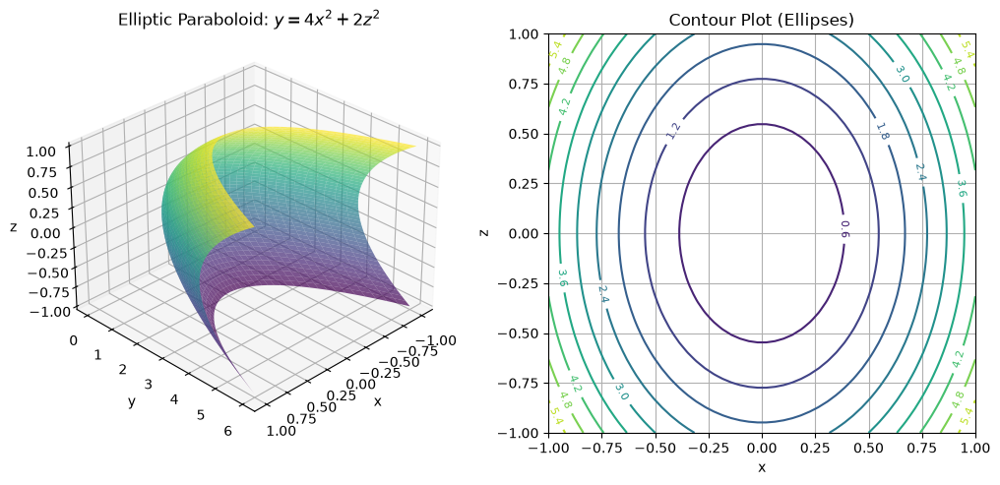
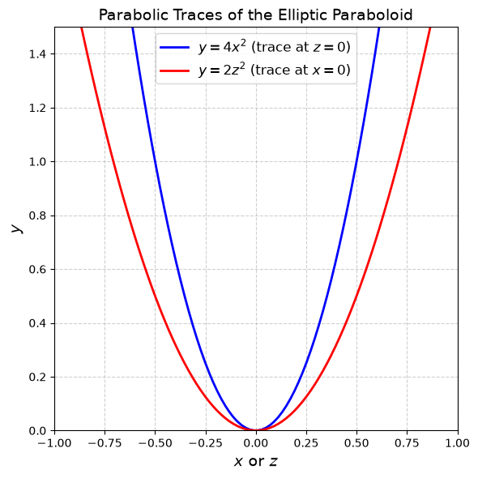
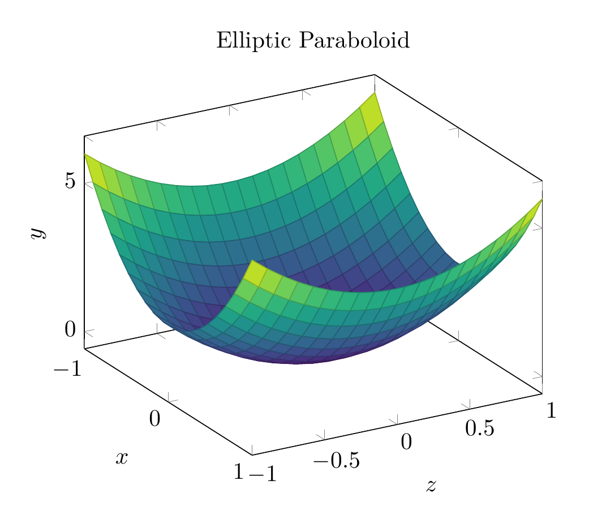
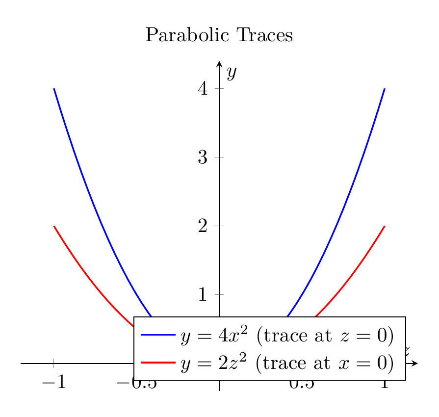

`[ Begin message. Type: AIMessage. ]`

To solve the problem, we follow these steps:

### 1. Reduce to Standard Form
Start with the given equation:
$$ 4x^2 - y + 2z^2 = 0 $$

Isolate the linear term $y$ by adding it to both sides:
$$ y = 4x^2 + 2z^2 $$

This is the standard form of an elliptic paraboloid. It can also be written in the form:
$$ \frac{y}{c} = \frac{x^2}{a^2} + \frac{z^2}{b^2} $$
where $c = 1$, $a = \frac{1}{2}$, and $b = \frac{1}{\sqrt{2}}$.

### 2. Classify the Surface
The equation features one linear variable ($y$) and two squared variables ($x^2$ and $z^2$) with positive coefficients. This identifies the surface as an **elliptic paraboloid**. It opens along the positive $y$-axis, with its vertex at the origin $(0,0,0)$.

### 3. Sketch the Surface
To understand the shape, we examine its traces (cross-sections):
- **Horizontal traces ($y = k > 0$):** The equation $4x^2 + 2z^2 = k$ represents a family of **ellipses** in planes parallel to the $xz$-plane.
- **Vertical traces ($x = 0$ and $z = 0$):** 
  - In the $yz$-plane ($x=0$), the trace is the parabola $y = 2z^2$.
  - In the $xy$-plane ($z=0$), the trace is the parabola $y = 4x^2$.

The 3D plot shows the bowl-shaped surface opening along the $y$-axis, and the 2D plot illustrates the parabolic traces.

$\boxed{\text{Elliptic paraboloid: } y = 4x^2 + 2z^2}$

---


(Image `20260827_011527_550420_utc_0800_pyplot_0.png`. Alt text: pyplot-generated plot.)



(Image `20260827_011527_550420_utc_0800_pyplot_1.png`. Alt text: pyplot-generated plot.)




---

[PGFplots / tikz plot.](./20260827_011527_550420_utc_0800_pgfplots_0.tex)

```latex
\documentclass[border=10pt]{standalone}
\usepackage{pgfplots}
\pgfplotsset{compat=newest}
\begin{document}
\begin{tikzpicture}
\begin{axis}[
    view={60}{30},
    domain=-1:1,
    y domain=-1:1,
    samples=20,
    xlabel={$x$},
    ylabel={$z$},
    zlabel={$y$},
    title={Elliptic Paraboloid},
    colormap/viridis
]
\addplot3[surf] {4*x^2 + 2*y^2};
\end{axis}
\end{tikzpicture}
\end{document}
```


(Image `20260827_011527_550420_utc_0800_pgfplots_0.png`. Alt text: PGFplots / tikz plot (converted to PNG).)




[PGFplots / tikz plot.](./20260827_011527_550420_utc_0800_pgfplots_1.tex)

```latex
\documentclass[border=10pt]{standalone}
\usepackage{pgfplots}
\pgfplotsset{compat=newest}
\begin{document}
\begin{tikzpicture}
\begin{axis}[
    xlabel={$x$ or $z$},
    ylabel={$y$},
    title={Parabolic Traces},
    domain=-1:1,
    samples=50,
    axis lines=middle,
    enlargelimits=true,
    legend pos=south east
]
\addplot[blue, thick] {4*x^2};
\addlegendentry{$y = 4x^2$ (trace at $z=0$)}

\addplot[red, thick] {2*x^2};
\addlegendentry{$y = 2z^2$ (trace at $x=0$)}

\end{axis}
\end{tikzpicture}
\end{document}
```


(Image `20260827_011527_550420_utc_0800_pgfplots_1.png`. Alt text: PGFplots / tikz plot (converted to PNG).)



`[ End message. Type: AIMessage. ]`