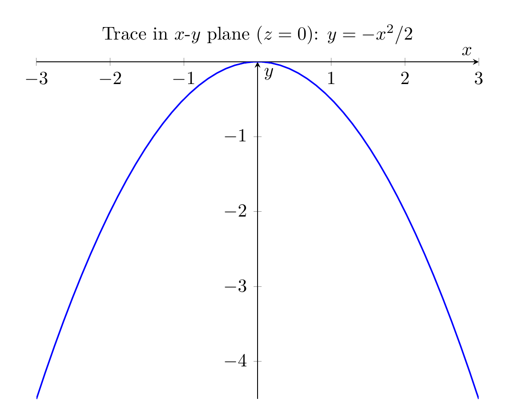
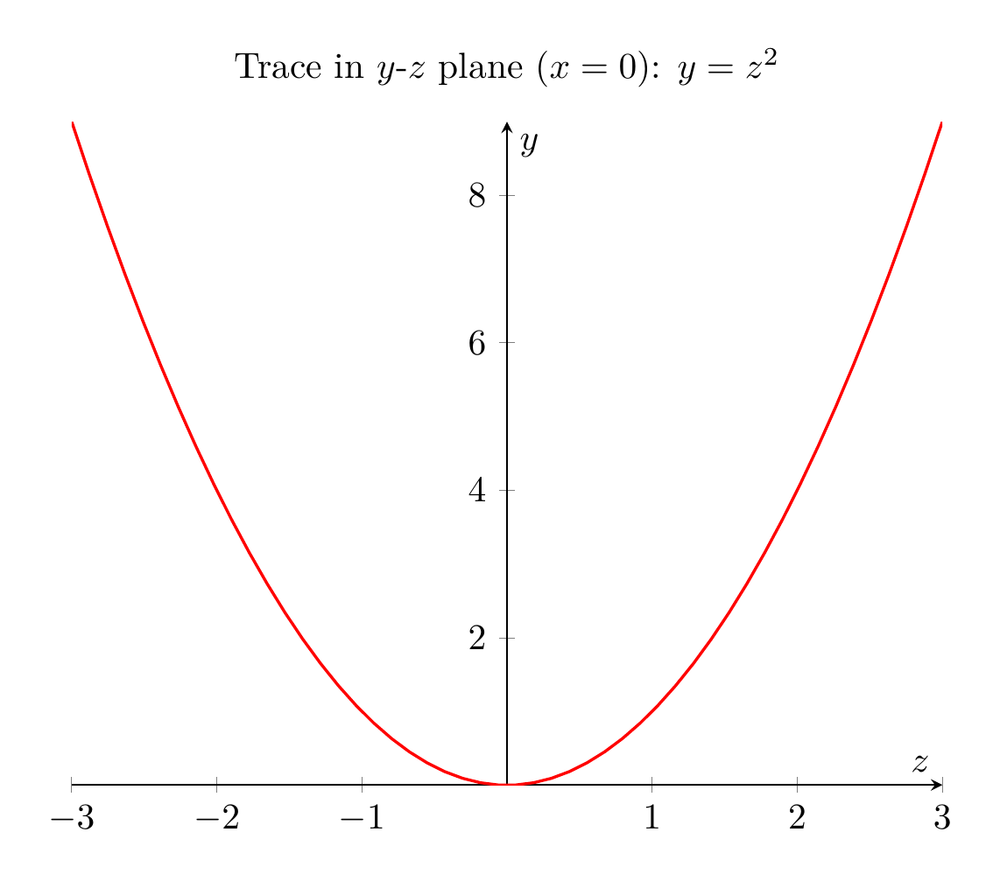

`[ Begin message. Type: HumanMessage. ]`

`[Begin Problem]`

`[ Begin message. Type: HumanMessage. ]`

Please solve the math problem in the image.


(Image `problem.png`. Alt text: Problem.)


(Image `20260827_010624_905820_utc_0800_0.png`. Alt text: Image: 20260827_010624_905820_utc_0800_human)


`[ End message. Type: HumanMessage. ]`

`[End Problem]`

`[ End message. Type: HumanMessage. ]`

`[ Begin message. Type: AIMessage. ]`

`[Begin Answer]`

To solve the problem, we need to manipulate the given equation into a recognizable standard form, identify the type of quadric surface, and describe its geometric features for sketching.

### 1. Reduce to Standard Form
The given equation is:
$$x^2 + 2y - 2z^2 = 0$$

First, isolate the linear term $2y$ by moving the squared terms to the other side:
$$2y = 2z^2 - x^2$$

Next, divide the entire equation by 2 to solve for $y$:
$$y = z^2 - \frac{x^2}{2}$$

This can be written explicitly in the standard form for a hyperbolic paraboloid:
$$y = \frac{z^2}{1^2} - \frac{x^2}{(\sqrt{2})^2}$$

### 2. Classify the Surface
The standard form $y = \frac{z^2}{c^2} - \frac{x^2}{a^2}$ corresponds to a **hyperbolic paraboloid**. 
- The axis of symmetry is the $y$-axis (the axis corresponding to the linear term).
- The surface has a saddle shape.

### 3. Sketching the Surface (Analysis of Traces)
To sketch the surface, we examine its traces (cross-sections) in coordinate planes:

*   **Traces in planes $x = k$ (parallel to $yz$-plane):**
    Substituting $x = k$ gives $y = z^2 - \frac{k^2}{2}$. These are **parabolas opening upward**.
*   **Traces in planes $z = k$ (parallel to $xy$-plane):**
    Substituting $z = k$ gives $y = k^2 - \frac{x^2}{2}$. These are **parabolas opening downward**.
*   **Trace in the plane $y = 0$ ($xz$-plane):**
    Substituting $y = 0$ gives $0 = z^2 - \frac{x^2}{2}$, which factors to $z = \pm \frac{x}{\sqrt{2}}$. These are **two intersecting lines** through the origin.

The combination of upward-opening parabolas in one direction and downward-opening parabolas in the perpendicular direction creates the characteristic "saddle" shape of a hyperbolic paraboloid.

**Final Answer:**
The standard form is $y = \frac{z^2}{1} - \frac{x^2}{2}$, and the surface is a hyperbolic paraboloid.

$\boxed{y = z^2 - \frac{x^2}{2}, \text{ Hyperbolic Paraboloid}}$

---


(Image `20260827_012856_326914_utc_0800_pyplot_0.png`. Alt text: pyplot-generated plot.)


(Image `20260827_012856_326914_utc_0800_pyplot_1.png`. Alt text: pyplot-generated plot.)


---

[PGFplots / tikz plot.](./20260827_012856_326914_utc_0800_pgfplots_0.tex)

```latex
\documentclass[border=10pt]{standalone}
\usepackage{pgfplots}
\pgfplotsset{compat=1.18}
\begin{document}
\begin{tikzpicture}
\begin{axis}[
    xlabel={$x$},
    ylabel={$y$},
    title={Trace in $x$-$y$ plane ($z=0$): $y = -x^2/2$},
    domain=-3:3,
    samples=50,
    axis lines=middle,
    width=10cm,
    height=8cm
]
\addplot[blue, thick] {-x^2/2};
\end{axis}
\end{tikzpicture}
\end{document}

```


(Image `20260827_012856_326914_utc_0800_pgfplots_0.png`. Alt text: PGFplots / tikz plot (converted to PNG).)




[PGFplots / tikz plot.](./20260827_012856_326914_utc_0800_pgfplots_1.tex)

```latex
\documentclass[border=10pt]{standalone}
\usepackage{pgfplots}
\pgfplotsset{compat=1.18}
\begin{document}
\begin{tikzpicture}
\begin{axis}[
    xlabel={$z$},
    ylabel={$y$},
    title={Trace in $y$-$z$ plane ($x=0$): $y = z^2$},
    domain=-3:3,
    samples=50,
    axis lines=middle,
    width=10cm,
    height=8cm
]
\addplot[red, thick] {x^2};
\end{axis}
\end{tikzpicture}
\end{document}

```


(Image `20260827_012856_326914_utc_0800_pgfplots_1.png`. Alt text: PGFplots / tikz plot (converted to PNG).)



`[End Answer]`

`[ End message. Type: AIMessage. ]`