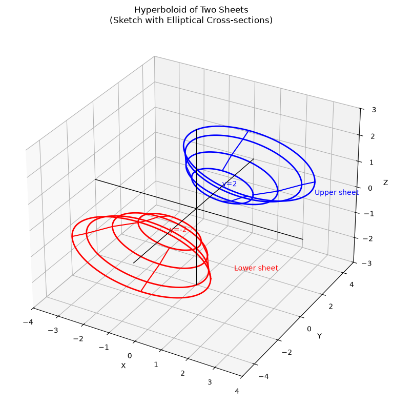
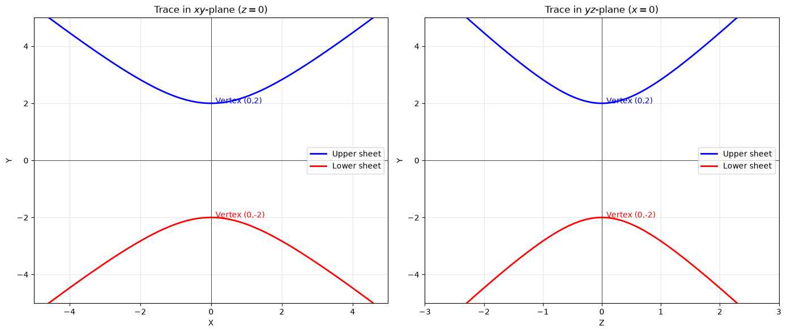
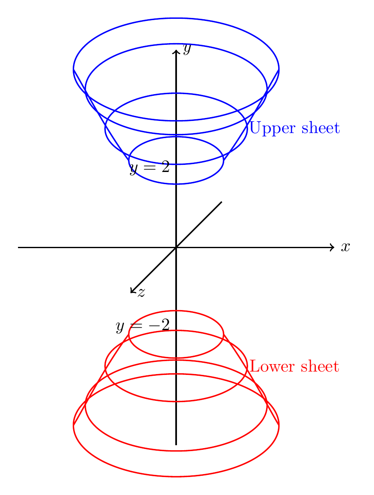

`[ Begin message. Type: AIMessage. ]`

## Solution

### Step 1: Reduce to Standard Form

Given equation:
$$y^2 = x^2 + 4z^2 + 4$$

Rearrange all variable terms to one side:
$$y^2 - x^2 - 4z^2 = 4$$

Divide by 4 to normalize:
$$\frac{y^2}{4} - \frac{x^2}{4} - \frac{z^2}{1} = 1$$

Or in standard form:
$$\boxed{\frac{y^2}{2^2} - \frac{x^2}{2^2} - \frac{z^2}{1^2} = 1}$$

### Step 2: Classify the Surface

This is a **hyperboloid of two sheets** with:
- **Axis of symmetry:** $y$-axis (the axis corresponding to the positive squared term)
- **Vertices:** $(0, \pm 2, 0)$
- **Parameters:** $a = 2$, $b = 1$, $c = 2$

The general form is $\frac{y^2}{c^2} - \frac{x^2}{a^2} - \frac{z^2}{b^2} = 1$.

### Step 3: Key Features for Sketching

**Traces:**
- **$y = k$ (horizontal planes):**
  - $|k| > 2$: Ellipses $\frac{x^2}{4(k^2/4-1)} + \frac{z^2}{k^2/4-1} = 1$
  - $|k| = 2$: Single point $(0, \pm 2, 0)$ (vertices)
  - $|k| < 2$: Empty set (no real intersection)

- **$x = k$ (vertical planes parallel to $yz$-plane):** Hyperbolas $\frac{y^2}{4} - z^2 = 1 + \frac{k^2}{4}$

- **$z = k$ (vertical planes parallel to $xy$-plane):** Hyperbolas $\frac{y^2}{4} - \frac{x^2}{4} = 1 + k^2$

The surface consists of two disconnected sheets that open along the positive and negative $y$-axis. The sheets are separated by the region $-2 < y < 2$, where there is no surface.

$\boxed{\text{Hyperboloid of two sheets; Standard form: } \frac{y^2}{4} - \frac{x^2}{4} - z^2 = 1}$

---


(Image `20260827_012940_169429_utc_0800_pyplot_0.png`. Alt text: pyplot-generated plot.)



(Image `20260827_012940_169429_utc_0800_pyplot_1.png`. Alt text: pyplot-generated plot.)




---

[PGFplots / tikz plot.](./20260827_012940_169429_utc_0800_pgfplots_0.tex)

```latex
\documentclass[border=10pt]{standalone}
\usepackage{tikz}

\begin{document}
\begin{tikzpicture}[scale=0.8]
% Draw coordinate axes in 3D perspective
\draw[->, thick] (-4,0,0) -- (4,0,0) node[right] {$x$};
\draw[->, thick] (0,-5,0) -- (0,5,0) node[right] {$y$};
\draw[->, thick] (0,0,-3) -- (0,0,3) node[right] {$z$};

% Upper sheet - ellipses at different y levels
\draw[blue, thick] (0,2.2,0) ellipse (1.2 and 0.6);
\draw[blue, thick] (0,3,0) ellipse (1.8 and 0.9);
\draw[blue, thick] (0,4,0) ellipse (2.3 and 1.15);
\draw[blue, thick] (0,4.5,0) ellipse (2.6 and 1.3);

% Lower sheet - ellipses at different y levels
\draw[red, thick] (0,-2.2,0) ellipse (1.2 and 0.6);
\draw[red, thick] (0,-3,0) ellipse (1.8 and 0.9);
\draw[red, thick] (0,-4,0) ellipse (2.3 and 1.15);
\draw[red, thick] (0,-4.5,0) ellipse (2.6 and 1.3);

% Connecting lines to show surface
\draw[blue, thick] (1.2,2.2,0) .. controls (1.8,3,0) and (2.3,4,0) .. (2.6,4.5,0);
\draw[blue, thick] (-1.2,2.2,0) .. controls (-1.8,3,0) and (-2.3,4,0) .. (-2.6,4.5,0);
\draw[red, thick] (1.2,-2.2,0) .. controls (1.8,-3,0) and (2.3,-4,0) .. (2.6,-4.5,0);
\draw[red, thick] (-1.2,-2.2,0) .. controls (-1.8,-3,0) and (-2.3,-4,0) .. (-2.6,-4.5,0);

% Labels
\node[blue] at (3,3,0) {Upper sheet};
\node[red] at (3,-3,0) {Lower sheet};
\node at (0,2,0) [left] {$y=2$};
\node at (0,-2,0) [left] {$y=-2$};

\end{tikzpicture}
\end{document}
```


(Image `20260827_012940_169429_utc_0800_pgfplots_0.png`. Alt text: PGFplots / tikz plot (converted to PNG).)




[PGFplots / tikz plot.](./20260827_012940_169429_utc_0800_pgfplots_1.tex)

```latex
\documentclass[border=10pt]{standalone}
\usepackage{pgfplots}
\pgfplotsset{compat=1.18}

\begin{document}
\begin{tikzpicture}
\begin{axis}[
    xlabel={$x$},
    ylabel={$y$},
    title={Trace in $xy$-plane ($z=0$)},
    width=10cm,
    height=8cm,
    axis lines=center,
    enlargelimits=0.15,
    grid=major,
    domain=-5:5,
    samples=100,
]
% Upper branch: y = 2*sqrt(1 + x^2/4)
\addplot[blue, thick] {2*sqrt(1 + x^2/4)};
% Lower branch: y = -2*sqrt(1 + x^2/4)
\addplot[red, thick] {-2*sqrt(1 + x^2/4)};
% Asymptotes
\addplot[black, dashed] {2 + x};
\addplot[black, dashed] {-2 - x};
\end{axis}
\end{tikzpicture}
\end{document}
```


(Image `20260827_012940_169429_utc_0800_pgfplots_1.png`. Alt text: PGFplots / tikz plot (converted to PNG).)


`[ End message. Type: AIMessage. ]`