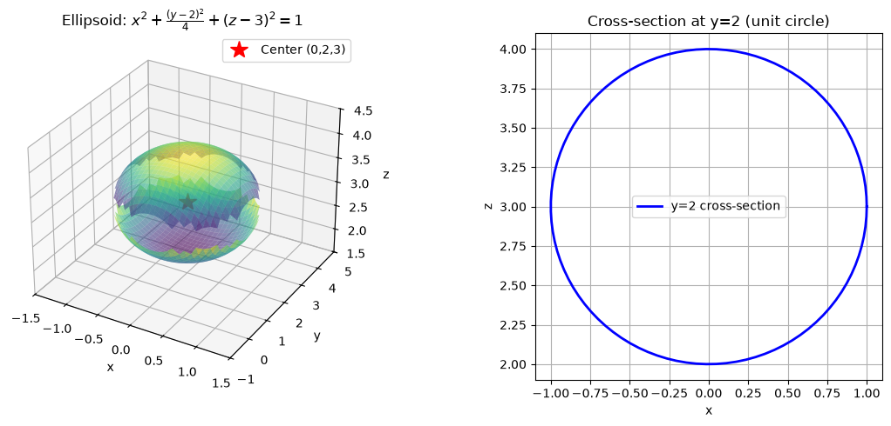
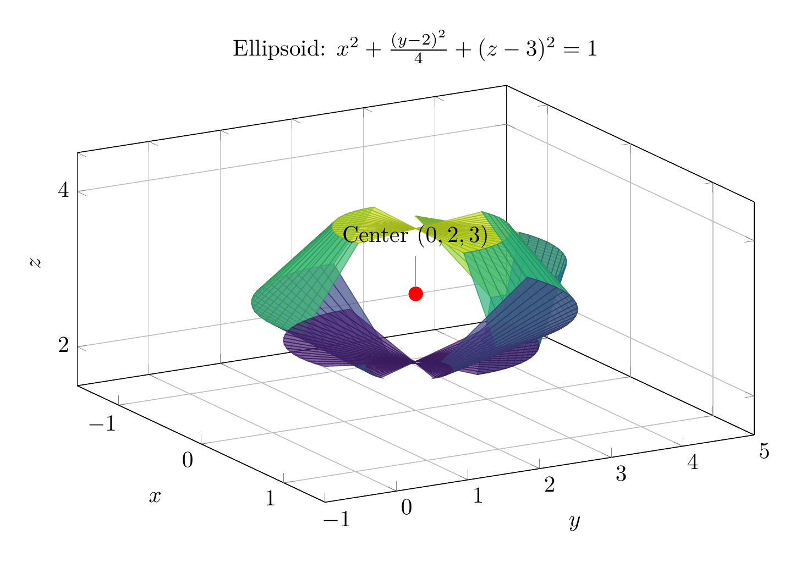

**Step 1: Group terms by variable**
$$4x^2 + (y^2 - 4y) + 4(z^2 - 6z) + 36 = 0$$

**Step 2: Complete the square**
For $y$: $y^2 - 4y = (y-2)^2 - 4$
For $z$: $4(z^2 - 6z) = 4((z-3)^2 - 9) = 4(z-3)^2 - 36$

Substitute these back into the equation:
$$4x^2 + (y-2)^2 - 4 + 4(z-3)^2 - 36 + 36 = 0$$

**Step 3: Simplify and rearrange**
$$4x^2 + (y-2)^2 + 4(z-3)^2 - 4 = 0$$
$$4x^2 + (y-2)^2 + 4(z-3)^2 = 4$$

**Step 4: Divide by 4 to get standard form**
$$x^2 + \frac{(y-2)^2}{4} + (z-3)^2 = 1$$

**Classification**
This equation matches the standard form of an **ellipsoid**:
$$\frac{(x-x_0)^2}{a^2} + \frac{(y-y_0)^2}{b^2} + \frac{(z-z_0)^2}{c^2} = 1$$
- **Center:** $(0, 2, 3)$
- **Semi-axes:** $a=1$, $b=2$, $c=1$

The surface is an ellipsoid elongated along the $y$-axis. The 3D sketch shows the overall shape, and the 2D plot shows the cross-section at $y=2$ (a unit circle in the $xz$-plane).

$\boxed{x^2 + \frac{(y-2)^2}{4} + (z-3)^2 = 1, \text{Ellipsoid}}$

---



---

[PGFplots / tikz plot.](./20260827_013316_344873_utc_0800_pgfplots_0.tex)

```latex
\documentclass[border=10pt]{standalone}
\usepackage{pgfplots}
\usepgfplotslibrary{colormaps}
\pgfplotsset{compat=newest}

\begin{document}
\begin{tikzpicture}
\begin{axis}[
    view={60}{30},
    xlabel={$x$},
    ylabel={$y$},
    zlabel={$z$},
    title={Ellipsoid: $x^2 + \frac{(y-2)^2}{4} + (z-3)^2 = 1$},
    colormap/viridis,
    grid=major,
    xmin=-1.5, xmax=1.5,
    ymin=-1, ymax=5,
    zmin=1.5, zmax=4.5,
    width=12cm,
    height=8cm
]
\addplot3[
    surf,
    domain=0:360,
    y domain=0:180,
    samples=20,
    samples y=10,
    opacity=0.7
] (
    {sin(deg(y))*cos(deg(x))},
    {2 + 2*sin(deg(y))*sin(deg(x))},
    {3 + cos(deg(y))}
);

\addplot3[only marks, mark=*, mark size=3, red] coordinates {(0, 2, 3)};
\node[pin={above:Center $(0,2,3)$}] at (axis cs:0,2,3) {};

\end{axis}
\end{tikzpicture}
\end{document}

```

