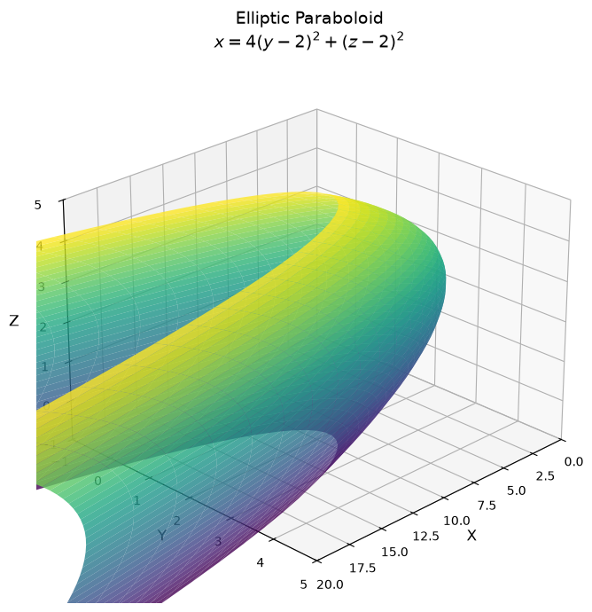
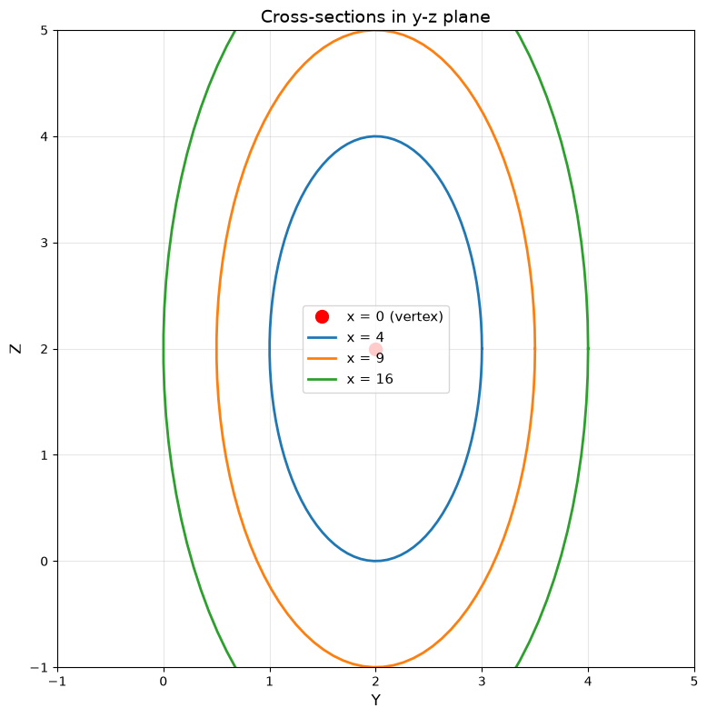
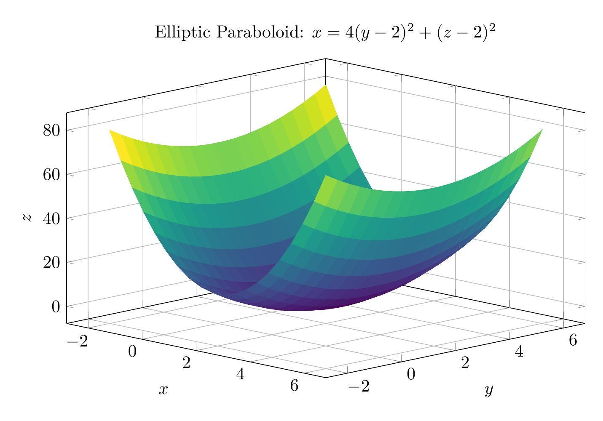
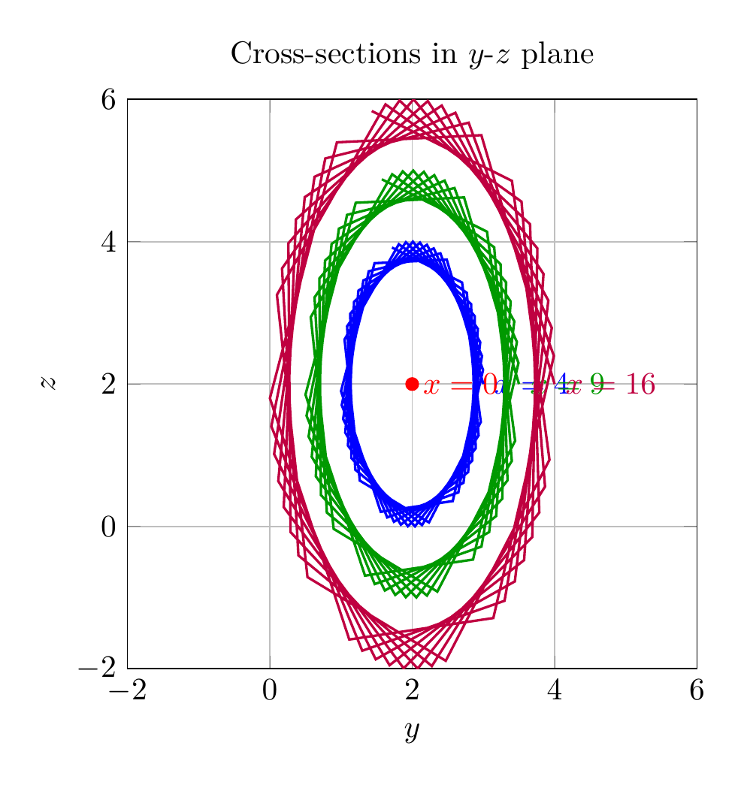

`[ Begin message. Type: AIMessage. ]`

## Solution

### Step 1: Complete the Square

Given equation:
$$4y^2 + z^2 - x - 16y - 4z + 20 = 0$$

Group the terms by variable:
$$4(y^2 - 4y) + (z^2 - 4z) - x + 20 = 0$$

Complete the square for $y$ and $z$:
- For $y$: $y^2 - 4y = (y-2)^2 - 4$
- For $z$: $z^2 - 4z = (z-2)^2 - 4$

Substitute back:
$$4\left[(y-2)^2 - 4\right] + \left[(z-2)^2 - 4\right] - x + 20 = 0$$

$$4(y-2)^2 - 16 + (z-2)^2 - 4 - x + 20 = 0$$

Simplify:
$$4(y-2)^2 + (z-2)^2 - x = 0$$

### Step 2: Standard Form

Rearranging:
$$x = 4(y-2)^2 + (z-2)^2$$

Or equivalently:
$$x = \frac{(y-2)^2}{(1/2)^2} + \frac{(z-2)^2}{1^2}$$

### Step 3: Classification

This is an **elliptic paraboloid**. 

The standard form is:
$$x = \frac{y^2}{a^2} + \frac{z^2}{b^2}$$

where $a = 1/2$ and $b = 1$.

**Key features:**
- **Vertex:** $(0, 2, 2)$
- **Axis of symmetry:** The line $y = 2, z = 2$ (parallel to the $x$-axis)
- **Opens in the positive $x$-direction**
- **Cross-sections** perpendicular to the $x$-axis are ellipses with semi-axes $\frac{\sqrt{x}}{2}$ in the $y$-direction and $\sqrt{x}$ in the $z$-direction

$\boxed{\text{Standard form: } x = 4(y-2)^2 + (z-2)^2; \text{ Classification: Elliptic Paraboloid}}$

---


(Image `20260827_014149_997716_utc_0800_pyplot_0.png`. Alt text: pyplot-generated plot.)



(Image `20260827_014149_997716_utc_0800_pyplot_1.png`. Alt text: pyplot-generated plot.)




---

[PGFplots / tikz plot.](./20260827_014149_997716_utc_0800_pgfplots_0.tex)

```latex
\documentclass[border=10pt]{standalone}
\usepackage{pgfplots}
\usepgfplotslibrary{colormaps}
\pgfplotsset{compat=newest}
\begin{document}
\begin{tikzpicture}
\begin{axis}[
    view={45}{20},
    xlabel={$x$},
    ylabel={$y$},
    zlabel={$z$},
    title={Elliptic Paraboloid: $x = 4(y-2)^2 + (z-2)^2$},
    colormap/viridis,
    samples=20,
    domain=-2:6,
    y domain=-2:6,
    enlargelimits=0.1,
    grid=major,
    width=12cm,
    height=8cm
]
\addplot3[surf, shader=flat corner] 
    {4*(x-2)^2 + (y-2)^2};
\end{axis}
\end{tikzpicture}
\end{document}

```


(Image `20260827_014149_997716_utc_0800_pgfplots_0.png`. Alt text: PGFplots / tikz plot (converted to PNG).)




[PGFplots / tikz plot.](./20260827_014149_997716_utc_0800_pgfplots_1.tex)

```latex
\documentclass[border=10pt]{standalone}
\usepackage{pgfplots}
\pgfplotsset{compat=newest}
\begin{document}
\begin{tikzpicture}
\begin{axis}[
    xlabel={$y$},
    ylabel={$z$},
    title={Cross-sections in $y$-$z$ plane},
    grid=major,
    axis equal image,
    xmin=-2, xmax=6,
    ymin=-2, ymax=6,
    width=8cm,
    height=8cm
]
% x = 0: point (2,2)
\addplot[only marks, mark=*, red] coordinates {(2,2)};
\node[red, anchor=west] at (axis cs:2,2) {$x=0$};

% x = 4: (y-2)^2 + (z-2)^2/4 = 1
\addplot[blue, thick, domain=0:360, samples=50] ({2 + cos(deg(x))}, {2 + 2*sin(deg(x))});
\node[blue, anchor=west] at (axis cs:3,2) {$x=4$};

% x = 9: (y-2)^2/(9/4) + (z-2)^2/9 = 1
\addplot[green!60!black, thick, domain=0:360, samples=50] ({2 + 1.5*cos(deg(x))}, {2 + 3*sin(deg(x))});
\node[green!60!black, anchor=west] at (axis cs:3.5,2) {$x=9$};

% x = 16: (y-2)^2/4 + (z-2)^2/16 = 1
\addplot[purple, thick, domain=0:360, samples=50] ({2 + 2*cos(deg(x))}, {2 + 4*sin(deg(x))});
\node[purple, anchor=west] at (axis cs:4,2) {$x=16$};

\end{axis}
\end{tikzpicture}
\end{document}

```


(Image `20260827_014149_997716_utc_0800_pgfplots_1.png`. Alt text: PGFplots / tikz plot (converted to PNG).)



`[ End message. Type: AIMessage. ]`