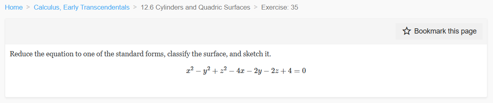
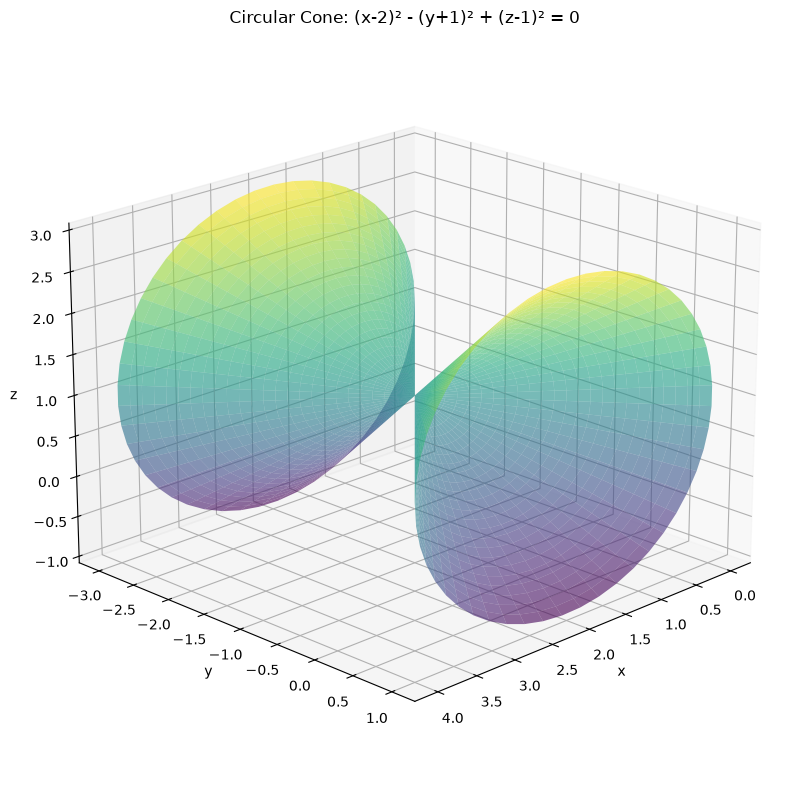
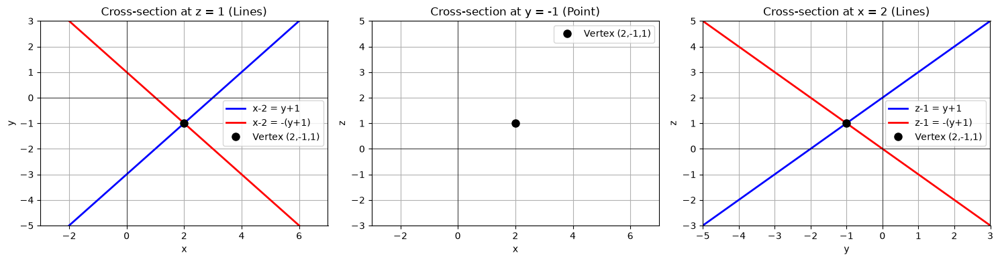
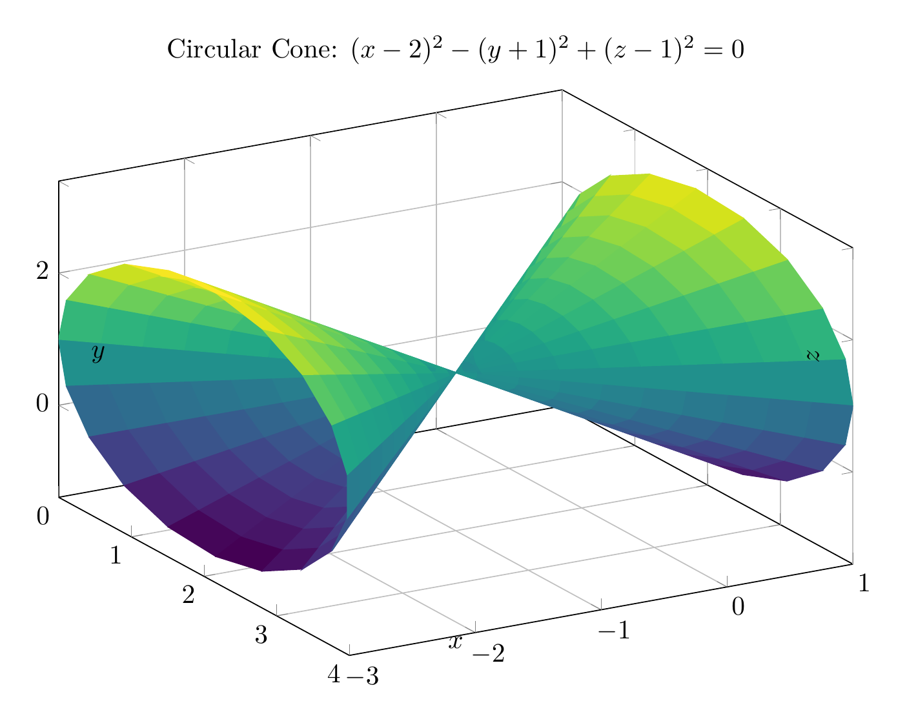
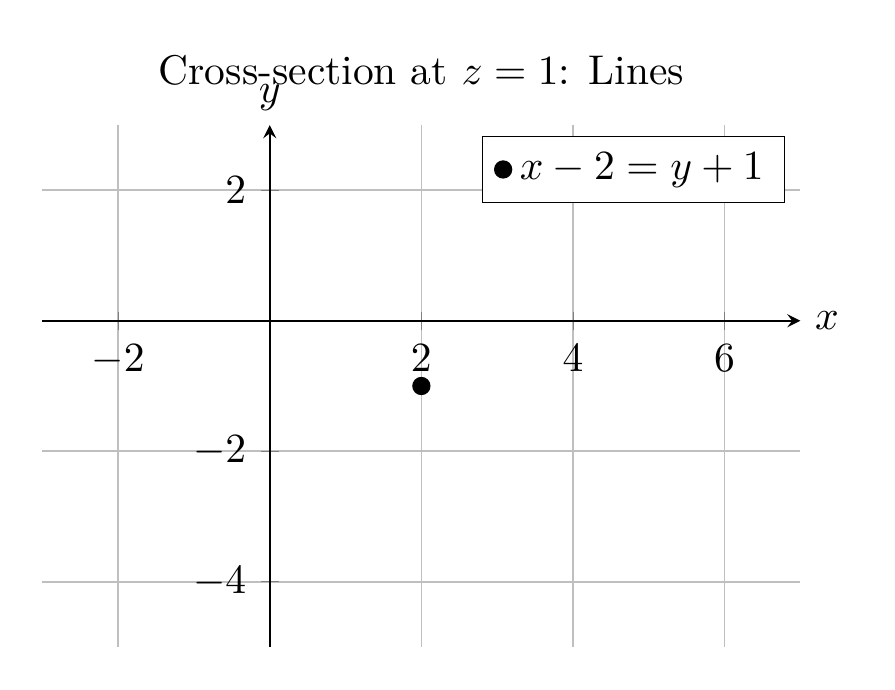

`[ Begin message. Type: HumanMessage. ]`

`[Begin Problem]`

`[ Begin message. Type: HumanMessage. ]`

Please solve the math problem in the image.


(Image `problem.png`. Alt text: Problem.)


(Image `20260827_014215_812203_utc_0800_0.png`. Alt text: Image: 20260827_014215_812203_utc_0800_human)




`[ End message. Type: HumanMessage. ]`

`[End Problem]`

`[ End message. Type: HumanMessage. ]`

`[ Begin message. Type: AIMessage. ]`

`[Begin Answer]`

## Solution

### Step 1: Reduce to Standard Form

Given equation:
$$x^2 - y^2 + z^2 - 4x - 2y - 2z + 4 = 0$$

**Group terms by variable:**
$$(x^2 - 4x) - (y^2 + 2y) + (z^2 - 2z) + 4 = 0$$

**Complete the square for each variable:**

- For $x$: $x^2 - 4x = (x-2)^2 - 4$
- For $y$: $-(y^2 + 2y) = -[(y+1)^2 - 1] = -(y+1)^2 + 1$
- For $z$: $z^2 - 2z = (z-1)^2 - 1$

**Substitute back:**
$$[(x-2)^2 - 4] - [(y+1)^2 - 1] + [(z-1)^2 - 1] + 4 = 0$$

**Simplify:**
$$(x-2)^2 - (y+1)^2 + (z-1)^2 - 4 + 1 - 1 + 4 = 0$$

$$\boxed{(x-2)^2 - (y+1)^2 + (z-1)^2 = 0}$$

### Step 2: Classify the Surface

The standard form is:
$$\frac{(x-2)^2}{1^2} + \frac{(z-1)^2}{1^2} - \frac{(y+1)^2}{1^2} = 0$$

This is a **circular cone** (a special case of an elliptic cone where the semi-axes are equal).

**Key properties:**
- **Vertex:** $(2, -1, 1)$
- **Axis:** Parallel to the $y$-axis
- **Cross-sections perpendicular to $y$-axis:** Circles with radius $|y+1|$
- **Cross-sections perpendicular to $x$ or $z$ axes:** Hyperbolas (or intersecting lines at the vertex)

### Summary

The equation represents a **circular cone** with vertex at $(2, -1, 1)$ opening along the $y$-axis.

$\boxed{(x-2)^2 - (y+1)^2 + (z-1)^2 = 0, \text{ Circular Cone}}$

---


(Image `20260827_015351_427582_utc_0800_pyplot_0.png`. Alt text: pyplot-generated plot.)



(Image `20260827_015351_427582_utc_0800_pyplot_1.png`. Alt text: pyplot-generated plot.)




---

[PGFplots / tikz plot.](./20260827_015351_427582_utc_0800_pgfplots_0.tex)

```latex
\documentclass[border=10pt]{standalone}
\usepackage{pgfplots}
\usepgfplotslibrary{colormaps}
\pgfplotsset{compat=1.18}

\begin{document}
\begin{tikzpicture}
\begin{axis}[
    view={60}{30},
    xlabel={$x$},
    ylabel={$y$},
    zlabel={$z$},
    title={Circular Cone: $(x-2)^2 - (y+1)^2 + (z-1)^2 = 0$},
    colormap/viridis,
    grid=major,
    width=12cm,
    height=9cm,
    xlabel style={at={(axis description cs:0.5,0.05)}, anchor=north},
    ylabel style={at={(axis description cs:0.05,0.5)}, anchor=south},
    zlabel style={at={(axis description cs:0.95,0.5)}, anchor=west},
]
% Plot the cone surface using parametric plot
\addplot3[
    surf,
    shader=flat corner,
    samples=20,
    samples y=20,
    domain=0:360,
    y domain=-2:2,
] (
    {2 + y*cos(x)},
    {y - 1},
    {1 + y*sin(x)}
);
\end{axis}
\end{tikzpicture}
\end{document}

```


(Image `20260827_015351_427582_utc_0800_pgfplots_0.png`. Alt text: PGFplots / tikz plot (converted to PNG).)




[PGFplots / tikz plot.](./20260827_015351_427582_utc_0800_pgfplots_1.tex)

```latex
\documentclass[border=10pt]{standalone}
\usepackage{pgfplots}
\pgfplotsset{compat=1.18}

\begin{document}
\begin{tikzpicture}
\begin{axis}[
    xlabel={$x$},
    ylabel={$y$},
    title={Cross-section at $z=1$: Lines},
    grid=major,
    width=8cm,
    height=6cm,
    axis lines=middle,
    xmin=-3, xmax=7,
    ymin=-5, ymax=3,
    xlabel style={at={(current axis.right of origin)}, anchor=west},
    ylabel style={at={(current axis.above origin)}, anchor=south},
]
% Plot the lines x-2 = y+1 and x-2 = -(y+1)
\addplot[blue, thick, domain=-5:3] ({y+3}, {y});
\addplot[red, thick, domain=-5:3] ({1-y}, {y});
% Plot the vertex
\addplot[black, mark=*, only marks] coordinates {(2, -1)};
% Add legend
\legend{$x-2 = y+1$, $x-2 = -(y+1)$, Vertex (2,-1,1)}
\end{axis}
\end{tikzpicture}
\end{document}

```


(Image `20260827_015351_427582_utc_0800_pgfplots_1.png`. Alt text: PGFplots / tikz plot (converted to PNG).)



`[End Answer]`

`[ End message. Type: AIMessage. ]`