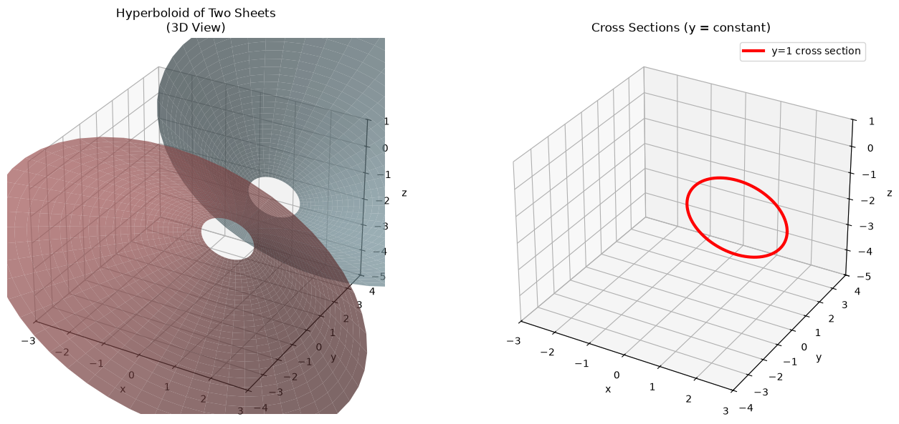
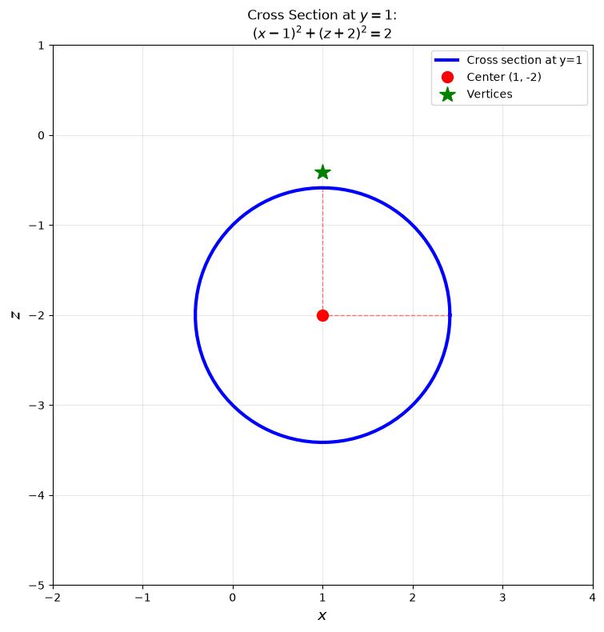
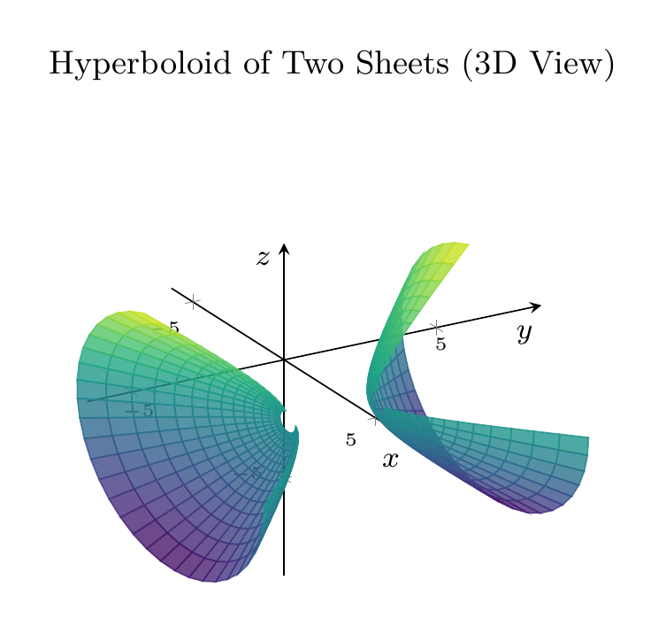
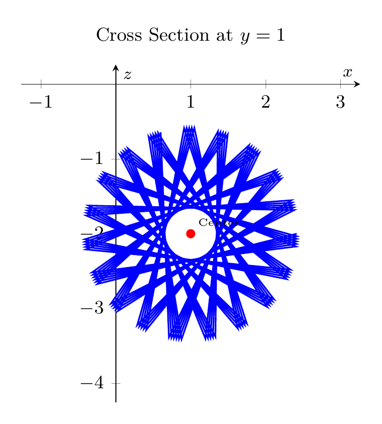

`[ Begin message. Type: AIMessage. ]`

## Solution

**Problem:** Reduce the equation to one of the standard forms, classify the surface, and sketch it.
$$x^2 - y^2 + z^2 - 2x + 2y + 4z + 2 = 0$$

---

### Step 1: Complete the Square

**Group terms by variable:**
$$(x^2 - 2x) - (y^2 - 2y) + (z^2 + 4z) + 2 = 0$$

**Complete the square for each variable:**
- For $x$: $x^2 - 2x = (x-1)^2 - 1$
- For $y$: $-(y^2 - 2y) = -[(y-1)^2 - 1] = -(y-1)^2 + 1$
- For $z$: $z^2 + 4z = (z+2)^2 - 4$

**Substitute back:**
$$[(x-1)^2 - 1] - [(y-1)^2 - 1] + [(z+2)^2 - 4] + 2 = 0$$

**Simplify constants:** $-1 + 1 - 4 + 2 = -2$

**Standard form:**
$$\boxed{(x-1)^2 - (y-1)^2 + (z+2)^2 = 2}$$

Or equivalently:
$$\frac{(x-1)^2}{2} - \frac{(y-1)^2}{2} + \frac{(z+2)^2}{2} = 1$$

---

### Step 2: Classify the Surface

This is a **hyperboloid of two sheets** with:
- **Center:** $(1, 1, -2)$
- **Axis of symmetry:** Parallel to the $y$-axis
- **Vertices:** $(1, 1 \pm \sqrt{2}, -2)$
- **Cross-sections perpendicular to $y$-axis:** Circles (circular hyperboloid)
- **Two sheets:** Upper sheet ($y \geq 1 + \sqrt{2}$) and lower sheet ($y \leq 1 - \sqrt{2}$)

---

### Step 3: Sketch

The surface consists of two separate sheets opening along the $y$-axis. Cross-sections perpendicular to the $y$-axis are circles. At $y = 1$, the cross-section is a circle of radius $\sqrt{2}$ centered at $(1, -2)$ in the $xz$-plane.

$\boxed{\text{Hyperboloid of two sheets: } (x-1)^2 - (y-1)^2 + (z+2)^2 = 2}$

---


(Image `20260827_020134_698364_utc_0800_pyplot_0.png`. Alt text: pyplot-generated plot.)



(Image `20260827_020134_698364_utc_0800_pyplot_1.png`. Alt text: pyplot-generated plot.)




---

[PGFplots / tikz plot.](./20260827_020134_698364_utc_0800_pgfplots_0.tex)

```latex
\documentclass[border=10pt]{standalone}
\usepackage{pgfplots}
\usepgfplotslibrary{colormaps}
\pgfplotsset{compat=1.18}
\begin{document}
\begin{tikzpicture}
\begin{axis}[
    view={60}{30},
    xlabel={$x$}, ylabel={$y$}, zlabel={$z$},
    title={Hyperboloid of Two Sheets (3D View)},
    domain=0:360,
    y domain=0.3:2,
    samples=30,
    samples y=15,
    colormap/viridis,
    axis lines=center,
    enlargelimits=0.2,
    tick label style={font=\tiny},
    label style={font=\footnotesize},
    title style={font=\small},
    xlabel style={at={(ticklabel* cs:1)}, anchor=near ticklabel},
    ylabel style={at={(ticklabel* cs:1)}, anchor=near ticklabel},
    zlabel style={at={(ticklabel* cs:1)}, anchor=near ticklabel}
]
% Upper sheet: y = 1 + sqrt(2)*cosh(v), x = 1 + sqrt(2)*sinh(v)*cos(theta), z = -2 + sqrt(2)*sinh(v)*sin(theta)
\addplot3[surf, shader=flat corner, opacity=0.8] (
    {1 + sqrt(2)*sinh(y)*cos(deg(x))},
    {1 + sqrt(2)*cosh(y)},
    {-2 + sqrt(2)*sinh(y)*sin(deg(x))}
);

% Lower sheet
\addplot3[surf, shader=flat corner, opacity=0.8] (
    {1 + sqrt(2)*sinh(y)*cos(deg(x))},
    {1 - sqrt(2)*cosh(y)},
    {-2 + sqrt(2)*sinh(y)*sin(deg(x))}
);
\end{axis}
\end{tikzpicture}
\end{document}

```


(Image `20260827_020134_698364_utc_0800_pgfplots_0.png`. Alt text: PGFplots / tikz plot (converted to PNG).)




[PGFplots / tikz plot.](./20260827_020134_698364_utc_0800_pgfplots_1.tex)

```latex
\documentclass[border=10pt]{standalone}
\usepackage{pgfplots}
\pgfplotsset{compat=1.18}
\begin{document}
\begin{tikzpicture}
\begin{axis}[
    xlabel={$x$}, ylabel={$z$},
    title={Cross Section at $y=1$},
    axis lines=center,
    enlargelimits=0.3,
    tick label style={font=\small},
    label style={font=\footnotesize},
    title style={font=\small},
    axis equal image
]
% Circle: (x-1)^2 + (z+2)^2 = 2
\addplot[domain=0:360, samples=100, thick, blue] ({1 + sqrt(2)*cos(deg(x))}, {-2 + sqrt(2)*sin(deg(x))});

% Center point
\addplot[only marks, mark=*, red, mark size=2pt] coordinates {(1, -2)};
\node[above right, font=\tiny] at (axis cs:1,-2) {Center};

\end{axis}
\end{tikzpicture}
\end{document}

```


(Image `20260827_020134_698364_utc_0800_pgfplots_1.png`. Alt text: PGFplots / tikz plot (converted to PNG).)



`[ End message. Type: AIMessage. ]`