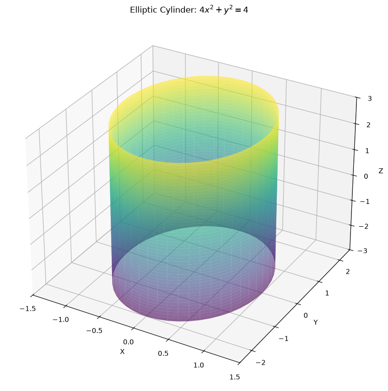
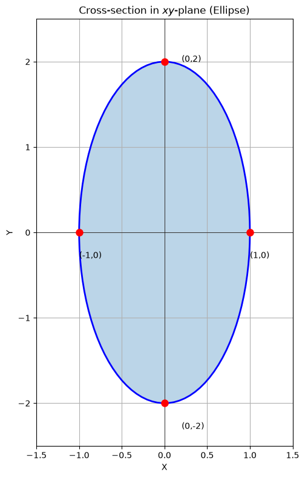
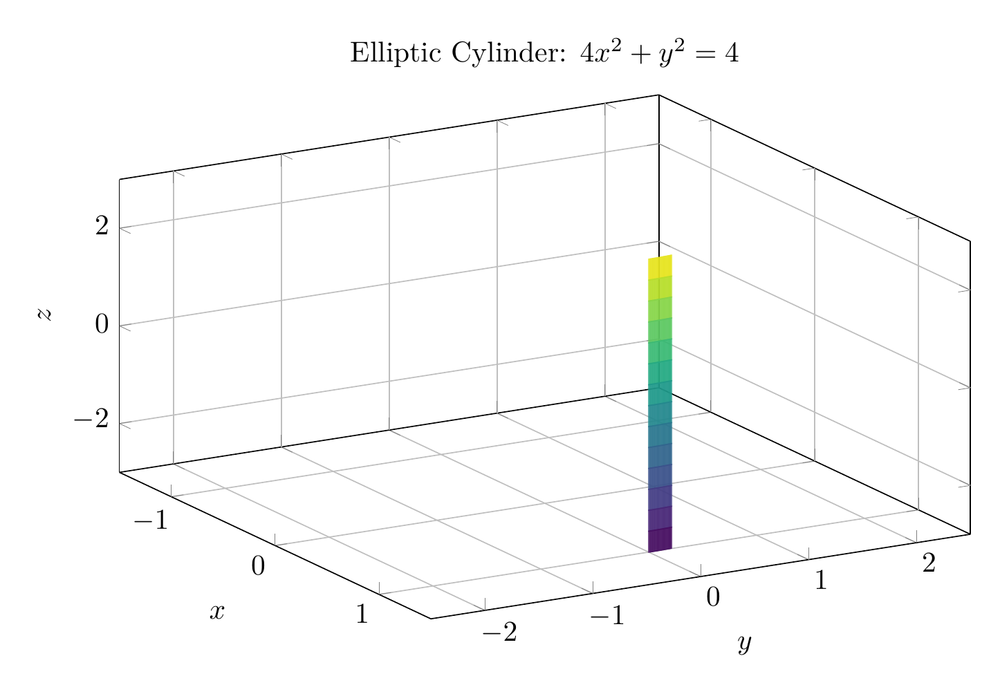
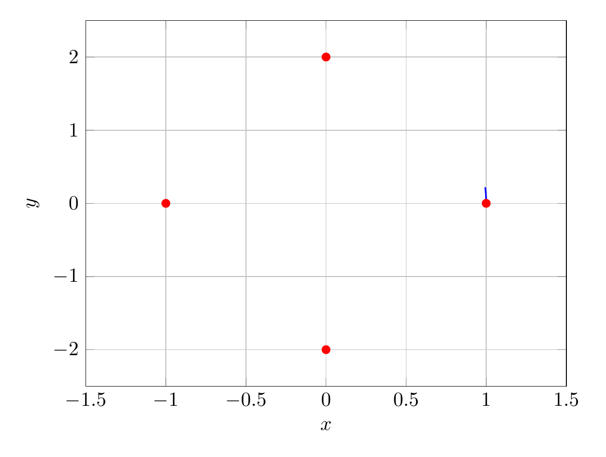

`[ Begin message. Type: HumanMessage. ]`

`[Begin Problem]`

`[ Begin message. Type: HumanMessage. ]`

Please solve the math problem in the image.


(Image `problem.png`. Alt text: Problem.)


(Image `20260826_231436_800254_utc_0800_0.png`. Alt text: Image: 20260826_231436_800254_utc_0800_human)


`[ End message. Type: HumanMessage. ]`

`[End Problem]`

`[ End message. Type: HumanMessage. ]`

`[ Begin message. Type: AIMessage. ]`

`[Begin Answer]`

## Solution

### Step 1: Analyze the Equation

The given equation is:
$$4x^2 + y^2 = 4$$

**Key observation:** The variable $z$ is missing from the equation. In three-dimensional space, when one variable is missing, we have a **cylinder** (in the general mathematical sense).

### Step 2: Identify the Cross-Section

Examine the equation in the $xy$-plane (where $z = 0$):
$$4x^2 + y^2 = 4$$

Divide both sides by 4 to get the standard form of an ellipse:
$$\frac{x^2}{1} + \frac{y^2}{4} = 1$$

This is an **ellipse** with:
- Semi-minor axis: $a = 1$ (along the $x$-axis)
- Semi-major axis: $b = 2$ (along the $y$-axis)
- Vertices: $(\pm 1, 0)$ and $(0, \pm 2)$

### Step 3: Describe the Surface

Since $z$ can take any value (it's not constrained), the ellipse extends infinitely in both the positive and negative $z$-directions.

**The surface is an elliptic cylinder** with:
- Elliptical cross-section in the $xy$-plane
- Generators (rulings) parallel to the $z$-axis
- Semi-axes of 1 (in $x$-direction) and 2 (in $y$-direction)

$$
\boxed{\text{Elliptic cylinder with elliptical cross-section } \frac{x^2}{1} + \frac{y^2}{4} = 1 \text{ and rulings parallel to the } z\text{-axis}}
$$

---


(Image `20260826_231910_505897_utc_0800_pyplot_0.png`. Alt text: pyplot-generated plot.)



(Image `20260826_231910_505897_utc_0800_pyplot_1.png`. Alt text: pyplot-generated plot.)




---

[PGFplots / tikz plot.](./20260826_231910_505897_utc_0800_pgfplots_0.tex)

```latex
\documentclass[border=10pt]{standalone}
\usepackage{pgfplots}
\pgfplotsset{compat=1.18}

\begin{document}
\begin{tikzpicture}
\begin{axis}[
    view={60}{30},
    xlabel={$x$},
    ylabel={$y$},
    zlabel={$z$},
    title={Elliptic Cylinder: $4x^2 + y^2 = 4$},
    colormap/viridis,
    width=12cm,
    height=8cm,
    xmin=-1.5, xmax=1.5,
    ymin=-2.5, ymax=2.5,
    zmin=-3, zmax=3,
    grid=major
]
% Parametric surface using mesh
\addplot3[
    mesh,
    samples=30,
    samples y=15,
    domain=0:6.28,
    y domain=-3:3,
    opacity=0.7
] (
    {cos(x)},
    {2*sin(x)},
    {y}
);
\end{axis}
\end{tikzpicture}
\end{document}
```


(Image `20260826_231910_505897_utc_0800_pgfplots_0.png`. Alt text: PGFplots / tikz plot (converted to PNG).)




[PGFplots / tikz plot.](./20260826_231910_505897_utc_0800_pgfplots_1.tex)

```latex
\documentclass[border=10pt]{standalone}
\usepackage{pgfplots}
\pgfplotsset{compat=newest}

\begin{document}
\begin{tikzpicture}
\begin{axis}[
    xlabel={$x$},
    ylabel={$y$},
    width=10cm,
    height=8cm,
    xmin=-1.5, xmax=1.5,
    ymin=-2.5, ymax=2.5,
    grid=major
]
\addplot[domain=0:6.28, samples=100, blue, thick] ({cos(x)}, {2*sin(x)});
\addplot[only marks, mark=*, red] coordinates {(1,0) (-1,0) (0,2) (0,-2)};
\end{axis}
\end{tikzpicture}
\end{document}
```


(Image `20260826_231910_505897_utc_0800_pgfplots_1.png`. Alt text: PGFplots / tikz plot (converted to PNG).)



`[End Answer]`

`[ End message. Type: AIMessage. ]`