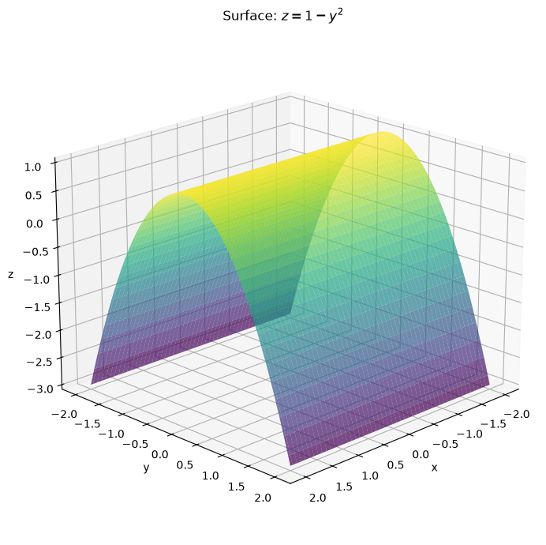
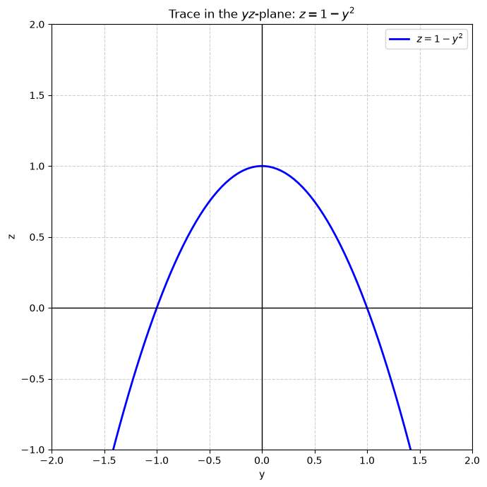
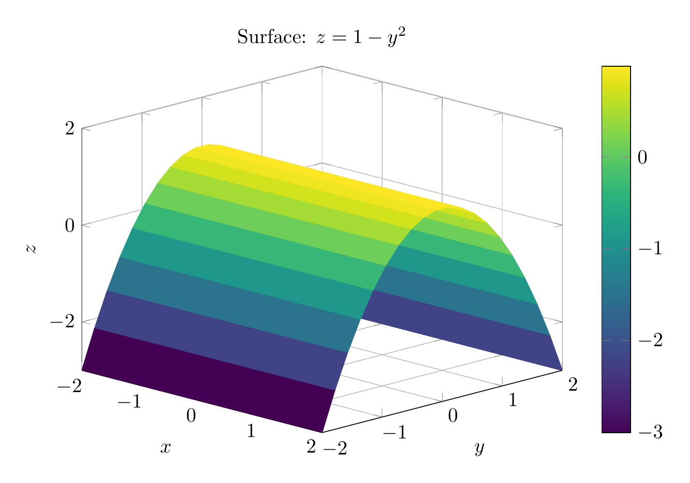
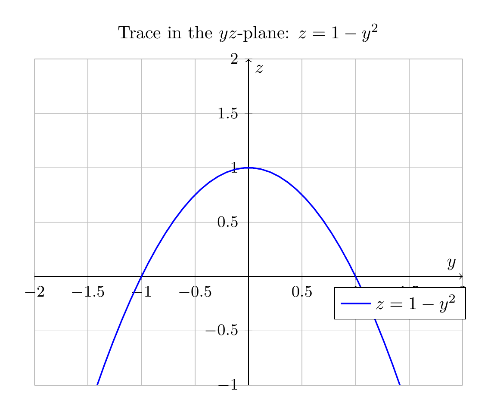

`[ Begin message. Type: HumanMessage. ]`

`[Begin Problem]`

`[ Begin message. Type: HumanMessage. ]`

Please solve the math problem in the image.


(Image `problem.png`. Alt text: Problem.)


(Image `20260826_232023_866734_utc_0800_0.png`. Alt text: Image: 20260826_232023_866734_utc_0800_human)


`[ End message. Type: HumanMessage. ]`

`[End Problem]`

`[ End message. Type: HumanMessage. ]`

`[ Begin message. Type: AIMessage. ]`

`[Begin Answer]`

## Description of the Surface $z = 1 - y^2$

### Analysis

**1. Identify the type of surface:**
The equation $z = 1 - y^2$ is missing the variable $x$. This indicates that the surface is a **cylinder** (in the general sense, not necessarily circular). The cross-section in the $yz$-plane is a parabola, and this parabola is extended along the entire $x$-axis.

**2. Trace in the $yz$-plane ($x = 0$):**
Setting $x = 0$, we get $z = 1 - y^2$, which is a parabola that:
- Opens downward
- Has its vertex at $(0, 1)$
- Has $y$-intercepts at $y = \pm 1$ (where $z = 0$)

**3. Traces parallel to the $yz$-plane:**
For any constant $x = c$, the trace is the same parabola $z = 1 - y^2$. This confirms the surface is a cylinder with parabolic cross-sections.

**4. Traces parallel to the $xz$-plane:**
For any constant $y = c$, we get $z = 1 - c^2$, which is a horizontal line parallel to the $x$-axis. This confirms the surface extends infinitely in the $x$-direction.

**5. Traces parallel to the $xy$-plane:**
For any constant $z = c$, we get $c = 1 - y^2$, or $y^2 = 1 - c$.
- If $c < 1$, we have two lines $y = \pm\sqrt{1-c}$ parallel to the $x$-axis
- If $c = 1$, we have the line $y = 0$ (the $x$-axis)
- If $c > 1$, there are no real solutions

### Conclusion

The surface $z = 1 - y^2$ is a **parabolic cylinder**. It is formed by taking the parabola $z = 1 - y^2$ in the $yz$-plane and extending it infinitely along the $x$-axis. The surface has a "trough" shape with its maximum height at $z = 1$ along the line $y = 0$ (the $xz$-plane).

$\boxed{\text{The surface is a parabolic cylinder with axis parallel to the } x\text{-axis, opening downward with vertex at } z = 1.}$

---


(Image `20260826_232341_030909_utc_0800_pyplot_0.png`. Alt text: pyplot-generated plot.)



(Image `20260826_232341_030909_utc_0800_pyplot_1.png`. Alt text: pyplot-generated plot.)




---

[PGFplots / tikz plot.](./20260826_232341_030909_utc_0800_pgfplots_0.tex)

```latex
\documentclass[border=10pt]{standalone}
\usepackage{pgfplots}
\usepgfplotslibrary{colormaps}
\pgfplotsset{compat=1.18}

\begin{document}
\begin{tikzpicture}
\begin{axis}[
    view={45}{20},
    xlabel={$x$},
    ylabel={$y$},
    zlabel={$z$},
    title={Surface: $z = 1 - y^2$},
    domain=-2:2,
    y domain=-2:2,
    samples=20,
    samples y=20,
    colormap/viridis,
    colorbar,
    grid=major,
    width=10cm,
    height=8cm,
    zmin=-3,
    zmax=2
]
\addplot3[surf, shader=flat corner] {1 - y^2};
\end{axis}
\end{tikzpicture}
\end{document}
```


(Image `20260826_232341_030909_utc_0800_pgfplots_0.png`. Alt text: PGFplots / tikz plot (converted to PNG).)




[PGFplots / tikz plot.](./20260826_232341_030909_utc_0800_pgfplots_1.tex)

```latex
\documentclass[border=10pt]{standalone}
\usepackage{pgfplots}
\pgfplotsset{compat=1.18}

\begin{document}
\begin{tikzpicture}
\begin{axis}[
    xlabel={$y$},
    ylabel={$z$},
    title={Trace in the $yz$-plane: $z = 1 - y^2$},
    domain=-2:2,
    samples=50,
    grid=major,
    width=10cm,
    height=8cm,
    ymin=-1,
    ymax=2,
    xmin=-2,
    xmax=2,
    axis lines=center,
    axis line style={->},
    ticklabel style={font=\small},
    legend style={at={(0.7,0.3)},anchor=north west}
]
\addplot[blue, thick] {1 - x^2};
\legend{$z = 1 - y^2$}
\end{axis}
\end{tikzpicture}
\end{document}
```


(Image `20260826_232341_030909_utc_0800_pgfplots_1.png`. Alt text: PGFplots / tikz plot (converted to PNG).)



`[End Answer]`

`[ End message. Type: AIMessage. ]`