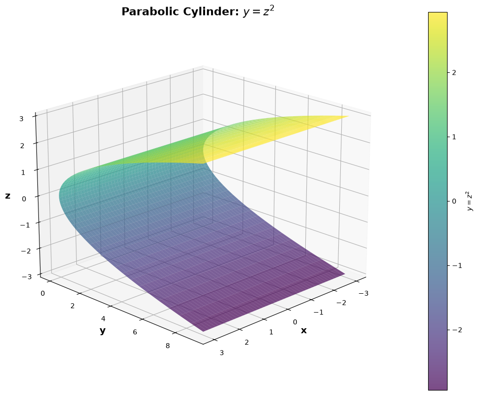
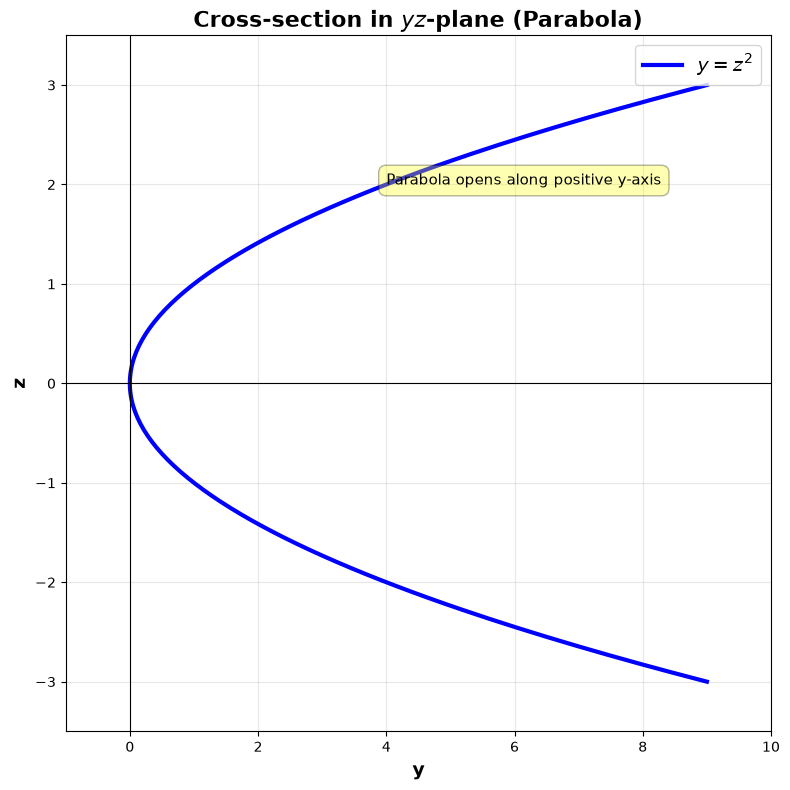
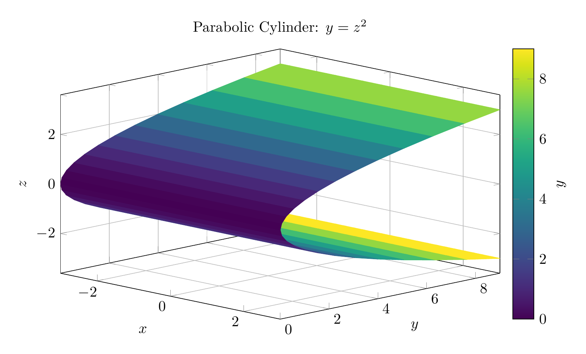
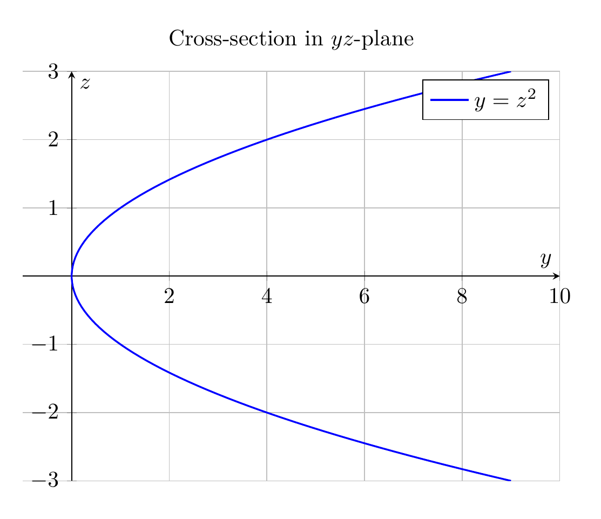

## Solution: Surface $y = z^2$

### Description

The surface $y = z^2$ is a **parabolic cylinder**.

**Key Properties:**
- **Type:** Parabolic cylinder (a type of quadric surface)
- **Generating curve:** The parabola $y = z^2$ in the $yz$-plane
- **Direction of extension:** Parallel to the $x$-axis (since $x$ is missing from the equation)
- **Symmetry:** Symmetric about the $xy$-plane (because $z$ appears only as $z^2$)
- **Domain:** $y \geq 0$ (since $z^2 \geq 0$ for all real $z$)

**Cross-sections:**
- Perpendicular to $x$-axis ($x = c$): Identical parabolas $y = z^2$
- Perpendicular to $y$-axis ($y = c > 0$): Two parallel lines $z = \pm\sqrt{c}$
- Perpendicular to $z$-axis ($z = c$): Horizontal lines $y = c^2$

### How to Identify This Surface

When you see an equation in 3D with only two variables:
1. **Missing variable indicates a cylinder** - the surface extends infinitely in that direction
2. **The equation in the remaining two variables gives the cross-section shape**
3. Here, $y = z^2$ is a parabola in the $yz$-plane, and it extends along the $x$-axis

### Sketch

The surface looks like a "trough" or "channel" that:
- Has a parabolic cross-section in any plane perpendicular to the $x$-axis
- Opens in the positive $y$-direction
- Extends infinitely along the $x$-axis (both positive and negative directions)

$\boxed{\text{Parabolic cylinder extending along the } x\text{-axis}}$

---





---

[PGFplots / tikz plot.](./20260826_234009_654267_utc_0800_pgfplots_0.tex)

```latex
\documentclass[border=10pt]{standalone}
\usepackage{pgfplots}
\usepgfplotslibrary{colormaps}
\pgfplotsset{compat=1.18}

\begin{document}
\begin{tikzpicture}
\begin{axis}[
    view={45}{20},
    xlabel=$x$,
    ylabel=$y$,
    zlabel=$z$,
    title={Parabolic Cylinder: $y = z^2$},
    colormap/viridis,
    colorbar,
    colorbar style={
        ylabel={$y$},
    },
    grid=major,
    width=12cm,
    height=8cm,
    samples=25,
    domain=-3:3,
    y domain=-3:3,
    z buffer=auto,
]
\addplot3[surf, shader=flat corner, point meta=y] ({x},{y^2},{y});
\end{axis}
\end{tikzpicture}
\end{document}

```



[PGFplots / tikz plot.](./20260826_234009_654267_utc_0800_pgfplots_1.tex)

```latex
\documentclass[border=10pt]{standalone}
\usepackage{pgfplots}
\pgfplotsset{compat=1.18}

\begin{document}
\begin{tikzpicture}
\begin{axis}[
    xlabel=$y$,
    ylabel=$z$,
    title={Cross-section in $yz$-plane},
    grid=major,
    width=10cm,
    height=8cm,
    axis lines=middle,
    xmin=-1, xmax=10,
    ymin=-3, ymax=3,
    legend style={at={(0.98,0.98)}, anchor=north east},
]
\addplot[blue, thick, domain=-3:3, samples=100] ({x^2}, {x});
\addlegendentry{$y = z^2$}
\end{axis}
\end{tikzpicture}
\end{document}

```

