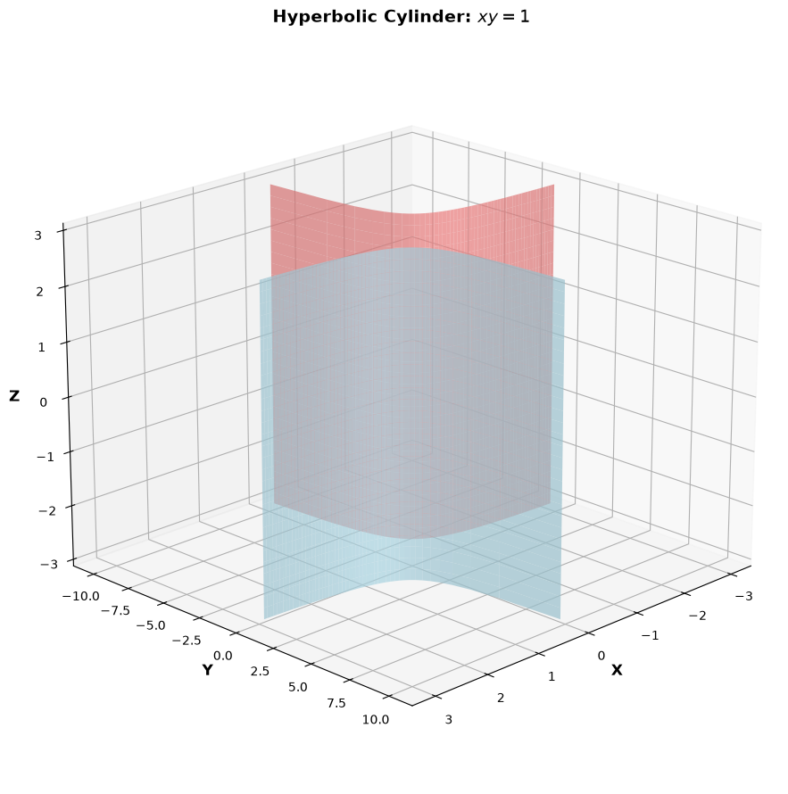
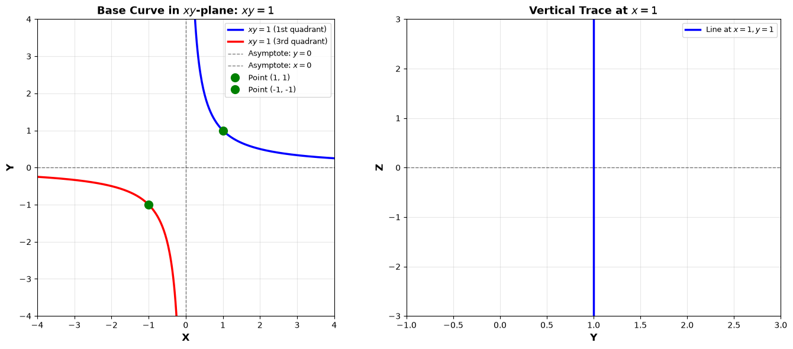
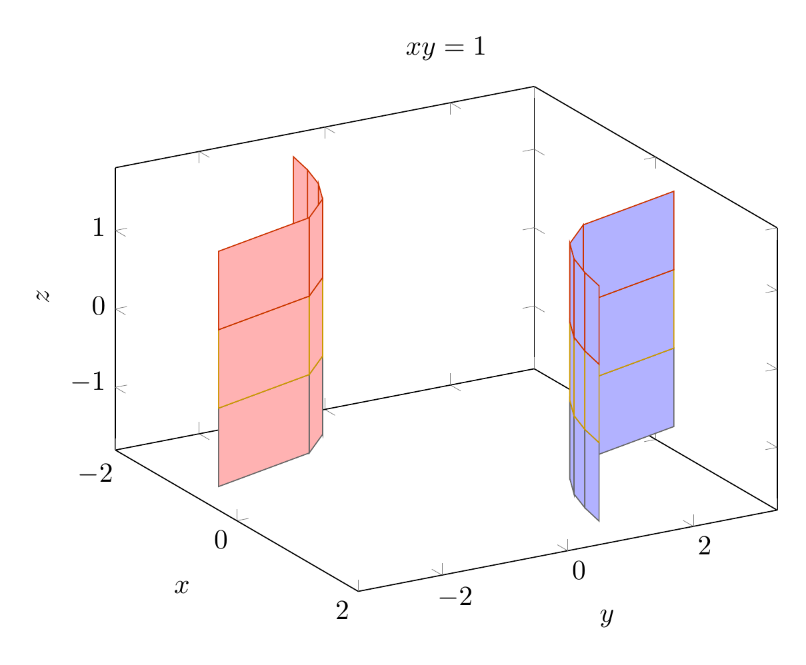
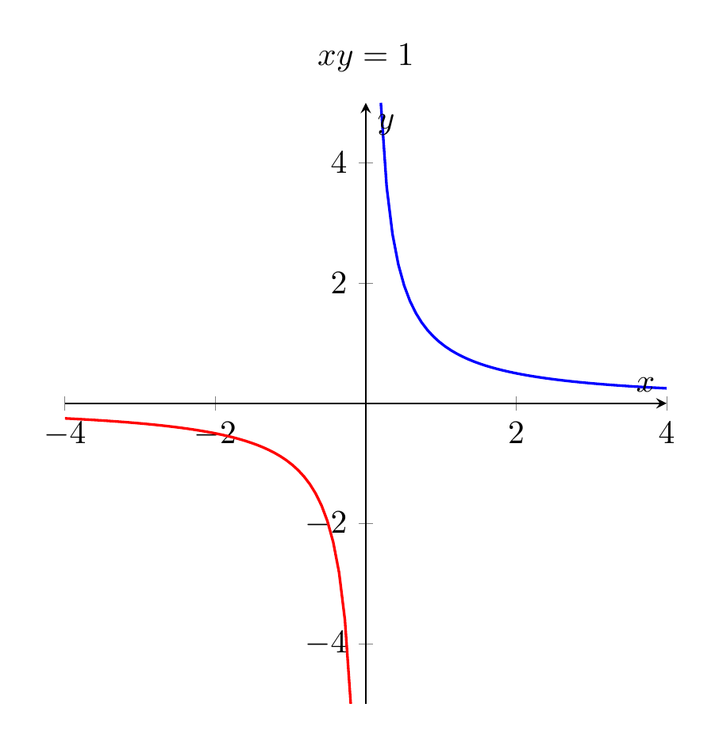

`[ Begin message. Type: AIMessage. ]`

## Solution: Describe and Sketch the Surface $xy = 1$

### Step 1: Identify the Surface Type

The equation $xy = 1$ involves only variables $x$ and $y$. Since the variable $z$ is **missing**, this represents a **cylinder** in 3D space. The surface is formed by extending a curve in the $xy$-plane infinitely along the $z$-direction.

### Step 2: Identify the Base Curve

In the $xy$-plane (where $z = 0$), the equation $xy = 1$ represents a **hyperbola** with:
- **Two branches**: 
  - First quadrant branch: $x > 0, y > 0$
  - Third quadrant branch: $x < 0, y < 0$
- **Asymptotes**: $x = 0$ (the $y$-axis) and $y = 0$ (the $x$-axis)
- **Key points**: $(1, 1)$, $(-1, -1)$, $(2, 1/2)$, $(-2, -1/2)$, etc.

### Step 3: Describe the Surface

The surface $xy = 1$ is called a **hyperbolic cylinder**. Its key properties are:

**Geometric Description:**
- The hyperbola $xy = 1$ is extended infinitely in both positive and negative $z$-directions
- The surface consists of two disconnected sheets (corresponding to the two branches of the hyperbola)
- Every vertical line parallel to the $z$-axis that intersects the hyperbola lies entirely on the surface

**Traces:**
- **Horizontal traces** ($z = c$): All are identical hyperbolas $xy = 1$
- **Vertical traces** ($x = c \neq 0$): Lines $y = 1/c$ parallel to the $z$-axis
- **Vertical traces** ($y = c \neq 0$): Lines $x = 1/c$ parallel to the $z$-axis
- **Traces** ($x = 0$ or $y = 0$): Empty (the surface never intersects the coordinate planes)

**Asymptotic Behavior:**
- As $x \to 0^+$, $y \to +\infty$ (first quadrant branch approaches the $yz$-plane)
- As $x \to +\infty$, $y \to 0^+$ (first quadrant branch approaches the $xz$-plane)
- Similar behavior for the third quadrant branch

### Final Answer

$\boxed{\text{The surface } xy = 1 \text{ is a hyperbolic cylinder with two sheets, extending infinitely along the } z\text{-axis.}}$

---


(Image `20260826_233943_445425_utc_0800_pyplot_0.png`. Alt text: pyplot-generated plot.)



(Image `20260826_233943_445425_utc_0800_pyplot_1.png`. Alt text: pyplot-generated plot.)




---

[PGFplots / tikz plot.](./20260826_233943_445425_utc_0800_pgfplots_0.tex)

```latex
\documentclass[border=10pt]{standalone}
\usepackage{pgfplots}

\begin{document}
\begin{tikzpicture}
\begin{axis}[
    view={60}{30},
    xlabel={$x$},
    ylabel={$y$},
    zlabel={$z$},
    title={$xy = 1$},
    width=10cm,
    height=8cm
]
\addplot3[domain=0.3:2, y domain=-1.5:1.5, surf, samples=6, samples y=4, blue!30] ({x}, {1/x}, {y});
\addplot3[domain=-2:-0.3, y domain=-1.5:1.5, surf, samples=6, samples y=4, red!30] ({x}, {1/x}, {y});
\end{axis}
\end{tikzpicture}
\end{document}
```


(Image `20260826_233943_445425_utc_0800_pgfplots_0.png`. Alt text: PGFplots / tikz plot (converted to PNG).)




[PGFplots / tikz plot.](./20260826_233943_445425_utc_0800_pgfplots_1.tex)

```latex
\documentclass[border=10pt]{standalone}
\usepackage{pgfplots}

\begin{document}
\begin{tikzpicture}
\begin{axis}[
    xlabel={$x$},
    ylabel={$y$},
    title={$xy = 1$},
    axis lines=center,
    domain=0.2:4,
    samples=50,
    width=8cm,
    height=8cm
]
\addplot[blue, thick] {1/x};
\addplot[red, thick, domain=-4:-0.2] {1/x};
\end{axis}
\end{tikzpicture}
\end{document}
```


(Image `20260826_233943_445425_utc_0800_pgfplots_1.png`. Alt text: PGFplots / tikz plot (converted to PNG).)



`[ End message. Type: AIMessage. ]`