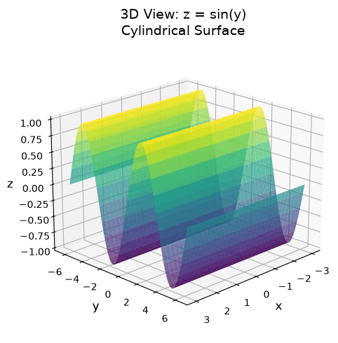
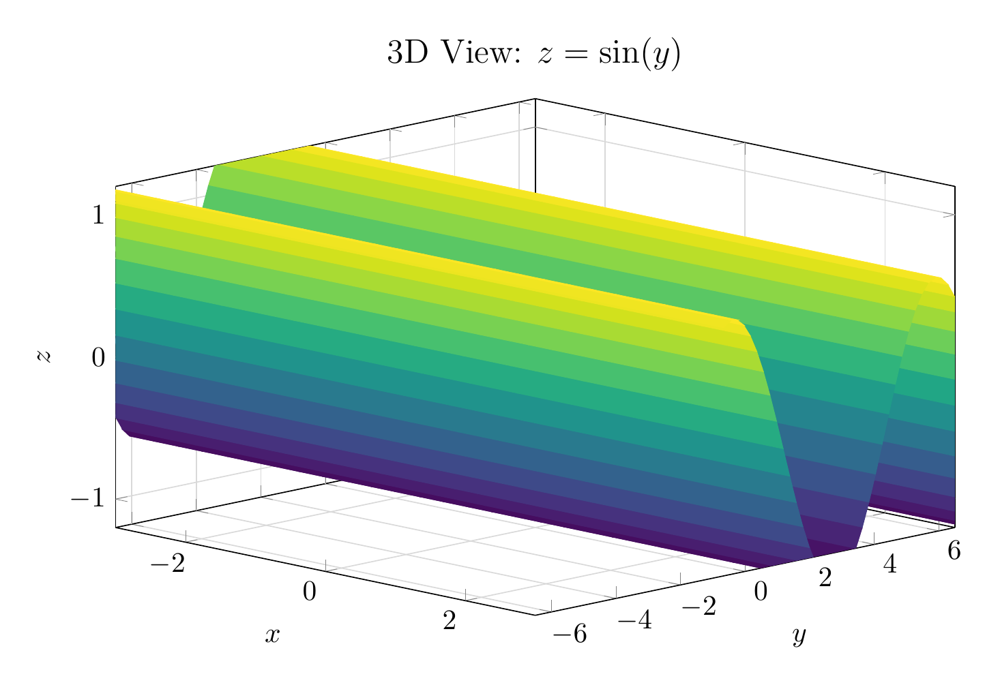
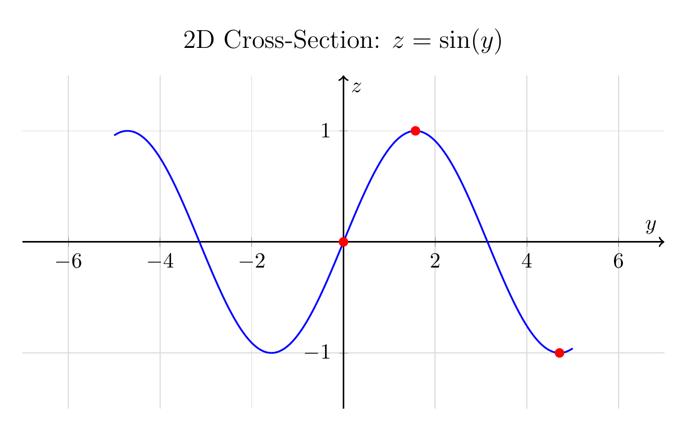

`[ Begin message. Type: HumanMessage. ]`

`[Begin Problem]`

`[ Begin message. Type: HumanMessage. ]`

Please solve the math problem in the image.


(Image `problem.png`. Alt text: Problem.)


(Image `20260826_233535_693903_utc_0800_0.png`. Alt text: Image: 20260826_233535_693903_utc_0800_human)


`[ End message. Type: HumanMessage. ]`

`[End Problem]`

`[ End message. Type: HumanMessage. ]`

`[ Begin message. Type: AIMessage. ]`

`[Begin Answer]`

## Solution: Describe and Sketch the Surface $z = \sin y$

### Description

The surface $z = \sin y$ is a **cylindrical surface** (also called a sinusoidal cylinder).

**Key observations:**
1. The variable $x$ is **missing** from the equation
2. This means the surface extends infinitely in both directions along the $x$-axis
3. The cross-section (trace) in any plane $x = c$ (where $c$ is any constant) is identical: the curve $z = \sin y$ in the $yz$-plane

**Properties:**
- **Amplitude:** 1 (the surface oscillates between $z = -1$ and $z = 1$)
- **Period:** $2\pi$ along the $y$-axis
- **Range:** $z \in [-1, 1]$ for all points on the surface
- **Generators:** Lines parallel to the $x$-axis

**Key points in one period:**
- At $y = 0$: $z = 0$
- At $y = \frac{\pi}{2}$: $z = 1$ (maximum)
- At $y = \pi$: $z = 0$
- At $y = \frac{3\pi}{2}$: $z = -1$ (minimum)
- At $y = 2\pi$: $z = 0$

### Sketch

The surface looks like a sine wave that has been extruded infinitely along the $x$-axis. Imagine taking the curve $z = \sin y$ in the $yz$-plane and sweeping it parallel to the $x$-axis.

**3D View:** The surface appears as parallel sinusoidal ridges and valleys running along the $x$-direction.

**2D Cross-section:** In the $yz$-plane (or any plane $x = c$), the trace is the familiar sine curve oscillating between $z = -1$ and $z = 1$ with period $2\pi$.

$\boxed{\text{Cylindrical surface (sinusoidal cylinder) with generators parallel to the } x\text{-axis}}$

---


(Image `20260826_233826_021889_utc_0800_pyplot_0.png`. Alt text: pyplot-generated plot.)



(Image `20260826_233826_021889_utc_0800_pyplot_1.png`. Alt text: pyplot-generated plot.)


---

[PGFplots / tikz plot.](./20260826_233826_021889_utc_0800_pgfplots_0.tex)

```latex
\documentclass[border=10pt]{standalone}
\usepackage{pgfplots}
\usepgfplotslibrary{colormaps}
\pgfplotsset{compat=1.18}

\begin{document}
\begin{tikzpicture}
\begin{axis}[
    view={45}{20},
    xlabel={$x$},
    ylabel={$y$},
    zlabel={$z$},
    title={3D View: $z = \sin(y)$},
    title style={font=\large},
    width=12cm,
    height=8cm,
    colormap/viridis,
    grid=major,
    grid style={gray!30},
    xmin=-3, xmax=3,
    ymin=-6.5, ymax=6.5,
    zmin=-1.2, zmax=1.2,
    samples=30,
    samples y=50,
]
\addplot3[surf, shader=flat corner] {sin(deg(y))};
\end{axis}
\end{tikzpicture}
\end{document}
```


(Image `20260826_233826_021889_utc_0800_pgfplots_0.png`. Alt text: PGFplots / tikz plot (converted to PNG).)




[PGFplots / tikz plot.](./20260826_233826_021889_utc_0800_pgfplots_1.tex)

```latex
\documentclass[border=10pt]{standalone}
\usepackage{pgfplots}
\pgfplotsset{compat=1.18}

\begin{document}
\begin{tikzpicture}
\begin{axis}[
    xlabel={$y$},
    ylabel={$z$},
    title={2D Cross-Section: $z = \sin(y)$},
    title style={font=\large},
    width=12cm,
    height=7cm,
    grid=major,
    grid style={gray!30},
    xmin=-7, xmax=7,
    ymin=-1.5, ymax=1.5,
    samples=200,
    axis lines=middle,
    axis line style={->, thick},
]
\addplot[blue, thick, smooth] {sin(deg(x))};
\addplot[red, only marks, mark=*] coordinates {(0,0) (1.5708,1) (4.7124,-1)};
\end{axis}
\end{tikzpicture}
\end{document}
```


(Image `20260826_233826_021889_utc_0800_pgfplots_1.png`. Alt text: PGFplots / tikz plot (converted to PNG).)



`[End Answer]`

`[ End message. Type: AIMessage. ]`